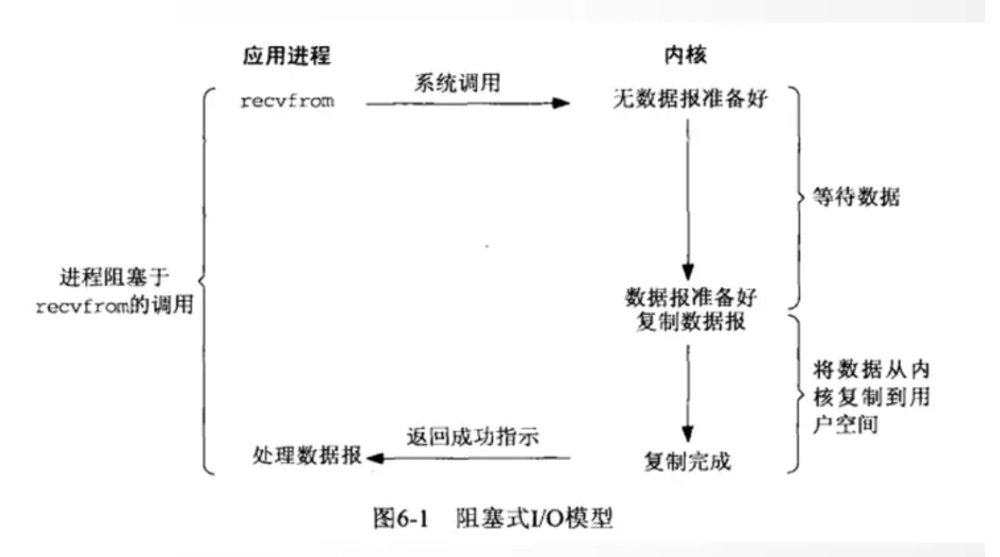
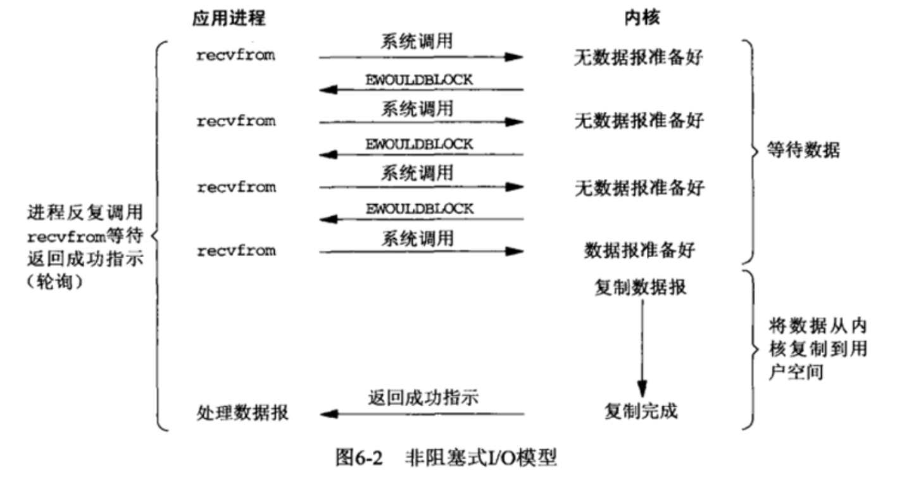
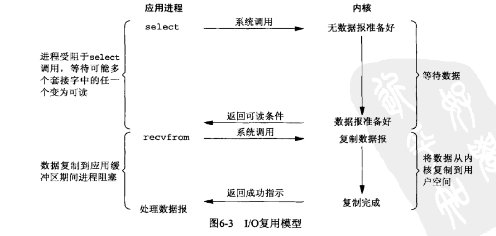
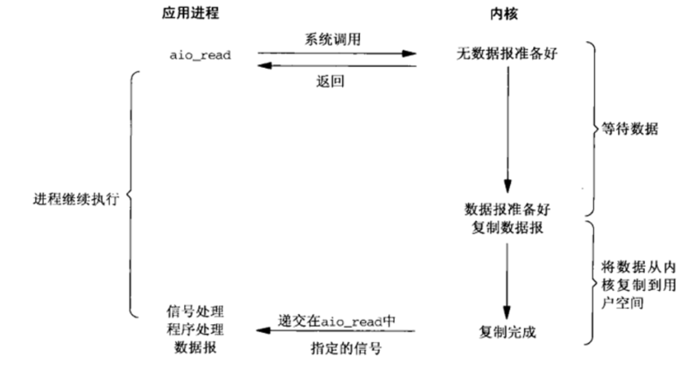
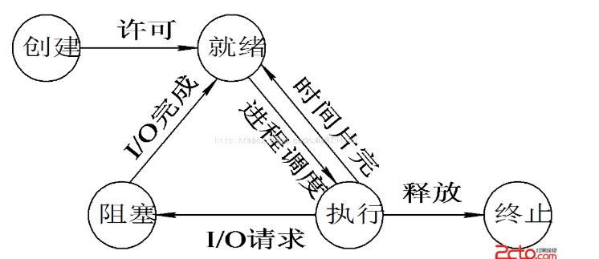
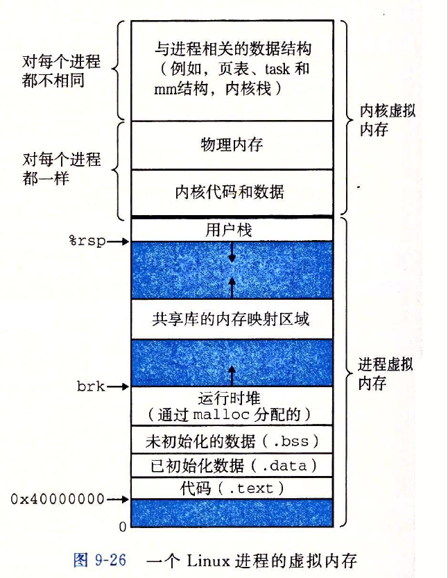

# **第一章、引论**

## **操作系统基本特性：**

并发、共享、虚拟、异步

### 1.并发和并行

- **并行**：是指两个或多个事件**在同一时刻发生**。 
- **并发**：是指两个或多个事件**在同一时间间隔内发生**。 
- **并发偏重于多个任务交替执行**，而多个任务之间有可能是串行的，而**并行是真正意义上的“同时执行”**。
- 如果系统只有一个CPU，而使用多线程任务，那么这些任务是不可能并行的，一个CPU一次只能执行一条命令，在这种情况下多线程就是并发的，而不是并行的。**只有多个CPU的系统才会出现并行**。
- 如果处理器是单核心，一次只能运行一个进程， 在多核心的CPU的支持下，进程支持真正的并行运行。

### 2.共享

- 互斥共享：系统中的某些资源虽然可以提供给多个线程（进程）使用，但在规定的时间内，只允许一个进程访问该资源。 
- 同时访问：系统中某些资源，允许在一段时间内由多个进程“同时”对他们进行访问。 
- **并发和共享时多用户OS的两个最基本的特性** 

### 3.虚拟

- 通过“空分复用”和“时分复用”技术，将一条物理信道变为若干条逻辑信道。 

### 4.同步和异步

- **同步和异步**的概念描述的是用户**线程与内核的交互方式**：
- **同步**：是指用户线程**发起IO请求后**需要**等待或者轮询内核IO操作完成后才能继续执行**；
- 异步：是指用户线程发**起IO请求后仍继续执行**，当**内核IO操作完成后会通知用户线程**，或者调用用户线程注册的回调函数。


### 5.同步与异步、阻塞和非阻塞

- **并发和并行**：并发和并行都可以表示多个任务一起执行，但是侧重点不同。**并发偏重于多个任务交替执行**，而多个任务有可能还是串行的，而**并行是真正意义上的“同时执行”**。如果**系统只有一个CPU，而使用多线程**任务，那么**这些任务是不可能并行的**，一个CPU一次只能执行一条命令，在这种情况下多线程就是并发的，而不是并行的。只有多个CPU的系统才会出现并行。
- **同步 + 阻塞:**调用了一个函数之后，在**等待这个函数返回结果之前，当前的线程是挂起状态**，就意味着当前线程什么都不能干，就等着获取结果，这就叫同步阻塞；
  - 比如去照相馆拍照，拍完照片之后，商家说需要 30 分钟左右才能洗出来照片，这个时候如果我们一直在店里面啥都不干，一直等待商家面前等待它洗完照片，这个过程就叫同步阻塞。
- **同步 + 非阻塞**:调用了一个函数之后，在**等待这个函数返回结果之前，当前的线程仍然是运行状态**，这意味当前线程是可以的继续处理其他任务，但要时不时的去看下是否有结果了，这就是同步非阻塞。
  - 比如等待时拿起手机开始看电视，看一会就会问老板洗完没，老板说没洗完，然后接着看，再过一会接着问，直到照片洗完，这个过程就叫同步非阻塞。
- **异步 + 阻塞**:老板说你把你手机号留下，我一会洗好了就打电话告诉你过来取，然后你去外面找了一个长凳开始躺着睡觉等待老板打电话，啥不都干，这个过程就叫异步阻塞。
- **异步 + 非阻塞**:大家可能会直接先去逛街或者吃饭做其他的活动，等待老板打电话再去取，这个过程就叫异步非阻塞。


## **操作系统的主要功能：**

- 操作系统为计算机系统资源的管理者
  - 处理机管理：进程控制、进程同步、进程通信、进程调度
  - 存储管理：内存分配、内存保护、地址映射、内存扩充
  - 设备管理：缓冲管理、设备分配、设备处理、虚拟设备管理
  - 文件管理：文件存储空间管理、目录管理、文件读写管理、文件保护、文件系统的安全性、文件接口
- 操作系统作为用户与计算机硬件系统之间的接口
  - 用户接口：命令接口、程序接口、图形接口


## Linux内核架构和子系统

- Linux内核的核心功能：管理硬件设备，如CPU、内存外存、输入输出设备、网络设备及其他设备，供应用程序使用。
- 根据内核的核心功能，Linux内核划分为5个子系统：
  - **进程管理/调度子系统**：**负责管理 CPU 资源**，让各进程以尽量公平的方式访问CPU。进程调度就是对CPU进行调度管理。有四个模块：
    - 进程调度的策略：决定哪个（或哪几个）进程将拥有 CPU；见进程调度算法。
    - 体系结构相关的部分：用于将对不同 CPU 的控制，抽象为统一的接口，如CPU的寄存器访问、汇编指令操作等；
    - 体系结构无关的部分：和进程调度策略部分沟通，决定接下来要执行哪个进程；
    - 系统调用接口：进程调度子系统通过系统调用接口，将需要提供给用户空间的接口开放出去
  - **内存管理子系统(MM)**：**负责管理内存资源**，以便让各个进程可以安全地共享机器的内存资源。而且**提供虚拟内存的机制**
    - Linux 系统会在硬件物理内存和进程所使用的内存（虚拟内存）之间建立一种映射关系，这种映射是以进程为单位，因而不同的进程可以使用相同的虚拟内存，而这些相同的虚拟内存，可以映射到不同的物理内存上。分为三个子模块：
      - 体系结构相关部分：提供用于访问硬件 Memory 的虚拟接口；
      - 体系结构无关部分：提供所有的内存管理机制；
      - 系统调用接口：通过该接口，向用户空间程序应用程序提供内存的分配、释放，文件的 map 等功能
  - **虚拟文件子系统(VFS)**：Linux **内核将不同功能的外部设备**，例如 Disk 设备（**硬盘、磁盘**、NAND Flash、Nor Flash 等）、输入输出设备、显示设备等等，**抽象为可以通过统一的文件操作接口**（open、close、read、write 等）来访问。
  - **网络子系统**：负责**管理系统的网络设备**，并实现各种网络协议栈，最终实现通过网络连接其它系统的功能。
  - **IPC子系统**：**进程间通信**。IPC 不管理任何的硬件，它主要负责 Linux 系统中进程之间的通信。
- 


## 五种IO模型

### 1.阻塞式 I/O

- 应用进程被阻塞，直到数据从内核缓冲区复制到应用进程缓冲区中才返回。
- 用户线程通过系统调用read发起IO读操作，由用户空间转到内核空间。内核等到数据包到达后，然后将接收的数据拷贝到用户空间，完成read操作。
- 即用户需要等待read将socket中的数据读取到buffer后，才继续处理接收的数据。整个IO请求的过程中，用户线程是被阻塞的，这导致用户在发起IO请求时，不能做任何事情



### 2.非阻塞式 I/O：

- 应用程序不阻塞的等待返回，采用轮询方式，CPU利用率较低
- 在阻塞模式下，若从网络流中读取不到指定大小的数据量，阻塞IO就在那里阻塞着。比如，已知后面会有10个字节的数据发过来，但是我现在只收到8个字节，那么当前线程就在那傻傻地等到下一个字节的到来，对，就在那等着，啥事也不做，直到把这10个字节读取完，这才将阻塞放开通行。
- 在非阻塞模式下，若从网络流中读取不到指定大小的数据量，非阻塞IO就立即通行。比如，已知后面会有10个字节的数据发过来，但是我现在只收到8个字节，那么当前线程就读取这8个字节的数据，读完后就立即返回，等另外两个字节再来的时候再去读取。



### 3.I/O多路复用：

- I/O多路复用机制，就是说通过一种机制，可以监视多个描述符，一旦某个描述符就绪（读就绪或者写就绪），能够通知程序进行相应的读写操作。
- 用户首先将需要进行IO操作的socket添加到select中，当进程调用select，进程就会被阻塞，此时内核会监视所有select负责的的socket，当socket的数据准备好后，就立即返回。进程再调用read操作，数据就会从内核拷贝到进程。
- 使用select以后最大的优势是用户可以在一个线程内同时处理多个socket的IO请求。用户可以注册多个socket，然后不断地调用select读取被激活的socket，即可达到在同一个线程内同时处理多个IO请求的目的。而在同步阻塞模型中，必须通过多线程的方式才能达到这个目的。



### 4.信号驱动式 I/O：

- 内核在数据到达时向应用进程发送 SIGIO 信号，应用进程收到之后在信号处理程序中调用 recvfrom 将数据从内核复制到应用进程中。

### 5.异步 I/O：

- 异步 I/O 与信号驱动 I/O 的区别在于：**异步 I/O 的信号是通知应用进程 I/O 完成**，而**信号驱动 I/O 的信号是通知应用进程可以开始 I/O**。
- 对于阻塞IO和非阻塞IO，进程都是被阻塞的，但是异步模式下，是不会阻塞；
- 对于异步 IO 呗。要为每一个输入都在系统中注册一个信号和信号处理函数，这可是要与内核打交道的。如果要等的输入非常多，会非常的麻烦，所以可以使用select 系统调用，使用IO多路复用。



- 阻塞、非阻塞、信号驱动式、IO多路复用都是同步 I/O。


### 五种IO模型的区别：

- 阻塞式IO：去火车站买票，排队三天买到一张退票。耗费：在车站等待了3天，其他事一件没干。

- 非阻塞式IO：去火车站买票，隔12小时去火车站问有没有退票，三天后买到一张票。耗费：往返车站6次，路上6小时，其他12个小时的时间做了好多事。

- IO多路复用：
  - select/poll：去火车站买票，委托黄牛，然后每隔6小时主动打电话向黄牛询问，黄牛买到票，然后去火车站交钱领票。耗费：打电话
  - epoll：去火车站买票，委托黄牛，黄牛买到后即通知去领，然后去火车站交钱领票。耗费：无需打电话

- 信号驱动式IO：去火车站买票，给售票员留下电话，有票后，售票员电话通知，然后老李去火车站交钱领票。耗费：无需打电话

- 异步IO：去火车站买票，给售票员留下电话，有票后，售票员电话通知并快递送票上门。耗费：无需打电话


### **select和epoll：**

#### select和epoll流程：

- 介绍：

- Select：允许应用程序监视一组文件描述符，等待一个或者多个描述符成为就绪状态；
  
  - select函数：
  
  ```c++
  //nfds：指定待测试的描述子个数
  //readfds,writefds,exceptfds：指定了我们让内核测试读、写和异常条件的描述字
  //fd_set：为一个存放文件描述符的信息的结构体
  //timeout：内核等待指定的描述字中就绪的时间长度
  //返回值：失败-1 超时0 成功>0
  int select(int nfds, fd_set *readfds, fd_set *writefds,fd_set *exceptfds, struct timeval *timeout);
  ```
  
  - select函数的调用过程：
  
    - 从用户空间将fd_set拷贝到内核空间
    - 注册回调函数
    - 调用其对应的poll方法 
    - poll方法会返回一个描述读写是否就绪的mask掩码，根据这个mask掩码给fd_set赋值。
    -  如果遍历完所有的fd都没有返回一个可读写的mask掩码，就会让select的进程进入休眠模式，直到发现可读写的资源后，重新唤醒等待队列上休眠的进程。如果在规定时间内都没有唤醒休眠进程，那么进程会被唤醒重新获得CPU，再去遍历一次fd。
    - 将fd_set从内核空间拷贝到用户空间
  
- poll ：功能与 select 类似，也是等待一组描述符中的一个成为就绪状态。区别：select 会修改描述符，而 poll 不会；

- **epoll**：仅适用于 Linux，

  - 使用红黑树和链表实现；
  - epoll_create()建立一个epoll对象。每一个epoll对象都有一个独立的eventpoll结构体，用于存放通过**epoll_ctl()方法向epoll对象中添加进来的事件**。这些事件都会**挂载到红黑树上**，这样重复添加的事件就可以通过红黑树而高效的识别出；
  - **通过epoll_ctl() 用于向内核注册新的描述符**或者是改变某个文件描述符的状态。
  - **已注册的描述符在内核中会被维护在一棵红黑树上，一旦基于某个文件描述符就绪时（状态发生改变），文件的fd状态发生改变，就会触发fd上的回调函数，内核会通过回调函数将 I/O 准备好的描述符加入到一个rdlist链表中管理**
  - rdlist不空，进程被唤醒，epoll_wait执行，epoll通过一个事件转移函数ep_events_transfer，将rdlist的数据拷贝到txlist上，并将rdlist的数据清空。
  - **进程调用 epoll_wait() 便可以得到事件完成的描述符**。

```C++
//创建一个epoll的句柄，size用来告诉内核这个监听的数目一共有多大。
int epoll_create(int size);

//epoll的事件注册函数，第一个参数是epoll_create()的返回值，第二个参数表示动作，用三个宏来表示：注册新的fd还是修改或者删除，第四个参数是告诉内核需要监听什么事件
int epoll_ctl(int epfd, int op, int fd, struct epoll_event *event);
 
//等待事件的产生，参数events用来从内核得到事件的集合，maxevents告之内核这个events有多大，这个 maxevents的值不能大于创建epoll_create()时的size，参数timeout是超时时间（毫秒，0会立即返回，-1将不确定，也有说法说是永久阻塞）。该函数返回需要处理的事件数目，如返回0表示已超时。
int epoll_wait(int epfd, struct epoll_event * events, int maxevents, int timeout);
```


#### **epoll的LT和ET**

- **水平触发-LT**：当 epoll_wait() 检测到描述符事件到达时，将此事件通知进程，**进程可以不立即处理该事件**，下次调用 epoll_wait() 会再次通知进程。
  - 因为LT模式只要available就会触发，所以：
  - 读事件：因为一般应用层的逻辑是“来了就能读”，所以一般没有问题，无需while循环读取到EAGAIN；
  - 写事件：如果没有内容要写，就会经常触发，解决方式如下。
  - LT经常触发读写事件的解决办法：修改fd的注册事件，或者把fd移出epollfd。
  - LT模式的优点在于：事件循环处理比较简单，无需关注应用层是否有缓冲或缓冲区是否满，只管上报事缺点是：可能经常上报，可能影响性能。
  - 缺点是：可能经常上报，可能影响性能。
- **边缘触发-ET**：和 LT 模式不同的是，通知之后**进程必须立即处理事件**，下次再调用 epoll_wait() 时不会再得到事件到达的通知。很大程度上减少了 epoll 事件被重复触发的次数，因此效率要比 LT 模式高。
  - 因为 ET 模式只有从 unavailable 到 available 才会触发，所以
  - 读事件：需要使用 while 循环读取完，一般是读到 EAGAIN，也可以读到返回值小于缓冲区大小；如果应用层读缓冲区满：那就需要应用层自行标记，解决 OS 不再通知可读的问题
  - 写事件：需要使用 while 循环写到 EAGAIN，也可以写到返回值小于缓冲区大小，如果应用层写缓冲区空（无内容可写）：那就需要应用层自行标记，解决 OS 不再通知可写的问题。
  - ET的问题：多个连接同时到达，服务器的 TCP 就绪队列瞬间积累多个就绪连接，由于是边缘触发模式，epoll 只会通知一次，accept 只处理一个连接，导致 TCP 就绪队列中剩下的连接都得不到处理。 、
    - 解决办法是用 while 循环抱住 accept 调用，处理完 TCP 就绪队列中的所有连接后再退出循环。如何知道是否处理完就绪队列中的所有连接呢？ accept  返回 -1 并且 errno 设置为 EAGAIN 就表示所有连接都处理完。 
- ET模式仅当状态发生变化的时候才获得通知,状态的变化并不包括缓冲区中还有未处理的数据,也就是说,如果要**采用ET模式,需要一直read/write直到出错**为止。**服务端使用多路转接技术（select，poll，epoll等）时，accept应工作在非阻塞模式。 **，避免某文件句柄在阻塞读或阻塞写的时候将其他文件描述符的任务饿死
- ET和LT的性能差距主要在于 epoll_wait 系统调用的处理速度，是否是 user app 的性能瓶颈需要视应用场景而定，不可一概而论。


### select和epoll的区别：

- Select：每次遍历都是线性遍历所有的fd集合，底层使用数组实现，最大连接数有限制(2048)，每次调用select都要把fd集合从用户态拷贝到内核态；

- Poll：每次遍历都是线性遍历，最大连接数无限制，底层链表实现；

- epoll：回调函数，最大连接数无限制，事件通知方式，每当fd就绪，系统注册的回调函数就会被调用，将就绪的fd放到rdlist里面，调用epoll_ctl()时拷贝fd集合到内核并保存，之后调用epoll_wait()不会拷贝fd集合，只拷贝数据即可。内存拷贝是利用mmap()文件映射内存的方式加速与内核空间的消息传递，减少复制开销。（内核与用户空间共享一块内存）


## 用户态和内核态：

- 当一个进程在执行用户自己的代码时处于用户运行态（用户态）；
- 当一个进程因为系统调用陷入内核代码中执行时处于内核运行态（内核态）
- 写程序是，凡是涉及到IO读写、内存分配等硬件资源的操作时，往往不能直接操作，而是通过**系统调用**的过程，让程序陷入到内核态运行，然后内核态的CPU执行有关硬件资源操作指令，得到相关的硬件资源后在返回到用户态继续执行，之间还要进行一系列的数据传输。
- 操作系统对内核级别的指令进行封装，统一管理硬件资源，然后向用户程序提供系统服务，用户程序进行系统调用后，操作系统执行一系列的检查验证，确保保证内核的安全，再进行相应的资源访问操作。**内核态能有效保护硬件资源的安全。**
- **用户态切换到内核态的3种方式：**系统调用、异常、中断


## 系统调用

- Linux 系统可以分为内核空间和用户空间，当用户空间的一个函数的实现既不是在C库，也不是自己实现，而是在内核空间，这就是系统调用。从用户空间，到内核空间，并找到函数执行体。

- **系统调用**：通过**软中断方式通知内核需要执行系统调用**，通过**引发一个异常来促使系统切换到内核态去处理异常程序，这个异常程序就是系统调用。**

- Linux中，每个系统调用被赋予一个系统调用号，这个号被用来关联系统调用，当用户空间的进程执行一个系统调用时，这个系统调用号就被用来指明到底要执行哪个系统调用，系统调用号一旦分配就不会变更；内核记录了系统调用表中的所有已注册过的系统调用列表。

- 用户空间执行系统调用时，会把系统调用号传给内核，在x86上，这个传递动作是通过在触发软中断前把系统调用号装入eax寄存器实现的，这样系统调用程序一旦运行，就可以从eax中得到系统调用号，其他体系结构的实现也类似。对于系统调用的额外的外部输入参数，和传递系统调用号一样，把这些参数放在寄存器上，一般最大有6个寄存器，如果多于6个用一个寄存器存放指向所有参数的用户空间地址的指针。同样的，内核完成系统调用后给用户空间的返回值也通过寄存器传递，在x86系统上，它存放在eax寄存器上。

- 比如：write()函数：从用户程序首先进入内核的中断处理程序内，然后保存CPU现场，再根据write()函数的系统调用号进入相应的中断处理程序子程序中，在子程序中完成调用，再返回中断处理程序内，恢复CPU现场，然后返回用户态。

- Linux系统调用的功能：

  - 进程控制：fork,exit,wait
  - 进程通信：pipe、mmap
  - 文件操作、设备操作：open、read、write、getpid、sleep
  - 设备操作：ioctl
  - 安全操作：chmod、unmask
  
- 

   

## 中断和轮询：

### 中断：

- 程序中断通常简称中断，是指CPU在正常运行程序的过程中，由于预先安排或发生了各种随机的内部或外部事件，使CPU中断正在运行的程序，而转到为响应的服务程序去处理。

- 中断的作用：CPU 与 I/O 设备并行工作、硬件故障处理、实现人机通信、实现多道程序的并发执行等。

-  中断的类型：硬件故障中断、程序性中断、外部中断、输入 / 输出设备中断、访管中断。
- 中断分类：
  - 外中断：由CPU执行指令以外的事件引起的，如：IO完成中断、输入输出设备处理完成中断、时钟中断等
  - 异常：由CPU执行指令的内部事件引起的，如：非法操作、地址越界、算数溢出；
  - 陷入：在用户程序中使用系统调用，也叫软中断。

### 轮询：

- 对I/O设备的程序轮询的方式，是早期的计算机系统对I/O设备的一种管理方式。它定时对各种设备轮流询问一遍有无处理要求。


# **第二章、进程的描述与控制**

进程是为了更好地描述和控制程序的并发执行，实现操作系统的并发性和共享性。

## **进程状态及状态切换：**

**创建、就绪、执行、阻塞、终止** 




- 只有就绪态和运行态可以相互转换，其它的都是单向转换。
- 就绪状态的进程通过调度算法从而获得 CPU 时间，转为运行状态；而运行状态的进程，在分配给它的 CPU 时间片用完之后就会转为就绪状态，等待下一次调度。
- 阻塞状态是缺少需要的资源从而由运行状态转换而来，但是该资源不包括 CPU 时间，缺少 CPU 时间会从运行态转换为就绪态。
- **为什么要引入挂起状态**：终端用户需要（I/O请求）、父进程要求、负荷调节需求（时间片）、操作系统需求（进程调度）


## **进程调度算法**

- **批处理系统**：
  - **先来先服务FCFS**：非抢占式的调度算法，按照请求的顺序进行调度，有利于长作业，但不利于短作业。
  - **短作业优先SJF**：非抢占式的调度算法，按估计运行时间最短的顺序进行调度。长作业有可能会饿死。
  - **最短剩余时间优先SRTN**：按剩余运行时间的顺序进行调度。 当一个新的作业到达时，其整个运行时间与当前进程的剩余时间作比较。如果新的进程需要的时间更少，则挂起当前进程，运行新的进程。否则新的进程等待。

- **交互式系统**
  - **时间片轮转：**将所有就绪进程按 FCFS 的原则排成一个队列，每次调度时，把 CPU 时间分配给队首进程，该进程可以执行一个时间片。当时间片用完时，由计时器发出时钟中断，调度程序便停止该进程的执行，并将它送往就绪队列的末尾，同时继续把 CPU 时间分配给队首的进程。
    - 缺页计算。
  - **优先级调度：**为每个进程分配一个优先级，按优先级进行调度。时间的推移增加等待的低优先级进程的优先级。
  - **高响应比优先调度算法**：该算法是对先来先服务调度算法和短作业优先调度算法的一种综合平衡，同时考虑每个作业的等待时间和估计的运行时间。在每次进行作业调度时，先计算后备作业队列中每个作业的响应比，从中选出响应比最高的作业投入运行。
  - **多级反馈队列：**这种调度算法看成是时间片轮转调度算法和优先级调度算法的结合。设置了多个队列，每个队列时间片大小都不同，例如 1,2,4,8,..。进程在第一个队列没执行完，就会被移到下一个队列。每个队列优先权也不同，最上面的优先权最高。因此只有上一个队列没有进程在排队，才能调度当前队列上的进程。


## **进程控制块PCB**

- 作为独立运行基本单位的标志、能够实现间接运行方式、提供经常管理所需要的信息、提供进程调度所需要的信息、实现与其他进程的同步与通信。
- PCB描述进程的基本信息和运行状态，所谓的创建进程和撤销进程，都是指对 PCB 的操作。
- PCB 主要包括进程描述信息、进程控制和管理信息、资源分配清单和处理机相关信息等。
  - 进程描述信息：进程标识符、用户标识符；
  - 进程控制和管理信息：进程当前状态、进程优先级；
  - 资源分配清单：包括进程的地址空间或虚拟地址空间的状态；所打开文件的列表和所使用的输入 / 输出设备信息。
  - 处理机相关信息：指处理机中各寄存器值，当进程被切断时，处理机状态信息都必须保存在相应的 PCB 中，以便在该进程重新执行时，能从断点继续执行。
- 为了方便进程的调度和管理，需要将各进程的 PCB 用适当的方法组织起来。常用的组织方式有链接方式和索引方式两种。
  - 链接方式将同一状态的 PCB 链接成一个队列，不同状态对应不同的队列，也可以把处于阻塞状态的进程的 PCB，根据其阻塞原因的不同，排成多个阻塞队列。
  - 索引方式是将同一状态的进程组织在一个索引表中，索引表的表项指向相应的 PCB，不同状态对应不同的索引表，如就绪索引表和阻塞索引表等。


## 进程的创建和终止

- **进程的创建**：

- 允许一个进程创建另一个进程。此时创建者称为父进程，被创建的进程称为子进程。

- 子进程可以继承父进程所拥有的资源。当子进程被撤销时，应将其从父进程那里获得的资源归还给父进程。在撤销父进程时，也必须同时撤销其所有的子进程。不然会产生孤儿进程或僵尸进程；

- 进程的创建过程：
  - 为新进程分配一个唯一的进程标识号，并申请一个空白的PCB。若PCB申请失败则创建失败。
  - 为进程分配资源，为新进程的程序和数据，以及用户栈分配必要的内存空间（在PCB中体现）。这里如果资源不足，并不是创建失败，而是处于阻塞状态。
  - 初始化PCB，主要包括初始化标志信息、初始化处理机状态信息和初始化处理机控制信息，以及设置进程的优先级。
  - 如果进程就绪队列能够接纳新进程，就将新进程插入到就绪队列，等待被调度运行。
  
- 进程有两种创建方式，

  - 一种是操作系统创建的；从计算机启动到终端执行程序的过程为：0号进程 -> 1号内核进程 -> 1号用户进程(init进程) -> getty进程 -> shell进程 -> 命令行执行进程。所以我们在命令行中通过 ./program执行可执行文件时，所有创建的进程都是shell进程的子进程，这也就是为什么shell一关闭，在shell中执行的进程都自动被关闭的原因。从shell进程到创建其他子进程需要通过以下接口。

  - 一种是父进程创建的。

  - ```C++
    //创建进程：返回值：出错返回-1；父进程中返回pid > 0；子进程中pid == 0
    pid_t fork(void);
    
    //结束进程：status是退出状态，通常0表示正常退出。
    void exit(int status);
    
    //获得PID：返回调用者pid。
    pid_t getpid(void);
    
    //获得父进程PID：返回父进程pid。
    pid_t getppid(void);
    ```

  - 

- **进程的终止：**

- 引起进程终止的事件主要有：

  - 正常结束，表示进程的任务已经完成和准备退出运行。
  - 异常结束，表示进程在运行时，发生了某种异常事件，使程序无法继续运行，如存储区越界、保护错、非法指令、特权指令错、I/O故障等。
  - 外界干预，是指进程应外界的请求而终止运行，如操作员或操作系统干预、父进程请求和父进程终止。

- 进程的终止过程：
  - 根据被终止进程的标识符，检索 PCB，从中读出该进程的状态；
  - 若被终止进程处于执行状态，立即终止该进程的执行，将处理机资源分配给其他进程；
  - 若该进程还有子进程，则应将其所有子进程终止；
  - 将该进程所拥有的全部资源，或归还给其父进程或归还给操作系统；
  - 将该 PCB 从所在队列（链表）中删除。
  
- 进程的正常退出方式：exit()、_exit()、return，异常退出方式：abort()、终止信号。


## 线程的概念

- 线程的基本概念：引入进程的目的，是为了更好地使用多道程序并发执行，以提高资源利用率和系统吞吐量，增加并发程度；而引入线程，则是为了减小程序在并发执行时所付出的时空开销，提高操作系统的并发性能。
- 线程最直接的理解就是 “轻量级进程”，是由线程 ID、程序计数器、寄存器集合和堆栈组成。
- 线程是进程中的一个实体，是被系统独立调度和分配的基本单位，线程自己不拥有系统资源，只拥有一点在运行中必不可少的资源，但它可与同属一个进程的其他线程共享进程所拥有的全部资源。
- 线程的实现可以分为两类：用户级线程和内核级线程；


## **进程与线程的区别：**

- 进程：进程是资源分配的基本单位。
- 线程：线程是CPU调度的基本单位。一个进程中可以有多个线程，它们共享进程资源。
- 区别：
  - 一个进程可以包含多个线程，一个线程只能属于一个进程。
  - **拥有资源**：进程是资源分配的基本单位，但是线程不拥有资源，线程可以访问隶属进程的资源。
  - **调度**：线程是CPU调度的基本单位。在同一进程中，线程的切换不会引起进程切换。
  - **系统开销**：创建或撤销进程时，系统都要为之分配或回收资源，如内存空间、I/O 设备等，所付出的开销远大于创建或撤销线程时的开销。线程自己基本上不拥有系统资源,只拥有一点在运行中必不可少的资源(如程序计数器,一组寄存器和栈),
  - **通信**：线程间可以通过直接读写同一进程中的数据进行通信，但是进程通信需要借助操作系统提供的进程间通信IPC机制。


## 进程同步

- **互斥和同步**
  - **互斥**：指的是多个进程之间由于竞争临界资源而相互制约。多个进程在同一时刻只有一个进程能进入临界区。
  - **同步**：指多个进程中发生的事件存在某种时序关系，需要相互合作，共同完成一项任务。
  - 同步机制遵循的原则：空闲让进；忙则等待（保证对临界区的互斥访问）；有限等待（有限代表有限的时间，避免死等）；让权等待（当进程不能进入自己的临界区时，应该释放处理机，以免陷入忙等状态）。
  
- **临界区**
  - **对临界资源进行访问的那段代码称为临界区**。
  - 每个进程在进入临界区之前，需要先进行检查。
  - 如果有若干进程要求进入空闲的临界区，**每次只准许一个进程进入临界区**，进入后不允许其他进程进入。如已有进程进入自己的临界区，则其它所有试图进入临界区的进程必须等待；
  - 进入临界区的进程要在有限时间内退出，以便其它进程能及时进入自己的临界区；
  - 如果进程不能进入自己的临界区，则应让出CPU，避免进程出现“忙等”现象。
- 实现临界区互斥的方法：在进入区设置和检查一些标志来标明是否有进程在临界区中，如果已有进程在临界区，则在进入区通过循环检查进行等待，进程离开临界区后则在退出区修改标志。
  
- **信号量**
  - 信号量是一个整型变量，**由一个值和一个指针组成，指针指向等待该信号量的进程，信号量的值表示相应资源的使用情况**。
  - 信号量的值表示相应资源的使用情况。信号量 S>=0 时，S 表示可用资源的数量。可以对其执行的P 和 V 操作。P相当于申请资源，V相当于释放资源。
  - P(S)：如果S是非零的，则将P操作将S减1，当 S<0 时，表示已经没有可用资源（S 的绝对值表示当前等待该资源的进程数）。挂起本进程或者本进程等待;S>=0时，继续执行本进程。
  - V(S)：信号量的值加1，若S>0，则执行V操作的进程继续执行，不唤醒s的队列中的等待进程；若S<=0，则从阻塞状态唤醒一个进程，并将其插入就绪队列，执行V操作的进程继续执行。
  - 信号量可以实现生产者-消费者问题。
  - 如果信号量的取值只能为 0 或者 1，那么就成为了 **互斥量（Mutex）** ，互斥量只有两个取值，0 表示临界区已经加锁，1 表示临界区解锁。


- **管程**
  - **管程是由一组数据以及定义在这组数据之上的对这组数据的操作组成的软件模块**，这组操作能初始化并改变管程中的数据和**同步进程**。
  - 特性：
    - 局部于管程的数据只能被局部于管程内的过程所访问。
    - 一个进程只有通过调用管程内的过程才能进入管程访问共享数据。
    - 每次仅允许一个进程在管程内执行某个内部过程。


## **进程同步经典问题：**

- 生产者-消费者

```C++
#define N 100
typedef int semaphore;
semaphore mutex = 1;
semaphore empty = N;
semaphore full = 0;

void producer() {
    while(TRUE) {
        int item = produce_item();
        down(&empty);
        down(&mutex);
        insert_item(item);
        up(&mutex);
        up(&full);
    }
}

void consumer() {
    while(TRUE) {
        down(&full);
        down(&mutex);
        int item = remove_item();
        consume_item(item);
        up(&mutex);
        up(&empty);
    }
}
```


- 哲学家进餐问题

  - 为了防止死锁的发生，可以设置两个条件：
  - 必须同时拿起左右两根筷子；
  - 只有在两个邻居都没有进餐的情况下才允许进餐。


- 读者-写者问题
  - 允许多个进程同时对数据进行读操作，但是不允许读和写以及写和写操作同时发生。
  - 一个整型变量 count 记录在对数据进行读操作的进程数量，一个互斥量 count_mutex 用于对 count 加锁，一个互斥量 data_mutex 用于对读写的数据加锁。


## **进程通信**

### **进程通信：**

- **管道**：你将一个命令的输出发送给另一个命令。能重定向一个进程的标准输出、输入和错误到另一个进程，以便于进一步处理。
  - **管道（未命名管道）**：通过调用 pipe 函数创建的，fd[0] 用于读，fd[1] 用于写。
    - 具有以下限制：只支持半双工通信（单向交替传输）；只能在父子进程或者兄弟进程中使用。
  - **命名管道FIFO**：有名管道也是半双工的通信方式，去除了管道只能在父子进程中使用的限制。常用于客户-服务器应用程序中，FIFO 用作汇聚点，在客户进程和服务器进程之间传递数据。
- **消息队列**：消息队列是消息的链表，存放在内核中并由消息队列标识符表示。 
  - 消息队列可以独立于读写进程存在，从而避免了 FIFO 中同步管道的打开和关闭时可能产生的困难；
  - 避免了 FIFO 的同步阻塞问题，不需要进程自己提供同步方法；
  - 读进程可以根据消息类型有选择地接收消息。但是容量受到系统限制，且要注意第一次读的时候，要考虑上一次没有读完数据的问题。 
- **信号量、信号**：信号量是一个计数器，用于为多个进程提供对共享数据对象的访问。
  - 不能传递复杂消息，只能用来同步 
- **共享内存**：能够很容易控制容量，速度快，但要保持同步，比如一个进程在写的时候，另一个进程要注意读写的问题，相当于线程中的线程安全。这是最快的一种 IPC。需要使用信号量用来同步对共享存储的访问。
  - 允许多个进程共享一个给定的存储区。因为数据不需要在进程之间复制，所以这是最快的一种 IPC。
  - 需要使用信号量用来同步对共享存储的访问。
  - 多个进程可以将同一个文件映射到它们的地址空间从而实现共享内存。
- **套接字socket**：套接字通信，可用于不同机器间的进程通信。


### **同步和通信的区别：**

- **同步**：控制多个进程按一定顺序执行；

- **通信**：进程间传输信息。进程通信是一种手段，而进程同步是一种目的。也可以说，为了能够达到进程同步的目的，需要让进程进行通信，传输一些进程同步所需要的信息。


## **线程通信方式**

- **锁机制**：包括互斥锁/量（mutex）、读写锁（reader-writer lock）、自旋锁（spin lock）、条件变量（condition）
- 互斥锁/量（mutex）：提供了以排他方式防止数据结构被并发修改的方法。
  - 读写锁（reader-writer lock）：允许多个线程同时读共享数据，而对写操作是互斥的。
  - 自旋锁（spin lock）与互斥锁类似，都是为了保护共享资源。互斥锁是当资源被占用，申请者进入睡眠状态；而自旋锁则循环检测保持者是否已经释放锁。
  - 条件变量（condition）：可以以原子的方式阻塞进程，直到某个特定条件为真为止。对条件的测试是在互斥锁的保护下进行的。条件变量始终与互斥锁一起使用。
  
- **信号量**/信号机制(Signal)：类似进程间的信号处理
- **事件**（barrier）：屏障允许每个线程等待，直到所有的合作线程都达到某一点，然后通知线程事件发生，从该点继续执行。
- **临界区**：通过多线程的串行化来访问公共资源或者一段代码，能保证某一时刻只有一个线程能访问数据，同步速度快，但是只能用于一个进程内的多个线程间的同步通信。


## 多线程和多进程编程

- 多线程：

  - 这里的多线程指的是用户态的多线程；

  - 同一个进程内部有多个线程，所有的线程共享同一个进程的内存地址空间，进程中定义的全局变量会被所有的线程共享，比如有全局变量int i = 10，这一进程中所有并发运行的线程都可以读取和修改这个i的值，而多个线程被CPU调度的顺序又是不可控的，所以对临界资源的访问尤其需要注意安全。

  - 每个线程特有的部分，除了标识线程的tid，每个线程还有自己独立的栈空间，线程彼此之间是无法访问其他线程栈上内容的。而作为处理机调度的最小单位，线程调度只需要保存线程栈、寄存器数据和PC即可，相比进程切换开销要小很多。

  - ```C++
    //多线程的接口函数
    
    /*创建一个新线程
    pthread：用来返回线程的tid，*pthread值即为tid，类型pthread_t == unsigned long int。
    
    attr：指向线程属性结构体的指针，用于改变所创线程的属性，填NULL使用默认值。
    
    start_routine：线程执行函数的首地址，传入函数指针。
    
    arg：通过地址传递来传递函数参数，这里是无符号类型指针，可以传任意类型变量的地址，在被传入函数中先强制类型转换成所需类型即可。
    */
    int pthread_create(pthread_t *pthread, const pthread_attr_t *attr, void *(*start_routine)(void *), void *agr);
    
    //获得线程ID：
    pthread_t pthread_self();
    
    //等待线程结束：主线程调用，等待子线程退出并回收其资源，类似于进程中wait/waitpid回收僵尸进程，调用pthread_join的线程会被阻塞。
    //tid：创建线程时通过指针得到tid值。retval：指向返回值的指针。
    int pthread_join(pthread_t tid, void** retval);
    
    //结束线程：子线程执行，结束当前线程并通过retval传递返回值，返回值通过pthread_join获得。
    pthread_exit(void *retval);
    
    //分离线程：主线程、子线程均可调用。主线程中pthread_detach(tid)，子线程中pthread_detach(pthread_self())，调用后和主线程分离，子线程结束时自己立即回收资源
    int pthread_detach(pthread_t tid);
    
    
    //比如
    void* thread_run(void* parm){...}
    
    pthread_t tid; 
    pthread_create(&tid, NULL, thread_run,NULL); 
    pthread_join(tid,NULL); 
    ```

  - 编程例题：编写一个程序，开启3个线程，这3个线程的ID分别为A、B、C，每个线程将自己的ID在屏幕上打印10遍，要求输出结果必须按ABC的顺序显示；如：ABCABC….依次递推。

  - ```C++
    #include <iostream>
    #include <mutex>
    #include <condition_variable>
    #include <thread>
    using namespace std;
    
    mutex m;
    condition_variable cond;
    int loop = 10;
    int flag = 0;
    
    void func(int id) {
        for (int i = 0; i < loop; ++i) {
            unique_lock<mutex> lk(m);
            while (flag != id)
                cond.wait(lk);
            cout << static_cast<char>('A' + id) << " ";
            flag = (flag + 1) % 3;
            cond.notify_all();
        }
    }
    
    int main() {
        thread A(func, 0);
        thread B(func, 1);
        func(2);
    
        A.join();
        B.join();
    
        return 0;
    }
    ```

  - 

- 多进程：

  - 每一个进程是资源分配的基本单位。进程结构由以下几个部分组成：代码段、堆栈段、数据段。
  - 在父进程创建子进程之后，父、子进程除了pid外，几乎所有的部分几乎一样，子进程创建时拷贝父进程PCB中大部分内容，而PCB的内容实际上是各种数据、代码的地址或索引表地址，所以复制了PCB中这些指针实际就等于获取了全部父进程可访问数据。
  - 创建新进程需要复制整个PCB，之后操作系统将PCB添加到进程核心堆栈底部，这样就可以被操作系统感知和调度了。
  - 父、子进程共享全部数据，但并不是说他们就是对同一块数据进行操作，子进程在读写数据时会通过写时复制机制将公共的数据重新拷贝一份，之后在拷贝出的数据上进行操作。
  - 如果子进程想要运行自己的代码段，还可以通过调用execv()函数重新加载新的代码段，之后就和父进程独立开了。我们在shell中执行程序就是通过shell进程先fork()一个子进程再通过execv()重新加载新的代码段的过程。

- 


## 多线程编程-锁：

### 锁的种类：

- **互斥锁**：用于保证在任何时刻，都只能有一个线程访问该对象。当获取锁操作失败时，线程会进入睡眠，等待锁释放时被唤醒。互斥锁的特点：
  - **原子性**：把一个互斥量锁定为一个原子操作，这意味着操作系统（或pthread函数库）保证了如果一个线程锁定了一个互斥量，没有其他线程在同一时间可以成功锁定这个互斥量；
  - **唯一性**：如果一个线程锁定了一个互斥量，在它解除锁定之前，没有其他线程可以锁定这个互斥量；
  - **非繁忙等待**：如果一个线程已经锁定了一个互斥量，第二个线程又试图去锁定这个互斥量，则第二个线程将被挂起（不占用任何cpu资源），直到第一个线程解除对这个互斥量的锁定为止，第二个线程则被唤醒并继续执行，同时锁定这个互斥量。
- **条件变量/互斥量：**阻塞锁，当某线程无法获取互斥量时，该线程会被直接挂起，当其他线程释放互斥量后，操作系统会激活那个被挂起的线程，让其投入运行。
- **自旋锁**：非阻塞锁，在任何时刻同样只能有一个线程访问对象。但是当获取锁操作失败时，不会进入睡眠，而是会在原地自旋，直到锁被释放。
  - 自旋锁与互斥量功能一样，唯一不同的就是互斥量阻塞后休眠让出cpu，而自旋锁阻塞后不会让出cpu，会一直忙等待，直到得到锁。
  - 自旋锁在用户态使用的比较少，在内核使用的比较多。
  - 自旋锁的使用场景：锁的持有时间比较短，或者说小于2次上下文切换的时间。
- **读写锁**：分为读锁和写锁。处于读操作时，可以允许多个线程同时获得读操作。但是同一时刻只能有一个线程可以获得写锁。其它获取写锁失败的线程都会进入睡眠状态，直到写锁释放时被唤醒。 当有一个线程获得写锁在写时，读锁也不能被其它线程获取；写者优先于读者。


### 无锁编程：

- **原子操作**：可以保证指令以原子的方式执行——执行过程不被打断。
- **CAS（compare and swap比较然后交换）无锁算法**：CAS 有三个操作数：内存值x, 旧值a, 新值b。主要思路是：当且仅当x==a,将x设置为b,否则放弃，然后开始不断重试上述操作。整个比较并替换的操作是一个原子操作。双保险的CAS可以解决多线程交错访问共享内存带来的地址重用问题。
- **RCU-读-拷贝修改**：对于被RCU保护的共享数据结构，读操作不需要获得任何锁就可以访问，但写操作在访问它时首先拷贝一个副本，然后对副本进行修改，最后在适当的时机把指向原来数据的指针重新指向新的被修改的数据。这个时机就是所有引用该数据的CPU都退出对共享数据的操作。使用RCU时，**读者几乎不需要同步开销**，既不需要获得锁，也不使用原子指令，不会导致锁竞争，因此就不用考虑死锁问题了。而对于**写者**的同步开销较大，它**需要复制被修改的数据**，还必须**使用锁机制同步并行其它写者的修改操作**。在**有大量读操作，少量写操作的情况下效率非常高**。
- **无锁队列**：使用数组来实现队列。
  - 队列实现的形式是环形数组的形式；
  - 队列的元素的值，初始的时候是三种可能的值。HEAD、TAIL、EMPTY；
  - 数组一开始所有的元素都初始化为EMPTY。有两个相邻的元素初始化为HEAD与TAIL，代表着空队列；
  - 入队操作。假设数据x要入队列，定位TAIL的位置，使用double-CAS方法把(TAIL, EMPTY) 更新成 (x, TAIL)。需要注意，如果找不到(TAIL, EMPTY)，则说明队列满了。
  - 出队操作。定位HEAD的位置，把(HEAD, x)更新成(EMPTY, HEAD)，并把x返回。同样需要注意，如果x是TAIL，则说明队列为空。


### 单核多线程需要加锁吗？

- 单核机器上运行多线程程序仍**需要线程锁**，在单核机器上写多线程程序，仍然需要线程锁。因为**线程锁通常用来实现线程的同步和通信**。在**单核机器上的多线程程序，仍然存在线程同步的问题**。因为在抢占式操作系统中，通常为每个线程分配一个时间片，当某个线程时间片耗尽时，操作系统会将其挂起，然后运行另一个线程。如果这两个线程共享某些数据，不使用线程锁的前提下，可能会导致共享数据修改引起冲突。


## 多进程和多线程的区别

### 进程间私有/共享的资源

- 私有：地址空间、堆、全局变量、栈、寄存器
- 共享：代码段，公共数据，进程目录，进程 ID


### 线程间私有/共享的资源

- 私有：线程栈，寄存器，程序寄存器
- 共享：堆，地址空间，全局变量，静态变量


### 对比

| 对比维度       | 多进程                                                       | 多线程                                                       | 总结             |
| -------------- | ------------------------------------------------------------ | ------------------------------------------------------------ | ---------------- |
| 数据共享、同步 | 数据共享复杂，需要用 IPC；数据是分开的，同步简单             | 因为共享进程数据，数据共享简单，但也是因为这个原因导致同步复杂 | 按照实际情况选择 |
| 内存、CPU      | 占用内存多，切换复杂，CPU 利用率低                           | 占用内存少，切换简单，CPU 利用率高                           | 线程占优         |
| 创建销毁、切换 | 创建销毁、切换复杂，速度慢                                   | 创建销毁、切换简单，速度很快                                 | 线程占优         |
| 编程、调试     | 编程简单，调试简单                                           | 编程复杂，调试复杂                                           | 进程占优         |
| 可靠性         | 进程间不会互相影响                                           | 一个线程挂掉将导致整个进程挂掉                               | 进程占优         |
| 分布式         | 适应于多核、多机分布式；如果一台机器不够，扩展到多台机器比较简单 | 适应于多核分布式                                             | 进程占优         |


### 选择

- 需要频繁创建销毁的优先用线程
- 需要进行大量计算的优先使用线程
- 强相关的处理用线程，弱相关的处理用进程
- 可能要扩展到多机分布的用进程，多核分布的用线程


## 如何将信号通知到进程

- 内核给进程发送信号，是在进程所在的进程表项的信号域设置对应的信号的位。
- 如果信号发送给一个正在睡眠的进程，那么要看 该进程进入睡眠的优先级，如果进程睡眠在可被中断的优先级上，则唤醒进程；否则仅设置进程表中信号域相应的位，而不唤醒进程。
- 进程检查是否收到信号的时机是：一个进程在即将从内核态返回到用户态时；或者，在一个进程要进入或离开一个适当的低调度优先级睡眠状态时。
- 进程有一个链表的数据结果，维护一个未决信号的链表。信号在进程中注册，其实就是把该信号加入到这个未决信号链表当中。
- 执行用户自定义的信号处理函数的方法：把该函数的地址放在用户栈栈顶，进程从内核返回到用户态的时候，先弹出信号处理函数地址，于是就去执行信号处理函数了，然后再弹出，才是返回进入内核时的状态。


## **僵尸进程和孤儿进程：**

- 孤儿进程：子进程是由父进程创建，而子进程和父进程的退出是无顺序的，两者之间都不知道谁先退出。正常情况下父进程先结束会调用 wait 或者 waitpid 函数等待子进程完成再退出，而一旦父进程不等待直接退出，则剩下的子进程会被init(pid=1)进程接收，成会孤儿进程。（进程树中除了init都会有父进程）。

- 僵尸进程：如果子进程先退出了，父进程还未结束并且没有调用 wait 或者 waitpid 函数获取子进程的状态信息，则子进程残留的状态信息（ task_struct 结构和少量资源信息）会变成僵尸进程。

- 区别和联系：孤儿进程不会对系统造成危害，系统进程会自动处理孤儿进程退出状态。如果有大量僵尸进程，将因为没有可用的进程号而导致系统不能产生新的进程。将僵尸进程的父进程杀死，僵尸进程就会变成孤儿进程。


## **用户级线程和内核线程：**

- **内核级线程**：这类线程依赖于内核，又称为内核支持的线程或轻量级进程。无论是在用户程序中的线程还是系统进程中的线程，它们的**创建、撤销和切换都由内核实现**。为此，需要在内核中建立一个线程控制块，内核根据该控制块而感知该线程的存在并对线程进行控制。**线程管理的所有工作由内核完成。**

- **用户级线程**：它仅存在于用户级中，这种线程是不依赖于操作系统核心的。**应用进程利用线程库来完成其创建、同步、调度和管理线程。因此用户线程间的切换不需要内核特权，不需要用户态/核心态切换**，速度快，操作系统内核无法感知用户级线程的存在。

- **区别：内核支持线程是OS内核可感知的，而用户级线程是OS内核不可感知的。**
- 用户级线程的创建、撤消和调度不需要OS内核的支持；而内核支持线程的创建、撤消和调度都需OS内核提供支持，而且与进程的创建、撤消和调度大体是相同的。
- 用户级线程执行系统调用指令时将导致其所属进程被中断，而内核支持线程执行系统调用指令时，只导致该线程被中断。
- 在只有用户级线程的系统内，CPU调度还是以进程为单位，处于运行状态的进程中的多个线程，由用户程序控制线程的轮换运行；在有内核支持线程的系统内，CPU调度则以线程为单位，由OS的线程调度程序负责线程的调度。
- 用户级线程的程序实体是运行在用户态下的程序，而内核支持线程的程序实体则是可以运行在任何状态下的程序。


## **协程：**

协程，是一种比线程更加轻量级的存在，协程不是被操作系统内核所管理，而完全是由程序所控制，也就是在用户态执行。

协程的特点在于是一个线程执行，那和多线程比，协程有何优势？

- 极高的执行效率：因为子程序切换不是线程切换，而是由程序自身控制，因此，没有线程切换的开销，和多线程比，线程数量越多，协程的性能优势就越明显；
- 不需要多线程的锁机制：因为只有一个线程，也不存在同时写变量冲突，在协程中控制共享资源不加锁，只需要判断状态就好了，所以执行效率比多线程高很多。


# **第三章、处理机调度与死锁**

**处理机调度的层次：**

高级调度、低级调度、中级调度


## **作业调度算法：**

- **先来先服务算法（FSFS）**

- **短作业优先调度算法（SJF）**

- **时间片轮转调度算法（RR）**

- **优先级调度算法（PSA）**

- **高响应比优先调度算法（HRRN）：**按照高响应比（（已等待时间＋要求运行时间）/ 要求运行时间）优先的原则，在每次选择作业投入运行时，先计算此时后备作业队列中每个作业的响应比 RP 然后选择其值最大的作业投入运行。 

- **多级队列调度算法：**将就绪队列再分为若干个子队列，所有的作业（或进程）按其性质排入相应的队列中，而不同的就绪队列采用不同的调度算法。


## 死锁：

### **什么是死锁：**

- 在两个或多个并发进程中，如果每个进程持有某种资源而又都等待别的进程释放它或它们现在保持着的资源，在未改变这种状态之前都不能向前推进，称这一组进程产生了死锁。通俗地讲，就是两个或多个进程被无限期地阻塞、相互等待的一种状态。


### **死锁产生的4个条件：**

只要系统发生死锁，这些条件必然成立，而只要上述条件之一不满足，就不会发生死锁。

- **互斥条件：**一个资源一次只能被一个进程使用

- **请求保持条件：** 一个进程因请求资源而阻塞时，对已经获得资源保持不放

- **不可抢占条件**：进程已获得的资源在未使用完之前不能强行剥夺

- **循环等待条件：**若干进程之间形成一种头尾相接的循环等待资源的关系


### **预防死锁的方法：**

- 破坏“请求保持”:一种实现方式是规定所有进程在开始执行前请求所需要的全部资源。

- 破坏“不可抢占”:

- 破坏“循环等待”:给资源统一编号，进程只能按编号顺序来请求资源。


### **避免死锁的方法：**

- **系统安全状态:**如果没有死锁发生，并且即使所有进程突然请求对资源的最大需求，也仍然存在某种调度次序能够使得每一个进程运行完毕，则称该状态是安全的

- **银行家算法:**判断进程对资源的请求的满足是否会进入不安全状态，如果是，就拒绝请求；否则予以分配。


### **死锁恢复**

- 利用抢占恢复

- 利用回滚恢复

- 通过杀死进程恢复


# **第四章、存储器管理**

## 存储器管理的主要功能：

对存储空间进行分配和管理、存储器保护、地址转换、扩充主存容量 (虚拟内存)。

存储器的地址转换：

静态地址转换和动态地址转换（实现非连续存储，为虚拟存储器的实现打下了基础）。

存储器的分区存储管理：

固定式分区存储管理（内部碎片）和动态分区存储管理（外部碎片）。


## **动态分区分配算法：**

- 首次适应算法（FF）
- 循环首次适应算法（NF）
- 最佳适应算法（BF）
- 最坏适应算法（WF）


# **第五章、虚拟存储器**和内存空间

## **为什么需要有虚拟存储器**

- 虚拟内存的目的是为了**让物理内存扩充成更大的逻辑内存**，从而**让程序获得更多的可用内存**。
- Linux 内存管理的基本思想之一，是只有在真正访问一个地址的时候才建立这个地址的物理映射。


## 虚拟内存管理的关键概念： 

- 每个进程都有独立的虚拟地址空间，每个进程访问的虚拟地址并不是真正的物理地址； 
- 虚拟地址可通过每个进程上的页表(在每个进程的内核虚拟地址空间)与物理地址进行映射，获得真正物理地址
- 如果虚拟地址对应物理地址不在物理内存中，则产生缺页中断，真正分配物理地址，同时更新进程的页表；
- 如果此时物理内存已耗尽，则根据内存替换算法淘汰部分页面至物理磁盘中。 


## 虚拟地址空间分布：

- 由低地址到高地址分别为： 
  - 代码段：
  - **只读段**：该部分空间只能读，不可写；包括：代码段、rodata 段 (C 常量字符串和 #define 定义的常量) )
  - **数据段**：保存全局变量、静态变量的空间； 
  - **堆** ：就是平时所说的动态内存， malloc/new 大部分都来源于此。其中堆顶的位置可通过函数 brk 和 sbrk 进行动态调整。 
  - **文件映射区域** ：如动态库、共享内存等映射物理空间的内存，一般是 mmap 函数所分配的虚拟地址空间
  - **栈**：用于维护函数调用的上下文空间，一般为 8M ，可通过 ulimit –s 查看。 
  - **内核虚拟空间**：用户代码不可见的内存区域，由内核管理 (页表就存放在内核虚拟空间)。



- 32 位系统有 4G 的地址空间， %rsp 指向栈顶，往低地址方向变化；brk/sbrk 函数控制堆顶往高地址方向变化。_edata 指针指向数据段的最高地址。 
- Linux下进程栈的默认大小是10M，可以通过 ulimit -s查看并修改默认栈大小。一个进程空间4G，内核占1G，用户留3G，一个线程默认8M，所以最多380个左右线程。
- ulimit -u：进程数的上限，默认大小3876
- cat /proc/sys/kernel/pid_max，查看系统支持的最大线程数，默认32768
- 堆的大小理论上大概等于进程虚拟空间大小-内核虚拟内存大小。Linux下，进程的高位1G留给内核，低位3G留给用户，所以进程堆大小要小于3G。
- 64 位 Linux 一般使用 48 位来表示虚拟地址空间，40 位表示物理地址，并不需要 2^64 这么大的寻址空间，过大空间只会导致资源的浪费。用户空间由低地址到高地址仍然是只读段、数据段、堆、文件映射区域和栈；


## 内存分配的原理(malloc/brk/mmap)：

- **进程分配内存有两种方式**，分别由两个系统调用完成：**brk 和 mmap**（不考虑共享内存）；
- brk 是将数据段 (.data) 的最高地址指针_edata 往高地址推；
- mmap 是在进程的虚拟地址空间中（堆和栈中间，称为文件映射区域的地方）找一块空闲的虚拟内存；
- 这两种方式**分配的都是虚拟内存，没有分配物理内存**。在**第一次访问已分配的虚拟地址空间的时候，发生缺页中断，操作系统才会去负责分配物理内存，然后建立虚拟内存和物理内存之间的映射关系**。
- **malloc分配原理：**
- **malloc 小于 128k 的内存，使用 brk 分配内存**，将_edata 往高地址推 (只分配虚拟空间，不对应物理内存 (因此没有初始化)，第一次读 / 写数据时，引起内核缺页中断，内核才分配对应的物理内存，然后虚拟地址空间建立映射关系)
  - brk 分配的内存需要等到高地址内存释放以后才能释放，会产生内存碎片；
  - 比如申请了一个A=30K，B=40K，C=100K，这时，edata指针指向C顶部，然后free(B)，B对应的虚拟内存和物理内存都没有释放，因为只有一个_edata指针，如果往回推，那么C这块内存就会出现问题，当然，B内存是可以重用的，如果这个时候再来一个40K的请求，那么malloc很可能就把B这块内存返回。
  - 如果这时再free(C)，变成一块140K的空闲内存。当最高地址空间的空闲内存超过128K，执行内存紧缩操作，edata指针回退到A内存顶；
- **malloc 大于 128k 的内存，使用 mmap 分配内存**，不是去推_edata指针，而是在堆和栈之间找一块空闲内存分配 (对应独立内存，而且初始化为 0)
  - mmap 分配的内存可以单独释放
  - mmap映射一个具体的文件可以实现任意进程间共享内存，映射一个匿名文件，可以实现父子进程间共享内存。


- **为什么不用mmap代替brk？**
- 进程向 OS 申请和释放地址空间的接口 sbrk/mmap/munmap 都是系统调用，频繁调用系统调用都比较消耗系统资源的。
- 并且， mmap 申请的内存被 munmap 后，重新申请会产生更多的缺页中断。缺页中断是内核行为，会导致内核态CPU消耗较大。
- 另外，如果使用 mmap 分配小内存，会导致地址空间的分片更多，内核的管理负担更大。
- 同时堆是一个连续空间，并且堆内碎片由于没有归还 OS ，如果可重用碎片，再次访问该内存很可能不需产生任何系统调用和缺页中断，这将大大降低 CPU 的消耗。


- **C++的内存分配方式与malloc**
- C++内存分配包括从栈、堆、静态存储区、常量存储区分配内存；
- malloc的原理：
  - **malloc从堆中分配内存**；
  - 采用类似内存池的方式，申请大块内存作为堆区，然后**将堆区分为多个内存块**，以块作为内存管理的基本单位。当用户申请内存时，直接从堆区分配一块合适的空闲块。**所要申请的内存是由多个内存块构成的链表。**
  - 内存块的大致结构：每个块由meta区和数据区组成，meta区记录数据块的元信息（数据区大小、空闲标志位、指针等等），数据区是真实分配的内存区域，并且数据区的第一个字节地址即为malloc返回的地址。 
  - 寻找合适的块：有两种查找算法：
    - First fit：从头开始，使用第一个数据区大小大于要求size的块所谓此次分配的块
    - Best fit：从头开始，遍历所有块，使用数据区大小大于size且差值最小的块作为此次分配的块
    - best fit具有较高的内存使用率，而first fit具有更好的运行效率。
  - 如果现有block都不能满足size的要求，则需要在链表最后开辟一个新的block, 那么将首先调用 brk/mmap 系统调用来增加可用空间, 然后再分配空间. 当申请内存小于128K时，会使用系统函数brk在堆区中分配；而当申请内存大于128K时，会使用系统函数mmap在映射区分配。
  - 当进行内存合并时，malloc采用边界标记法，根据每个块的前后块是否已经分配来决定是否进行块合并。
-  在 Linux 系统上，程序被载入内存时，内核为用户进程地址空间建立了代码段、数据段和堆栈段，在数据段与堆栈段之间的空闲区域用于动态内存分配。


## 虚拟内存管理

- 虚拟内存管理技术是基于大多数程序的一个典型特性：访问局部性，以求高效使用CPU和RAM资源。正是由于访问局部性，使得程序即使有部分地址空间存在于RAM，依旧可以执行。
  - 空间局部性：是指**程序倾向于访问在最近访问过的内存地址附近的内存**
  - 时间局部性：是指**程序倾向于在不久的将来再次访问最近刚刚访问过的内存地址**
- 虚拟内存规划之一就是**将每个程序使用的内存切割成小型的、固定大小的“页”单元**。**任何一个时刻只有部分页驻留在物理内存（RAM）中**，**程序未使用的页拷贝保存在交换区。**若进程欲访问的页面目前未驻留在物理内存中，将会发生页面错误，内核即可挂起进程的执行，同时从磁盘中将该页面载入内存。
- 内核需要为每个进程维护一张页表，该页表描述了每页在进程虚拟地址空间中的位置。页表中的每个条目要么指出一个虚拟页面在RAM中的位置，要么表明其当前驻留在磁盘上。
- 虚拟内存管理的优点：
  - 进程与进程、进程与内核相互隔离。
  - 适当情况下，两个或者更多进程可以共享内存。
  - 便于实现内存保护机制。
  - 使得每个进程使用的RAM减少了，RAM中可以同时容纳的进程数量增多了，提高CPU利用率。

- 多进程之间，在一个进程中将共享内存的一个变量的地址赋给共享内存的一个指针的话，实际保存的是进程虚拟内存空间的地址，不同进程保存的地址可能不同，也可能相同，因为进程实际上是将共享内存映射到进程所属的虚拟内存空间内。


## **如何实现虚拟存储器**

- 操作系统将内存抽象成地址空间。每个程序拥有自己的地址空间，这个地址空间被分割成多个块，每一块称为一页。这些页被映射到物理内存，但不需要映射到连续的物理内存，也不需要所有页都必须在物理内存中。
- 当程序引用到不在物理内存中的页时，由硬件执行必要的映射，将缺失的部分装入物理内存并重新执行失败的指令。
- 内核的内存管理单元（MMU）管理着地址空间和物理内存的转换，其中的页表（Page table）存储着页（程序地址空间）和页框（物理内存空间）的映射表。


## 不同进程地址可能相同吗？

- **应用程序的指针访问的是虚拟地址**，所以**两个不同的进程，可以访问相同的地**址，但是**每个进程的这个虚拟地址，被操作系统放在不同的物理地址上，互相没有任何关系。**
- 如果希望**两个进程共享内存，必须调用特定的操作系统函数，获取一个映射的页面，此时多个进程才能访问相同的物理地址的数据**，并且共享数据。


## 分片和分段

- 页是信息的物理单位，分页是为实现离散分配方式，以消减内存的外零头，提高内存的利用率；或者说，分页仅仅是由于系统管理的需要，而不是用户的需要。

- 段是信息的逻辑单位，它含有一组其意义相对完整的信息。分段的目的是为了能更好的满足用户的需要。

- 页的大小固定且由系统确定，把逻辑地址划分为页号和页内地址两部分，是由机器硬件实现的，因而一个系统只能有一种大小的页面。

- 段的长度不固定，决定于用户所编写的程序，通常由编辑程序在对源程序进行编辑时，根据信息的性质来划分

- 分页的作业地址空间是一维的，即单一的线性空间，程序员只须利用一个记忆符，即可表示一地址。

- 分段的作业地址空间是二维的，程序员在标识一个地址时，既需给出段名，又需给出段内地址。


## Linux内存管理

- 内核分配内存与用户态分配内存：二者是不同的，用户态如果出现内存溢出因为有内存保护机制，内核作为管理者还会阻止并发出警告报错，而在内核态若出现内存溢出后果就会严重的多,可能会导致系统的崩溃。
- 内核把页作为内存管理的基本单位，内核用 struct page 结构体表示系统中的每一个物理页：
  - flags ：存放页的状态，如该页是不是脏页；
  - _count 域：表示该页的使用计数，如果该页未被使用，就可以在新的分配中使用它；
  - page 结构体描述的是物理页而非逻辑页，描述的是内存页的信息而不是页中数据；
  - 若一个 struct page 占用 40 字节内存，一个页有 8KB，内存大小为 4G 的话，共有 524288 个页面，需要刚好 20MB 的大小来存放结构体。
- 内核使用区的概念将具有相似特性的页进行分组。区是一种逻辑上的分组的概念，而没有物理上的意义。 
  -  x86 体系结构中主要分为 3 个区：ZONE_DMA，ZONE_NORMAL，ZONE_HIGHMEM。 
  - ZONE_DMA 区中的页用来进行 DMA (直接内存存取)时使用；DMA:DMA 传输将数据从一个地址空间复制到另外一个地址空间。允许不同速度的硬件装置来沟通，而不需要依赖于 CPU 的大量中断负载。
  - ZONE_HIGHMEM 是高端内存，其中的页不能永久的映射到内核地址空间，也就是说，没有虚拟地址。
  - 有些 64 位的体系结构,没有 ZONE_HIGHMEM 区;
- slab层：
  - slab 层就是用于解决频繁分配和释放数据结构的问题。
  - 普通做法：为了便于数据的频繁分配和回收，编程者常常会用到一个空闲链表。该链表包含了有可供使用的、已经分配好的数据结构块。当代码需要一个新的数据结构实例时，就可以从空闲链表中抓取一个，而不需要分配内存，再把数据放进去。以后，当不再需要这个数据结构的实例时，就把它放回空闲链表，而不是释放掉它。从某种意义上说，空闲链表相当于对象高速缓存以便快速存储频繁使用的对象类型。
  - 在内核中，空闲链表的主要问题是无法全局控制，当内存紧缺时，内核无法通知空闲链表来释放内存，所以Linux内核引入slab层来扮演数据结构缓存层的角色。
  - 物理内存中有多个高速缓存，每个高速缓存都是一个结构体类型，slab 通常为一页或者多个物理上连续的页，其中存放着数据结构类型的实例化对象。 
  - slab层工作原理：把不同的对象分为不同的高速缓存组，例如，一个高速缓存组存放进程描述符，另外一个高速缓存组存放磁盘索引节点对象(inode结构)等；然后这些高速缓存组又被划分为slabs，slab 由一个或者多个物理上连续的页组成，一个高速缓存中会有一个或多个 slab，每个slab又包含一些数据成员，这里的对象指的是被缓存的数据结构；当内核的某一部分需要一个新的对象时，先从部分满的slab中进行分配，如果没有部分满的slab，就从空闲的slab进行分配，如果没有空的slab，就创建一个新的。
- 


## 请求分页存储器管理和请求分段存储器管理

- 请求分页存储管理除了要求一定容量的内存和外存，还需要
  - 请求页表机制
  - 缺页中断机构
  - 地址变化机构


- 页面分配算法：平均分派算法。2、按比例分配算法。3、按优先级分配算法。


## **页面置换算法**

在进程运行过程种，若所要访问的页面不在内存，就需要将它调入内存，而将哪个页面调入，就根据算法而定

- **最佳置换算法（OPT）**

- **先进先出算法（FIFO）**

- **最近最久未使用（LRU）**

- **最少使用算法（LFU）**

- **最近未使用（NRU）**

- **时钟CLOCK**


# **第六章、设备管理**

## **磁盘调度算法：**

1. 先来先服务
2. 最短寻道时间优先
3. 电梯算法


# **第七章、链接**

## **编译过程**

- 预处理阶段：处理以 # 开头的预处理命令；
- 编译阶段：翻译成汇编文件；
- 汇编阶段：将汇编文件翻译成可重定位目标文件；
- 链接阶段：将可重定位目标文件和 printf.o 等单独预编译好的目标文件进行合并，得到最终的可执行目标文件。


## **静态链接和动态链接**

- 静态链接：以一组可重定位目标文件为输入，生成一个完全链接的可执行目标文件作为输出，静态链接库其实是一种粘贴复制，只不过它操作的对象是目标代码而不是源码而已。因为静态库被链接后库就直接嵌入可执行文件中。是在链接阶段就嵌入可执行程序中。

- 动态链接：动态库是在程序运行时被链接的，所以磁盘上只须保留一份副本，动态库在程序运行时被链接，故程序的运行速度和链接静态库的版本相比必然会打折扣。是运行阶段加载的。


# **第八章、Linux**

## **分区**

磁盘分区表主要有两种格式，

1. **MBR 分区表：**第一个扇区包含：开机记录 + 分区表，分区表只有 64 bytes，最多只能存储 4 个分区，这 4 个分区为主分区和扩展分区。其中扩展分区只有一个，它使用其它扇区来记录额外的分区表，因此通过扩展分区可以分出更多分区，这些分区称为逻辑分区。MBR 不支持 2.2 TB 以上的硬盘。
2.  **GPT 分区表：**GPT 第 1 个区块记录了主要开机记录（MBR），紧接着是 33 个区块记录分区信息，并把最后的 33 个区块用于对分区信息进行备份。GPT 没有扩展分区概念，都是主分区。

开机检测程序：BIOS和UEFI，BIOS 不可以读取 GPT 分区表，而 UEFI 可以。


## Buffer和Cache

- Cache：缓存区，是**高速缓存位于CPU和内存之间**，
  - 因为CPU的速度远远高于主内存的速度，CPU从内存中读取数据需等待很长的时间，而  Cache保存着CPU刚用过的数据或循环使用的部分数据，这时从Cache中读取数据会更快，减少了CPU等待的时间，提高了系统的性能。
  - Cache并不缓存文件的，而是缓存块的(块是I/O读写最小的单元)；
- Buffer：缓冲区，**是I/O缓存，位于内存和硬盘之间**，
  - 用于内存和硬盘之间的写操作；
  - 目的是将写的操作集中起来进行，减少磁盘碎片和硬盘反复寻址过程，提高性能。在Linux系统内部有一个守护进程会定期清空Buffer中的内容，将其写入硬盘内，当手动执行sync命令时也会触发上述操作。
  - 通过buffer可以减少进程间通信需要等待的时间，当存储速度快的设备与存储速度慢的设备进行通信时，存储慢的数据先把数据存放到buffer，达到一定程度存储快的设备再读取buffer的数据，在此期间存储快的设备CPU可以干其他的事情。
- Cache（缓存），为了调高CPU和内存之间数据交换而设计，Buffer（缓冲）为了提高内存和硬盘（或其他I/O设备的数据交换而设计）。
- 通过free命令看Linux内存：
  - total：总内存大小。
  - used：已经使用的内存大小（这里面包含cached和buffers和shared部分）。
  - free：空闲的内存大小。
  - shared：进程间共享内存
  - buffers：内存中写完的东西缓存起来，这样快速响应请求，后面数据再定期刷到磁盘上。
  - cached：内存中读完缓存起来内容占的大小（这部分是为了下次查询时快速返回）。
  - Swap：硬盘上交换分区的使用大小。当buffers/cache表示的可用内存都已使用完，新的读写请求过来后，会把内存中的部分数据写入磁盘，从而把磁盘的部分空间当做虚拟内存来使用。
- 


## **文件系统**

对分区进行格式化是为了在分区上建立文件系统。一个分区通常只能格式化为一个文件系统。


### **组成：**

最主要的几个组成部分如下：

- inode：一个文件仅占用一个 inode，记录文件的属性，同时记录此文件的内容所在的 block 编号；
- block：记录文件的内容，一个 block 只能被一个文件所使用，文件太大时，会占用多个 block。
- superblock：记录文件系统的整体信息，包括 inode 和 block 的总量、使用量、剩余量，以及文件系统的格式与相关信息等；
- block bitmap：记录 block 是否被使用的位图。

### **文件读取：**

对于 Ext2 文件系统（LINUX内核所用的文件系统。），当要读取一个文件的内容时，先在 inode 中查找文件内容所在的所有 block，然后把所有 block 的内容读出来。

而对于 FAT 文件系统（Windows的文件系统），它没有 inode，每个 block 中存储着下一个 block 的编号。


### **目录：**

建立一个目录时，会分配一个 inode 与至少一个 block。block 记录的内容是目录下所有文件的 inode 编号以及文件名。

文件的 inode 本身不记录文件名，文件名记录在目录中，因此新增文件、删除文件、更改文件名这些操作与目录的写权限有关。


### **文件权限属性：**

第 1 位为文件类型字段，后9 位的文件权限字段中，每 3 个为一组，共 3 组，每一组分别代表对文件拥有者、所属群组以及其它人的文件权限。一组权限中的 3 位分别为 r、w、x 权限，表示可读、可写、可执行。


## **文件搜索：**

- which：如which java ：在环境变量$PATH设置的目录里查找符合条件的文件，并显示路径（查询运行文件所在路径）
- whereis：如whereis java :查看安装的软件的所有的文件路径
- locate：如locate a.txt ：在系统全局范围内查找文件名包含a.txt字样的文件（比find快）;
- find：如find . -name '*.log'|grep hello :在当前目录及子目录下查出文件名后缀为.log的文件并且文件名包含了hello字样（grep用来处理字符串）；


## 查看文件内容：

- **cat [-n] 文件名** :显示文件内容，连行号一起显示
- **less 文件名** ：一页一页的显示文件内容（搜索翻页同man命令）
- **head [-n] 文件名** ：显示文件头n行内容，n指定显示多少行
- **tail [-nf] 文件名**:显示文件尾几行内容,n指定显示多少行,f用于实时追踪文件的所有更新，常用于查阅正在改变的日志文件（如tail -f -n 3 a.log 表示开始显示最后3行，并在文件更新时实时追加显示，没有-n默认10行）
- **sed -n '2,$p' ab** ：显示第二行到最后一行；
- **sed -n '/搜索的关键词/p' a.txt** ：显示包括关键词所在行
- **cat filename |grep abc -A10** ：查看filename中含有abc所在行后10行（A10）、前10行（B10）内容


## 管道指令

- cut切割、
- sort排序：
  - -u : unique 唯一，排序并且排除重复项
  - -r : reverse 反向排序
  - -n ：number按照数字进行排序
  - -f：忽略大小写
- uniq去重、
- tr替换和删除字符、
- split切割文件


## **正则表达式：**

- grep行全局查找并打印、
- print格式化输出、
- awk：把文件逐行的读入，以空格为默认分隔符将每行切片
  
  - -F：指明输入时用到的字段分隔符，默认空白字符；
  
  - ```bash
    cat /etc/passwd |awk  -F ":"  '{print $1}'  
    ```
- sed：sed 编辑器逐行处理文件（或输入），并将输出结果发送到屏幕。 


## **进程管理**

查看进程：ps、pstree、top、netstat、iostat、free

- 进程状态：
  - R	在执行或者可执行，此时进程位于执行队列中。
  - D	不可中断阻塞，通常为 IO 阻塞。
  - S	可中断阻塞，此时进程正在等待某个事件完成。
  - Z	僵死，进程已经终止但是尚未被其父进程获取信息。
  - T	结束，进程既可以被作业控制信号结束，也可能是正在被追踪。
- free命令：
  - total:总计物理内存的大小。
  - used:已使用多大。
  - free:可用有多少。
  - Shared:多个进程共享的内存总额。
  - Buffers/cached:磁盘缓存的大小。
- df命令：查看磁盘空间使用情况


## 查看CPU使用率：

- **top**：动态实时显示cpu、内存、进程等使用情况
- **sar**：sar -u 3 5 :查看cpu使用情况（3秒一次，共5次）
- **vmstat**：vmstat 2 10 ：每隔2秒采集一次服务器状态，采集10次
- **iostat** ：可查io读写、cpu使用情况


## 硬链接和软连接：

- **硬链接：就是同一个文件使用了多个别名，以文件副本的形式存在。但不占用实际空间。**不允许给目录创建硬链接。删除其中一个硬链接文件并不影响其他有相同 inode 号的文件。

- **软连接**：**类似于windows系统中的快捷方式，是一个普通文件，只是数据块内容有点特殊，文件用户数据块中存放的内容是另一文件的路径名的指向**。软链接可以对目录进行链接。软链接可以对一个不存在的文件名进行链接，硬链接必须要有源文件。

- Linux系统可以用ln命令来创建链接文件。

  

## wait和waitpid

- 父进程调用 wait() 会一直阻塞，直到收到一个子进程退出的 SIGCHLD 信号，之后 wait() 函数会销毁子进程并返回。
- waitpid()作用和 wait() 完全相同，但是多了两个可由用户控制的参数 pid 和 options。pid 参数指示一个子进程的 ID，表示只关心这个子进程退出的 SIGCHLD 信号。options 参数主要有 WNOHANG 和 WUNTRACED 两个选项，WNOHANG 可以使 waitpid() 调用变成非阻塞的，也就是说它会立即返回，父进程可以继续执行其它任务。
- exec 函数族的作用是根据指定的文件名找到可执行文件，并用它来取代调用进程的内容，换句话说，就是在调用进程内部执行一个可执行文件。这里的可执行文件既可以是二进制文件，也可以是任何 Linux 下可执行的脚本文件。与一般情况不同，exec 函数族的函数执行成功后不会返回，因为调用进程的实体，包括代码段，数据段和堆栈等都已经被新的内容取代，只留下进程 ID 等一些表面上的信息仍保持原样，颇有些神似 "三十六计" 中的 "金蝉脱壳"。看上去还是旧的躯壳，却已经注入了新的灵魂。只有调用失败了，它们才会返回一个 - 1，从原程序的调用点接着往下执行。
- Linux 下是如何执行新程序的，每当有进程认为自己不能为系统和拥护做出任何贡献了，他就可以发挥最后一点余热，调用任何一个 exec，让自己以新的面貌重生；或者，更普遍的情况是，如果一个进程想执行另一个程序，它就可以 fork 出一个新进程，然后调用任何一个 exec，这样看起来就好像通过执行应用程序而产生了一个新进程一样。


## mtime, atime，ctime：

结合find命令使用，

- ctime：change time
- mtime：modify time；
  - mtime和ctime的区别在于，只有修改了文件的内容，才会更新文件的mtime，而对文件更名，修改文件的属主等操作，只会更新ctime。
- atime：每次查看文件内容的时候会更新。比如cat操作，而ls操作是不会更新的。
- 用法实例：
  - find /home -mtime +120	-----	**在/home目录下找出120天之前被修改过的文件？**
  -  find /var \! -atime -90         -----     **在/var目录下找出90天之内未被访问过的文件？**


## tcpdump

- 参数：
  - -i：指定网卡
  - host：指定IP地址
  - port：指定端口
  - -nn ：IP和端口均以数字形式显示
  - -e ：输出数据链路层的头部信息(显示MAC地址相关信息)。
  - -v ：输出更详细的报文信息
  - -w：写入文件
- 实现原理：
  - 通过libpcap库来实现的，tcpdump调用libpcap的api函数，由libpcap进入到内核态到链路层来抓包。
  - Linux下的抓包是通过注册一种虚拟的底层网络协议来完成对网络报文(准确的说是网络设备)消息的处理权。


## GDB

- 常用命令：
  - gdb + 可执行程序：开始调试程序
  - b 源文件:行号：添加断点
  - r：run，运行
  - n：next，下一行
  - c：continue，继续运行
  - p：print，打印
  - bt：查看函数堆栈
  - f：进入某个函数堆栈中
  - q：quit，退出
  - 多进程调试：
  - pstree、ps -ef | grep "main"等找到子进程的pid，在将其附加（attach）到gdb调试器上：attach child-pid        使用该命令后，直接run即可，和调试普通程序就没区别了
  - 多线程调试：
  - info threads                                       显示所有线程
  - thread id                                           切换到指定线程
  - break filename:linenum thread all     在所有线程相应行设置断点，注意如果主线程不会执行到该行，并且启动all-stop模式，主线程执行n或s会切换过去
  - set scheduler-locking off|on\step       默认off，执行s或c其它线程也同步执行。on，只有当前相称执行。step，只有当前线程执行
  - show scheduler-locking                    显示当前模式
  - thread apply all command                每个线程执行同意命令，如bt。或者thread apply 1 3 bt，即线程1，3执行bt。
- 实现原理：
  - 实现依赖于一个系统函数ptrace，
  - ptrace可以让父进程观察和控制其子进程的检查、执行，改变其寄存器和内存的内容，主要应用于打断点（也是gdb的主要功能）和打印系统调用轨迹。
  - gdb调试一个新进程：通过fork函数创建一个新进程，在子进程中执行ptrace(PTRACE_TRACEME, 0, 0, 0)函数，然后通过execv()调用准备调试的程序。
  - 


## 主机字节序与网络字节序

### 主机字节序

主机字节序又叫 CPU 字节序，其不是由操作系统决定的，而是由 CPU 指令集架构决定的。主机字节序分为两种：

- 大端字节序（Big Endian）：高序字节存储在低位地址，低序字节存储在高位地址
- 小端字节序（Little Endian）：高序字节存储在高位地址，低序字节存储在低位地址

### 网络字节序

网络字节顺序是 TCP/IP 中规定好的一种数据表示格式，它与具体的 CPU 类型、操作系统等无关，从而可以保证数据在不同主机之间传输时能够被正确解释。

网络字节顺序采用：大端（Big Endian）排列方式。

### 判断大端还是小端

```C++
#include <iostream>
using namespace std;

int main() {
	int i = 0x12345678;//如果是小端，那么在内存块中看到的是0x78 0x56 0x34 0x12

	if (*((char*)&i) == 0x12)
		cout << "大端" << endl;
	else	
		cout << "小端" << endl;

	return 0;
}
```


# LINUX内核

Linux操作系统原理与应用 - 陈莉君

Linux内核分析与应用 - 学堂在线

## 内核第一宏 - list_entry

- [参考链接]: https://mp.weixin.qq.com/s?__biz=MzI3NzA5MzUxNA==&amp;mid=2664606810&amp;idx=1&amp;sn=648fe02c5e0d1714f8ee968546167ba6&amp;chksm=f04d81bfc73a08a97659e8a5e887c6af8ccae2cde4b49f614a4b4060afef5e4d5ab9ac6278f2&amp;mpshare=1&amp;scene=1&amp;srcid=&amp;sharer_sharetime=1567137599130&amp;sharer_shareid=b8547c2a6226167c63d976abee2b0a89&amp;key=f16bdc9aaadd20b95eb220b8e9cd74fb48ff739734875902317520b4b9cc37787b64f884b725c3be38c08dea0b0de0f66b36cb7d8d1f6f78facfb6dbc044968846980757abf235522012e8d14681dd4b&amp;ascene=14&amp;uin=MjU5MTIxMjAyOQ%3D%3D&amp;devicetype=Windows+10&amp;version=62060833&amp;lang=zh_CN&amp;pass_ticket=M3217zTJLtpfUBY0g9cDZAlD6eC9%2FvPoQhTa3wMtqL1fHEEc9c7GZ4laoqiGXFxi

  

- 作用：通过结构体成员的指针来返回结构体的指针；

- list_entry()在内核源代码/include/linux目录下的list.h中被定义，如下:

- ```C++
  //list_entry()在内核源代码/include/linux目录下的list.h中
  /**
   * list_entry - get the struct for this entry
   * @ptr:    the &struct list_head pointer.
   * @type:   the type of the struct this is embedded in.
   * @member: the name of the list_struct within the struct.
   */
  #define list_entry(ptr, type, member) \
      container_of(ptr, type, member)
  
  //container_of定义在/include/linux/kernel.h中
  /**
   * container_of - cast a member of a structure out to the containing structure
   * @ptr:    the pointer to the member.
   * @type:   the type of the container struct this is embedded in.
   * @member: the name of the member within the struct.
   *
   */
  #define container_of(ptr, type, member) ({          \
          const typeof( ((type *)0)->member ) *__mptr = (ptr);    \
          (type *)( (char *)__mptr - offsetof(type,member) );})
  
  //在/include/linux/stddef.h中
  #define offsetof(TYPE, MEMBER) ((size_t) &((TYPE *)0)->MEMBER)
  ```

  

- 首先分析宏offsetof，offsetof用于计算TYPE结构体中成员MEMBER的偏移量。从offsetof的定义中可以看到，在&((TYPE **)0)->MEMBER中，有一个明显的强制类型转换((TYPE \*)0)*。在C语言中，强制类型转换有两种语法：  

  ```C++
   1.(TYPE)var_name; //变量名形式，如(int)i; 
   2.(TYPE)varlue;   //值形式,如（type*）0;
  ```

  - 定义中使用了第二种语法，将0值强制类型转换成一个TYPE结构体的指针。通过这种强制类型转换后，TYPE结构体的地址变成了0。
  - 这么做的目的只有一个，就是为了更容易拿到成员的偏移量。因为：结构体类型在预编译的时候，为了使CPU能够对数据快速访问和有效节省存储空间，有一个内存对齐的问题，就是结构体的每个成员在内存中的存储都要按照一定的偏移量来存储。所以会由于成员类型的不同，导致每个成员的偏移量也不尽相同，所以我们就不能一劳永逸的来给所有成员设定一个固定的偏移值。
  - 由于编译器在预编译的时候，对每个成员的偏移量是心知肚明的，所以编译器如果想要知道某个成员的地址，它只需要用结构体的地址+成员的偏移量就可以得到该成员的地址。
  - 例如：如果结构体的地址p=1000,，成员C的偏移量（offset）是4，那成员C的地址pc就1000+4=1004；如果这个时候我们能拿到成员C的地址pc，则可以通过将结构体的地址变成0不就可以了吗？0加一个数就等于这个数本身，这样相加的结果正好就是成员的偏移量了。
  -  所以我们让编译器执行&((TYPE *)0)->MEMBER这句话的时候，它做的就是这样一个事情，它先将type类型结构体的地址变成0,然后再去加上成员MEMBER的偏移量，0+偏移量=偏移量，所以最后得到的结果就是成员的偏移量了。
  - **所以，当我们调用offsetof(TYPE, MEMBER)之后，就会得到成员MEMBER在TYPE结构体中的偏移量了**
  - 这里要注意的是，将结构体地址变成了0，并不导致程序崩溃，编译器在执行&((TYPE *)0)->MEMBER的时候，并没有真正去访问0地址中的内容，而只是将这个0值当作加法运算中的一个加数来处理。是因为有“&”的存在，编译器看到有“&”，就会明白我只需要拿到地址就可以了，并不会对地址指向的内容做修改

- 宏container_of：

  - 先分析其中使用的typeof和“({ })”。

  - typeof ：GNU C编译器的特有关键字，只在编译期生效，用于得到变量的类型，比如：

  - ```C++
    int i = 100;
    typeof(i) j = i; <=> int j = i;  //这两个语句的作用是等价的，变量i的类型是int，typeof(i)就相当于拿到变量i的类型
    ```

  - ({     }) :是GNU C编译器的语法扩展,与逗号表达式类似，结果为最后一个语句的值

  - 

- 

