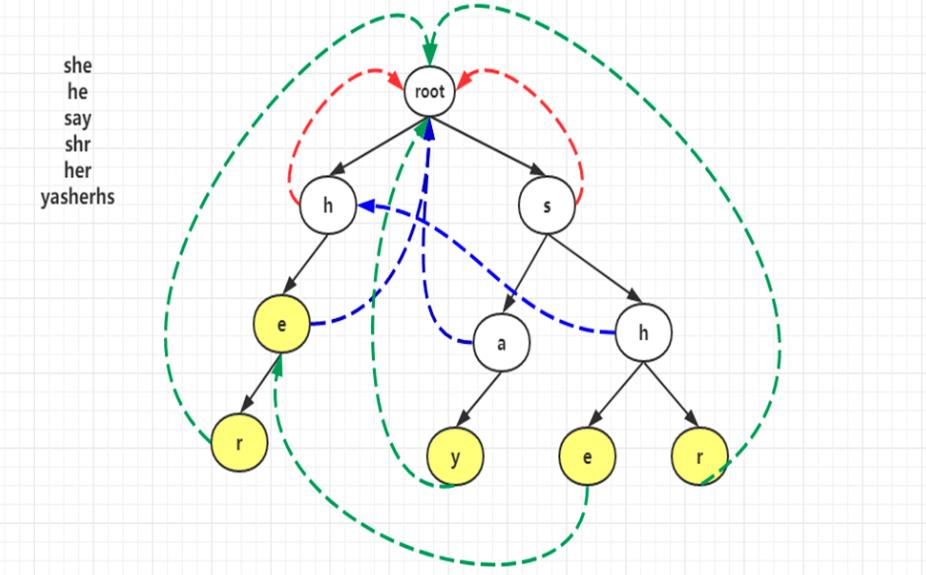

目录

[TOC]

# 1. 常见算法

## 1.1 实现string类

```C++
class my_string
{
private:
    char *m_data;
    int length;

public:
    my_string();                //默认构造函数
    my_string(const char *str); //普通构造函数
    my_string(const my_string &ms);//拷贝构造函数
    ~my_string();//析构函数

    my_string &operator=(const my_string &ms);//赋值函数
    char operator[](const unsigned int index);
};

my_string::my_string()
{
    m_data = new char[1];
    m_data[0] = '\0';
}

my_string::my_string(const char *str)
{
    if(str == NULL)
    {
        m_data = new char[0];
        m_data = '\0';
    }
    else
    {
        int tmp_len = strlen(str);
        m_data = new char[tmp_len + 1];
        length = tmp_len;
        memcpy(m_data, str, tmp_len);
    }
}

my_string::my_string(const my_string &ms)
{
    int tmp_len = strlen(ms.m_data);
    m_data = new char[tmp_len + 1];
    length = tmp_len;
    memcpy(m_data, ms.m_data, tmp_len);
}

my_string::~my_string()
{
    if(m_data != NULL)
    {
        delete[] m_data;
        m_data = NULL;
        length = 0;
    }
}

my_string &my_string::operator=(const my_string &ms)
{
    if(this == &ms)
        return *this;

    if(m_data != NULL)
    {
        delete[] m_data;
        m_data = NULL;
    }

    int tmp_len = strlen(ms.m_data);
    m_data = new char[tmp_len + 1];
    memcpy(m_data, ms.m_data, tmp_len);
    length = tmp_len;
    return *this;
}

char my_string::operator[](const unsigned int index)
{
    return m_data[index];
}
```

## 1.2 Top K问题

```c++
#include <vector>
#include <algorithm>
//使用C++自带堆函数，最小堆获得前k大，最大堆获得前k小
void top_min_k(vector<int> v, int k) {
    if(v.size() <= 0 || k <=0)
        return;
    vector<int> res;
    for(int i = 0; i < k; i++) {
        res.push_back(v[i]);
    }
    make_heap(res.begin(), res.end(), less<int>());

    for(int i = k; i < v.size(); i++) {
        if(v[i] < res[0]) {
            res[0] = v[i];
            make_heap(res.begin(), res.end(), less<int>());
        }
    }
    sort_heap(res.begin(), res.end());
}

void top_max_k(vector<int> v, int k) {
    if(v.size() <= 0 || k <=0)
        return;
    vector<int> res;
    for(int i = 0; i < k; i++) {
        res.push_back(v[i]);
    }
    make_heap(res.begin(), res.end(), greater<int>());

    for(int i = k; i < v.size(); i++) {
        if(v[i] > res[0]) {
            res[0] = v[i];
            make_heap(res.begin(), res.end(), greater<int>());
        }
    }
    sort_heap(res.begin(), res.end());
}

//使用自己的堆函数-获得第K小的数
int get_min_k_num(vector<int> v, int K)
{
    if(v.size() <= 0)
        return 0;

    int *key_heap = new int[K];//大顶堆
    for(int i = 0; i < K; i++)//把k个数形成大顶堆
    {
        make_heap(key_heap, v[i], i);
    }
    //剩余的数，逐个检查是否有小于堆顶的数
    for(int i = K; i < v.size(); i++)
    {
        if(v[i] < key_heap[0])
        {
            key_heap[0] = v[i];
            adjust_heap(key_heap, K);
        }
    }
    int res = key_heap[0];
    delete[] key_heap;
    return res;
}

//构建大根堆
void make_heap(int a[], int num, int index)
{
    a[index] = num;
    while(index)
    {
        int parent = (index - 1) / 2;
        if(a[parent] < a[index])
        {
            swap(a, parent, index);
            index = parent;
        }
        else
        {
            break;
        }
    }
}

//调整堆
void adjust_heap(int a[], int heap_size)
{
    int index = 0;//从堆顶开始向下调整
    int left = index * 2 + 1;//左孩子
    int right = 0;//右孩子
    int largest = 0;
    //左孩子节点未越界
    while(left < heap_size)
    {
        right = left + 1;
        //左孩子和右孩子谁大，谁的下标就是largest的值
        largest = right < heap_size && a[right] > a[left] ? right : left;
        //左右孩子中大的，和其根节点的值比较，较大的为largest
        largest = a[largest] > a[index] ? largest : index;
        if(largest == index)//如果最大的还是根，则不用继续进行调整
        {
            break;
        }
        else
        {//最大的不是根，则交换，然后令index在largest所在子堆中继续调整
            swap(a, largest, index);
            index = largest;
            left = index * 2 + 1;
        }
    }
}
```

- 动态求中位数问题：建立两个堆，一个大根堆和一个小根堆，用大根堆存放比中位数小的元素，，用小根堆存放比中位数大或等于的元素。 每次插入一个数时，偶数个数的情况下，在最小堆中插入元素，奇数个数据的情况下，则在最大堆中插入元素。如果最大堆有数据，且当前元素小于最大堆的根节点(最大值)，则当前数存入最大堆，最大堆堆顶元素弹出，并插入最小堆，反之最小堆有数据，且当前元素大于最小堆的根节点(最小值)，则当前数存入最小堆，最小堆堆顶元素弹出，并插入最大堆。


## 1.3 快排

```c++
//解决最坏情况的随机三路快排
void random_quick_sort(int a[], int left, int right)
{
    if(left >= right)
    {
        return;
    }
    int less = left - 1;
    int more = right + 1;
    int current = left;
    int ran = (rand() % (right - left + 1)) + left;//解决最坏情况
    swap(a, ran, right);
    int index = a[right];
    while(current < more)
    {
        if(a[current] < index)
        {
            swap(a, ++less, current++);
        }
        else if(a[current] > index)
        {
            swap(a, --more, current);
        }
        else
        {
            current++;;
        }
    }
    
    random_quick_sort(a, left, less);//即排序小于index的区间
    random_quick_sort(a, more, right);//排序大于index的区间
}
```

- 荷兰国旗问题使用快排的思路求解；
- 快速排序最坏的情况是给定的数组是有序时，这时时间复杂度会上升到O(n^2)，解决方案就是使用随机快排，每次生成一个待排序区域内的随机的下标，和最右边下标交换，然后再排序即可。


## 1.4 归并排序

```C++
void merge_sort(int a[], int left, int right)
{
    if(left >= right)
    {
        return;
    }
    int mid = left + (right - left)/2;//防止大数越界
    merge_sort(a, left, mid);
    merge_sort(a, mid + 1, right);
    merge(a, left, mid, right);
}

void merge(int a[], int left, int mid, int right)
{
    int size = right - left + 1;
    int* temp = new int[size];
    int i = 0;
    int t1 = left;
    int t2 = mid + 1;
    while(t1 <= mid && t2 <= right)
    {
        temp[i++] = a[t1] < a[t2] ? a[t1++] : a[t2++];
    }
    while(t1 <= mid)
    {
        temp[i++] = a[t1++];
    }
    while(t2 <= right)
    {
        temp[i++] = a[t2++];
    }
    
    for(i = 0; i < size; i++)
    {
        a[left + i] = temp[i];
    }
}
```

- 数组的小数和问题；数组的逆序对问题都使用归并的思路来求解。


## 1.5 字典树/Trie树

- 每个节点保存一个字符，根节点不保存字符
- 每个节点最多有n个子节点(n是所有可能出现字符的个数)
- 查询的时间复杂度为O(k)，k为查询字符串长度

```C++
class Trie
{
public:
    /** Initialize your data structure here. */
    Trie() {
        root = new Node();
    }

    /** Inserts a word into the trie. */
    void insert(string word) {
        if(word.size() <= 0)
            return;
        Node *current_node = root;
        const int len = word.size();
        for(int i = 0; i < len; i++) {
            //current_node中没有走向word[i]的路径
            if(current_node->node.find(word[i]) == current_node->node.end()) {
                current_node->node[word[i]] = new Node();
            }
            //current_node指向下一级节点
            current_node = current_node->node[word[i]];
            current_node->path++;//路径值++
        }
        current_node->end_num++;
    }

    /** Returns if the word is in the trie. */
    bool search(string word) {
        if(word.size() <= 0)
            return false;
        Node *current_node = root;
        const int len = word.size();
        for(int i = 0; i < len; i++) {
            if(current_node->node.find(word[i]) == current_node->node.end())
                return false;//没有以这个节点为头节点的，直接返回，后边都不用找了
            current_node = current_node->node[word[i]];
        }
        return (current_node->end_num >= 1) ? true : false;
    }

    /** Returns if there is any word in the trie that starts with the given prefix. */
    bool startsWith(string prefix) {
        if(prefix.size() <= 0)
            return false;
        Node *current_node = root;
        const int len = prefix.size();
        for(int i = 0; i < len; i++) {
            if(current_node->node.find(prefix[i]) == current_node->node.end())
                return false;//没有以这个节点为头节点的，直接返回，后边都不用找了
            current_node = current_node->node[prefix[i]];
        }
        return true;
    }

private:
        class Node
        {
            public:
                int end_num;    //代表多少个单词以这个结点结尾
                int path;       //代表多少个单词共用这个结点，统计前缀个数
                unordered_map<char, Node*> node;

                Node():end_num(0), path(0){}
        };

        Node *root;
};
```


## 1.6 LRU

```C++
class LRUCache
{
public:
    LRUCache(int capacity) {
        size = 0;
        this-> capacity = capacity;
    }

    int get(int key) {
        unordered_map<int, list<pair<int, int>>::iterator>::iterator it = m.find(key);
        ///如果缓存中没有，返回-1
        if(it == m.end()){
            return -1;
        }
        ///把it->second剪接到cache的开始位置
        cache.splice(cache.begin(), cache, it->second);
        return it->second->second;//返回list中该key对应的value
    }

    void put(int key, int value) {
        unordered_map<int, list<pair<int, int>>::iterator>::iterator it = m.find(key);
        if(it == m.end()){//缓存中没有，直接插入到头部
            pair<int, int> p(key, value);
            cache.insert(cache.begin(), p);
            m[key] = cache.begin();
            size ++;
        }
        else//缓存中存在，则修改其value值，并且设置为最近使用
        {
            it -> second -> second = value;
            cache.splice(cache.begin(), cache, it -> second);
        }
        if(size > capacity)//缓存超了，去掉尾，即最近最少使用的元素
        {
            pair<int, int> p = cache.back();
            m.erase(p.first);
            cache.pop_back();
            size--;
        }
    }
    int size;
    int capacity;
    unordered_map<int, list<pair<int, int>>::iterator> m;//map<key, key和value的迭代器>
    list<pair<int, int>> cache;//双向链表
}
```


## 1.7 背包问题

- 0/1背包 - 每件物品数量为1

  ```C++
  //dp[i][j]=max{ dp[i-1][j], (dp[i-1][j - weight[a]] + value[a])}
   int find_max_value_two(vector<BagNode*> v, int weight)
  {
          vector<vector<int> >dp(v.size(), vector<int>(weight + 1, 0));
          int row = v.size() - 1;
          int col = weight;
          //首先把第一行的值确定
          for(int i = 0; i <= col; i++)
              dp[0][i] = (i >= v[0]->size) ? v[0]->value : 0;
          //从第二行开始
          for(int i = 1; i <= row; i++)
          {
              for(int j = 0; j <= col; j++)
              {
                  if(j >= v[i]->size)//如果当前允许承重y大于当前物品的重量，那么比较放或不放两种情况
                  {
                      dp[i][j] = max(dp[i - 1][j], dp[i - 1][j - v[i]->size] + v[i]->value);
                  }
                  else
                  {
                      dp[i][j] = dp[i - 1][j];
                  }
              }
          }
          return dp[row][col];
  }
  ```

  

- 完全背包 - 每件物品数量无限

  ```c++
  //dp[i][j] = max(dp[i - 1][j], dp[i][j - v[i]->size] + v[i]->value);
  int find_max_value_two(vector<BagNode*> v, int weight)
  {
          vector<vector<int> >dp(v.size(), vector<int>(weight + 1, 0));
          int row = v.size() - 1;
          int col = weight;
  
          //首先把第一行的值确定
          for(int i = 0; i <= col; i++)
              dp[0][i] = (i < v[0]->size) ? 0 : ((i / v[0]->size) * v[0]->value);//与01背包不同
  
          //从第二行开始
          for(int i = 1; i <= row; i++)
          {
              for(int j = 0; j <= col; j++)
              {
                  if(j >= v[i]->size)//如果当前允许承重y大于当前物品的重量，那么比较放或不放两种情况
                  {
                      //与01背包不同
                      dp[i][j] = max(dp[i - 1][j], dp[i][j - v[i]->size] + v[i]->value);
                  }
                  else
                  {
                      dp[i][j] = dp[i - 1][j];
                  }
              }
          }
          return dp[row][col];
  }
  ```

  

- 多重背包 - 每件物品数量有限

  ```C++
  int find_max_value(vector<BagNode*> v, int weight)
  {
          if(v.size() <= 0)
              return 0;
  
          vector<vector<int> >dp(v.size(), vector<int>(weight + 1, 0));
          int row = v.size() - 1;
          int col = weight;
          //第一行的值可以确定
          for(int i = 0; i <= col; i++)
              dp[0][i] = (i < v[0]->size) ? 0 : (min(v[0]->num, i / v[0]->size) * v[0]->value);
  
          for(int i = 1; i <= row; i++)
          {
              for(int j = 0; j <= col; j++)
              {
                  if(j >= v[i]->size)
                  {
                      int num_of_i = min(v[i]->num, j / v[i]->size);//第i件物品可以放num_of_i个
                      dp[i][j] = dp[i - 1][j];//默认为上一行放的值
                      for(int k = 0; k <= num_of_i; k++)
                      {
                          //第i件物品放num_of_i件时，有num_of_i+1种情况，计算每一种的价值，保留最大的一种
                          int temp = dp[i - 1][j - k * v[i]->size] + k * v[i]->value;
                          if(temp >= dp[i][j])
                              dp[i][j] = temp;
                      }
                  }
                  else
                  {
                      dp[i][j] = dp[i - 1][j];
                  }
              }
          }
          return dp[row][col];
  }
  ```

  


## 1.8 单例模式

- 懒汉模式

  - 第一次使用实例对象时，创建对象
  - 优点：时间换空间，用时初始化；
  - 缺点：复杂

  ```c++
  class Singleton {
  public:
      static Singleton* get_instance() {//获取实例
          if(instance == NULL) {//线程安全-双重锁定
              mtx.lock();
              if(instance == NULL) {
                  instance = new Singleton();
              }
              mtx.unlock();
          }
          return instance;
      }
  
  private:
      static Singleton *instance;     //单例对象指针
      static mutex mtx;             //互斥锁
      Singleton();                    //构造函数私有化
      ~Singleton();
      Singleton(const Singleton &);   //拷贝构造函数私有化
      Singleton & operator=(const Singleton &);//赋值构造函数私有
  };
  
  Singleton *Singleton::instance = NULL;  //静态成员变量类外初始化
  mutex Singleton::mtx;
  ```

  

- 饿汉模式

  - 优点：在调用之前实例就初始化好了，线程安全，简单，空间换时间
  - 缺点：可能会导致进程启动慢，且如果有多个单例类对象实例启动顺序不确定。
  - 比较：在访问量较小时，采用懒汉实现，这是以时间换空间。 
  - 在访问量比较大，采用饿汉实现，这是以空间换时间。

```c++
class CSingleton {
private:
    CSingleton() {}
    static CSingleton *m_pInstance;
    class CGarbo {
    public:
        ~CGarbo() {
            if(CSingleton::m_pInstance)
                delete CSingleton::m_pInstance;
        }
    };
    static CGarbo Garbo;
public:
    static CSingleton * GetInstance() {
        if(m_pInstance == NULL)
            m_pInstance = new CSingleton();
        return m_pInstance;
    }
};

CSingleton *CSingleton::m_pInstance = new CSingleton;
CSingleton::CGarbo CSingleton::Garbo;

int main() {
    CSingleton *s1 = CSingleton::GetInstance();
    return 0;
}
```


## 1.9 数据流等概率随机采样-蓄水池抽样

- 问题描述
  - 有一个网页抓取器每秒钟抓取一个网页，定义一个 API，每次调用的时候要等概率的从目前已经抓取的网页中随机选取一个，怎么实现？
  - 给定一个数据流，数据流长度N很大，且N直到处理完所有数据之前都不可知，请问如何在只遍历一遍数据（O(N)）的情况下，能够随机选取出m个不重复的数据。
- 问题思路
  - 这个问题的主要有以下三个点：数据流长度N很大且不可知，所以不能一次性存入内存。时间复杂度为O(N)。随机选取m个数，每个数被选择的概率为m/N。
  - 第1点限制了不能直接取N内的m个随机数，然后按索引取出数据。第2点限制了不能先遍历一遍，然后分块存储数据，再随机选取。第3点是数据选取绝对随机的保证。
  - 算法的大致思路：
    - 1.如果接收的数据量小于m，则依次放入蓄水池；
    - 2.当接收到第i个数据时，i >= m，在[0, i]范围内取以随机数d，若d落在[0，m-1]范围内，则用接收到的第i个数据替换蓄水池中的第d个数据。
    - 3.重复步骤2.
  - 该算法当处理完所有数据时，蓄水池中的每个数据都是以m/N的概率获得的。
  - 说明：假设数据开始编号为1.第i个接收到的数据最后能够留在蓄水池中的概率**=**第i个数据进入过蓄水池的概率*****之后第i个数据不被替换的概率
  - 
  - 进一步-分布式蓄水池抽样：
  - 假设有K台机器，将大数据集分成K个数据流，每台机器使用单机版蓄水池抽样处理一个数据流，抽样m个数据，并最后记录处理的数据量为N1, N2, ..., Nk, ..., NK(假设m<Nk)。N1+N2+...+NK=N。
  - 取[1, N]一个随机数d，若d<N1，则在第一台机器的蓄水池中等概率不放回地（1/m）选取一个数据；若N1<=d<(N1+N2)，则在第二台机器的蓄水池中等概率不放回地选取一个数据；一次类推，重复m次，则最终从N大数据集中选出m个数据。
- 编程实现


## 1.10 海量数据处理问题

### 1、海量日志数据，提取出某日访问百度次数最多的那个IP

  **算法思想：分而治之+Hash**

- IP地址最多有2^32=4G种取值情况，所以不能完全加载到内存中处理； 
- 可以考虑采用“分而治之”的思想，按照IP地址的Hash(IP)%1024值，把海量IP日志分别存储到1024个小文件中。这样，每个小文件最多包含4MB个IP地址； 
- 对于每一个小文件，可以构建一个IP为key，出现次数为value的Hash map，同时记录当前出现次数最多的那个IP地址；
- 可以得到1024个小文件中的出现次数最多的IP，再依据常规的排序算法得到总体上出现次数最多的IP；


### 2、搜索引擎会通过日志文件把用户每次检索使用的所有检索串都记录下来，统计最热门的10个查询串

**每个查询串的长度为1-255字节。**    假设目前有一千万个记录，这些查询串的重复度比较高，虽然总数是1千万，但如果除去重复后，不超过3百万个。一个查询串的重复度越高，说明查询它的用户越多，也就是越热门。请你统计最热门的10个查询串，要求使用的内存不能超过1G。

**算法思想：TOP-K问题**

- 先对这批海量数据预处理，在O（N）的时间内用Hash表完成统计，统计出现次数。
- 借助堆这个数据结构，找出Top K，时间复杂度为N * logK。
- 即借助堆结构，维护一个K(该题目中是10)大小的小根堆，然后遍历查询串，分别和根元素进行对比所以，我们最终的时间复杂度是：O（N） + N'*O（logK）。
- 采用trie树，关键字域存该查询串出现的次数，没有出现为0。最后用10个元素的最小推来对出现频率进行排序。


### 3、有一个1G大小的一个文件，里面每一行是一个词，词的大小不超过16字节，内存限制大小是1M。返回频数最高的100个词。

- 方案：顺序读文件中，对于每个词x，取hash(x)%5000，然后按照该值存到5000个小文件（记为x0,x1,...x4999）中。这样每个文件大概是200k左右。
- 如果其中的有的文件超过了1M大小，还可以按照类似的方法继续往下分，直到分解得到的小文件的大小都不超过1M。
- 对每个小文件，统计每个文件中出现的词以及相应的频率（可以采用trie树/hash_map等），并取出出现频率最大的100个词（可以用含100个结点的最小堆），并把100个词及相应的频率存入文件，这样又得到了5000个文件。下一步就是把这5000个文件进行归并（类似与归并排序）的过程了。


### 4、 给定a、b两个文件，各存放50亿个url，每个url各占64字节，内存限制是4G，找出a、b文件共同的url

- 可以估计每个文件的大小为5G×64=320G，远远大于内存限制的4G。所以不可能将其完全加载到内存中处理。考虑采取**分而治之**的方法。
  - 遍历文件a，对每个url求取hash(url)%1000，然后根据所取得的值将url分别存储到1000个小文件（记为a0,a1,...,a999）中。这样每个小文件的大约为300M。
  - 遍历文件b，采取和a相同的方式将url分别存储到1000小文件（记为b0,b1,...,b999）。这样处理后，所有可能相同的url都在对应的小文件（a0vsb0,a1vsb1,...,a999vsb999）中，不对应的小文件不可能有相同的url。然后我们只要求出1000对小文件中相同的url即可。
  - 求每对小文件中相同的url时，可以把其中一个小文件的url存储到hash_set中。然后遍历另一个小文件的每个url，看其是否在刚才构建的hash_set中，如果是，那么就是共同的url，存到文件里面就可以了。
- 如果允许有一定的错误率，可以使用Bloom filter（布隆过滤器），4G内存大概可以表示340亿bit。将其中一个文件中的url使用Bloom filter映射为这340亿bit，然后挨个读取另外一个文件的url，检查是否与Bloom filter，如果是，那么该url应该是共同的url（注意会有一定的错误率）。


### 5、在2.5亿个整数中找出不重复的整数。

- 采用2-Bitmap（每个数分配2bit，00表示不存在，01表示出现一次，10表示多次，11无意义）进行，

- 共需内存2^32 * 2 bit=1 GB内存。

- 然后扫描这2.5亿个整数，查看Bitmap中相对应位，如数字为7000，则看Bitmap[7000]，如果是00变01，01变10，10保持不变。

- 完全扫描后，遍历bitmap，把对应位是01的整数输出即可。

  

### 6、给40亿个不重复的unsigned int的整数，没排过序的，然后再给一个数，如何快速判断这个数是否在那40亿个数当中？

- **方案：**采用1-Bitmap，申请40亿/() = 512M的内存，一个bit位代表一个unsigned int值。
  - 读入40亿个数，设置bitArr相应的bit位，如数字100，则把bitArr[100]位置置为1，把40亿位置都置完后，读入要查询的数，查看相应bit位是否为1，为1表示存在，为0表示不存在。


### 7、一个文本文件，大约有一万行，每行一个词，要求统计出其中最频繁出现的前10个词，请给出思想，给出时间复杂度分析。

- 方案：用trie树统计每个词出现的次数，时间复杂度是O(nle)（le表示单词的平准长度）。
- 然后是找出出现最频繁的前10个词，可以用堆来实现，前面的题中已经讲到了，时间复杂度是O(nlg10)。
- 所以总的时间复杂度，是O(nle)与O(nlg10)中较大的哪一个。


### 8.海量数据处理方法大总结

- 一、Bloom filter-布隆过滤器
  - 适用范围：可以用来实现数据字典，进行数据的判重，或者集合求交集
  - 基本原理及要点：对于原理来说很简单，位数组+k个独立hash函数。将hash函数对应的值的位数组置1，查找时如果发现所有hash函数对应位都是1说明存在，很明显这个过程并不保证查找的结果是100%正确的。同时也不支持删除一个已经插入的关键字，因为该关键字对应的位会牵动到其他的关键字。所以一个简单的改进就是 counting Bloom filter，用一个counter数组代替位数组，就可以支持删除了。
  - 如何根据输入元素个数n，确定位数组m的大小及hash函数个数。当hash函数个数k=(ln2)(m/n)时错误率最小。在错误率不大于E的情况下，m至少要等于nlg(1/E)才能表示任意n个元素的集合。但m还应该更大些，因为还要保证bit数组里至少一半为0，则m应该>=nlg(1/E)lge 大概就是nlg(1/E)1.44倍(lg表示以2为底的对数)。
  - m与n的单位不同，m是bit为单位，而n则是以元素个数为单位(准确的说是不同元素的个数)。通常单个元素的长度都是有很多bit的。所以使用bloom filter内存上通常都是节省的。
  - 问题实例：给你A,B两个文件，各存放50亿条URL，每条URL占用64字节，内存限制是4G，让你找出A,B文件共同的URL。如果是三个乃至n个文件呢。


- 二、Hashing
  - 适用范围：快速查找，删除的基本数据结构，通常需要总数据量可以放入内存
  - 基本原理及要点：
  - hash函数选择，针对字符串，整数，排列，具体相应的hash方法。
  - 碰撞处理，一种是open hashing，也称为拉链法；
  - 另一种就是closed hashing，也称开地址法，opened addressing。
  - 问题实例：海量日志数据，提取出某日访问百度次数最多的那个IP。IP的数目还是有限的，最多2^32个，所以可以考虑使用hash将ip直接存入内存，然后进行统计。


- 三、bit-map
  - 适用范围：可进行数据的快速查找，判重，删除，一般来说数据范围是int的10倍以下
  - 基本原理及要点：使用bit数组来表示某些元素是否存在
  - 问题实例
    - 已知某个文件内包含一些电话号码，每个号码为8位数字，统计不同号码的个数。
      8位最多99 999 999，大概需要99m个bit，大概10几m字节的内存即可。
    - 2.5亿个整数中找出不重复的整数的个数，内存空间不足以容纳这2.5亿个整数。
  - 将bit-map扩展一下，用2bit表示一个数即可，0表示未出现，1表示出现一次，2表示出现2次及以上。


- 四、堆
  - 适用范围：海量数据前n大，并且n比较小，堆可以放入内存
  - 基本原理：最大堆求前n小，最小堆求前n大。方法，比如求前n小，我们比较当前元素与最大堆里的最大元素，如果它小于最大元素，则应该替换那个最大元素。这样最后得到的n个元素就是最小的n个。适合大数据量，求前n小，n的大小比较小的情况，这样可以扫描一遍即可得到所有的前n元素，效率很高。
  - 扩展：双堆，一个最大堆与一个最小堆结合，可以用来维护数据流的中位数。
  - 问题实例：100w个数中找最大的前100个数。最小堆即可

 

- 五、双层桶划分----本质上就是【分而治之】的思想，重在“分”的技巧上！
  - 适用范围：第k大，中位数，不重复或重复的数字
  - 基本原理及要点：因为元素范围很大，不能利用直接寻址表，所以通过多次划分，逐步确定范围，然后最后在一个可以接受的范围内进行。可以通过多次缩小，双层只是一个例子。
  - 问题实例：
  - 2.5亿个整数中找出不重复的整数的个数，内存空间不足以容纳这2.5亿个整数。有点像鸽巢原理，整数个数为2^32,也就是，我们可以将这2^32个数，划分为2^8个区域(比如用单个文件代表一个区域)，然后将数据分离到不同的区域，然后不同的区域在利用bitmap就可以直接解决了。也就是说只要有足够的磁盘空间，就可以很方便的解决。
  - 5亿个int找它们的中位数。
  - 这个例子比上面那个更明显。首先我们将int划分为2^16个区域，然后读取数据统计落到各个区域里的数的个数，之后我们根据统计结果就可以判断中位数落到那个区域，同时知道这个区域中的第几大数刚好是中位数。然后第二次扫描我们只统计落在这个区域中的那些数就可以了。


- 六、外排序
  - 适用范围：大数据的排序，去重
  - 基本原理及要点：外排序的归并方法，置换选择败者树原理，最优归并树
  - 问题实例：有一个1G大小的一个文件，里面每一行是一个词，词的大小不超过16个字节，内存限制大小是1M。返回频数最高的100个词。这个数据具有很明显的特点，词的大小为16个字节，但是内存只有1m做hash有些不够，所以可以用来排序。内存可以当输入缓冲区使用。


- 七、trie树
  - 适用范围：数据量大，重复多，但是数据种类小可以放入内存
  - 基本原理及要点：实现方式，节点孩子的表示方式
  - 问题实例：
    - 有10个文件，每个文件1G，每个文件的每一行都存放的是用户的query，每个文件的query都可能重复。要你按照query的频度排序。
    - 1000万字符串，其中有些是相同的(重复),需要把重复的全部去掉，保留没有重复的字符串。请问怎么设计和实现？
    - 寻找热门查询：查询串的重复度比较高，虽然总数是1千万，但如果除去重复后，不超过3百万个，每个不超过255字节。


## 1.11 各种排序算法的时间复杂度说明

| 排序算法                                                     | 平均时间复杂度 | 最差时间复杂度 | 空间复杂度 | 数据对象稳定性       |
| ------------------------------------------------------------ | -------------- | -------------- | ---------- | -------------------- |
| [冒泡排序](https://github.com/huihut/interview/blob/master/Algorithm/BubbleSort.h) | O(n2)          | O(n2)          | O(1)       | 稳定                 |
| [选择排序](https://github.com/huihut/interview/blob/master/Algorithm/SelectionSort.h) | O(n2)          | O(n2)          | O(1)       | 数组不稳定、链表稳定 |
| [插入排序](https://github.com/huihut/interview/blob/master/Algorithm/InsertSort.h) | O(n2)          | O(n2)          | O(1)       | 稳定                 |
| [快速排序](https://github.com/huihut/interview/blob/master/Algorithm/QuickSort.h) | O(n*log2n)     | O(n2)          | O(log2n)   | 不稳定               |
| [堆排序](https://github.com/huihut/interview/blob/master/Algorithm/HeapSort.cpp) | O(n*log2n)     | O(n*log2n)     | O(1)       | 不稳定               |
| [归并排序](https://github.com/huihut/interview/blob/master/Algorithm/MergeSort.h) | O(n*log2n)     | O(n*log2n)     | O(n)       | 稳定                 |
| [希尔排序](https://github.com/huihut/interview/blob/master/Algorithm/ShellSort.h) | O(n*log2n)     | O(n2)          | O(1)       | 不稳定               |
| [计数排序](https://github.com/huihut/interview/blob/master/Algorithm/CountSort.cpp) | O(n+m)         | O(n+m)         | O(n+m)     | 稳定                 |
| [桶排序](https://github.com/huihut/interview/blob/master/Algorithm/BucketSort.cpp) | O(n)           | O(n)           | O(m)       | 稳定                 |
| [基数排序](https://github.com/huihut/interview/blob/master/Algorithm/RadixSort.h) | O(k*n)         | O(n2)          |            | 稳定                 |


- 桶排序：
  - 将待排序的元素划分到不同的桶中，首先扫描一遍序列求出最大值 maxV 和最小值 minV，设桶的个数为 k ，则把区间 [minV, maxV] 均匀划分成 k 个区间，每个区间就是一个桶。将序列中的元素分配到各自的桶。
  - 对每个桶内的元素进行排序。可以选择任意一种排序算法。
  -  将各个桶中的元素顺序合并成一个大的有序序列。
  - 假设数据是均匀分布的，则每个桶的元素平均个数为 n/k 。
  - 假设选择用快排对每个桶内的元素进行排序，那么每次排序的时间复杂度为 O(n/klog(n/k)) 。当 k 接近于 n 时，桶排序的时间复杂度就可以认为是 O(n) 。即桶越多，时间效率就越高，而桶越多，空间就越大。
- 基数排序：
  - 将整数按位数切割成不同的数字，然后按每个位数分别比较。
  - 将所有待比较数值统一为同样的数位长度，数位较短的数前面补零。然后，从最低位开始，依次进行一次排序。这样从最低位排序一直到最高位排序完成以后, 数列就变成一个有序序列。
- 计数排序：
  - 其思路是开一个长度为 maxValue - minValue + 1 的数组，然后：
  - 分配：扫描一遍原始数组，以当前值 减去 minValue 作为下标，将该下标的计数器增 1。


## 1.12 图的搜索算法

- BFS-广度优先搜索：类似树的层次遍历，先把临近的都走完，

  - ```C++
    初始化队列Queue
    Queue={起点s}；s标记为已访问；
    while(Queue非空) {
    	取Queue队首元素u；u出队；
    	if(u == 目标状态) {...}
    	所有与u相邻且未被访问的点进入队列；
    	标记u为已被访问；
    }
    ```

  - 例子：眼镜掉在地上，趴在地上找，先把最近的地方找一遍，如果没有，再往远的地方去找；

- DFS-深度优先搜索：一直往深处走，直到找到或者走不下去为止，

  - ```c++
    DFS（depth, ...）{
        if(找到解 || 走不下去) {
            ...
            return;
        }
        DFS(depth + 1, ...)
    }
    ```

  - 使用栈保存未被检测的结点，结点按照深度优先的次序被访问并依次被压入栈中，并以相反的次序出栈进行新的检测。

  - 例子：走迷宫，因为没法用分身术站在每个走过的位置，所以只能一路走到底；

- 


## 1.13 一致性哈希

- 一致性哈希：一致性哈希将整个哈希值空间组织成一个虚拟的圆环，如假设某哈希函数H的值空间为0-2 ^ 32-1（即哈希值是一个32位无符号整形）。
- 整个空间按顺时针方向组织。0和2^32-1在零点处重合。
- 下一步将各个服务器/缓存节点使用Hash进行一个哈希，具体可以选择服务器的ip或主机名作为关键字进行哈希，这样每台机器就能确定其在哈希环上的位置。
- 接下来将数据key使用相同的函数Hash计算出哈希值，并确定此数据在环上的位置（代码实现时可以使用二分法，找到数据key计算出的hash值在服务器计算出的排好序的哈希值中应该归属的服务器），从此位置沿环顺时针“行走”，第一台遇到的服务器就是其应该定位到的服务器。
- 假设环上有数据A会被定为到NodeA上，B被定为到NodeB上，C被定为到NodeC上，D被定为到Node D上。若NodeC宕机，则NodeA、NodeB、NodeD不会受到影响，只有C被重定位到NodeD。如果在系统中增加一台服务器NodeX，其位置在NodeB和NodeC之间且在数据C顺时针之后的位置，则只有数据C被重定位到NodeX，其他节点不会受到影响。
- 综上所述，一致性哈希算法对于节点的增减都只需重定位环空间中的一小部分数据，具有较好的容错性和可扩展性。
- 扩容：一致性哈希算法在服务节点太少时，容易因为节点分部不均匀而造成数据倾斜问题。
  - 引入了虚拟节点机制，即对每一个服务节点计算多个哈希，每个计算结果位置都放置一个此服务节点，称为虚拟节点。
  - 具体做法可以在服务器ip或主机名的后面增加编号来实现。例如上面的情况，可以为每台服务器计算三个虚拟节点，于是可以分别计算 “Node A#1”、“Node A#2”、“Node A#3”、“Node B#1”、“Node B#2”、“Node B#3”的哈希值，于是形成六个虚拟节点。
  - 同时数据定位算法不变，只是多了一步虚拟节点到实际节点的映射，例如定位到“Node A#1”、“Node A#2”、“Node A#3”三个虚拟节点的数据均定位到Node A上。
  - 这样就解决了服务节点少时数据倾斜的问题。


## 1.14 红黑树

- 基本性质：
  - 树中所有节点非红即黑。
  - 根节点必为黑节点。
  - 叶子节点(NULL节点)一定为黑。
  - 红节点的子节点必为黑（黑节点子节点可为黑）。
  - 从根到NULL的任何路径上黑结点数相同。
- 从根节点到叶子节点的最长路径不可能大于最短路径的2倍。大致平衡的二叉树，并不是完全严格平衡的。
- 操作的时间复杂度：插入、删除、调整均为O(logN)
- 红黑树相比较于BST和AVL有什么优点？
  - 相比于BST(二叉查找树)，因为红黑树可以能确保树的最长路径不大于两倍的最短路径的长度，所以可以看出它的查找效果是有最低保证的。在最坏的情况下也可以保证O(logN)的，这是要好于二叉查找树的。因为二叉查找树最坏情况可以让查找达到O(N)。
  - 相比于AVL(二叉平衡树)，因为AVL树是一定平衡的，所以在插入和删除中所做的后期维护操作肯定会比红黑树要耗时好多，红黑数插入和删除最多只需要3次旋转。
- 插入的调整过程：插入的节点为红色，
  - 如果插入的节点N，父节点为黑色，则直接插入即可；
  - 如果插入的节点N，父节点是红,
    - case1：叔父节点为红，则把父节点和叔叔节点涂成黑色，祖父节点涂成红色。将祖父结点作为新插入的结点继续向上迭代进行平衡操作，在迭代时如果调整到根，则根为黑色，跳出循环
    - case2：叔父节点为黑，插入节点，父亲节点，祖父节点三者不在一条直线上：
      - 以父节点右旋（若插入节点是父亲节点的右儿子则左旋），将父亲节点看为新的插入节点，将情况转化为case3,即三者在一条直线上的情况 ，交给case 3处理。
    - case3：叔父节点为黑，插入节点，父亲节点，祖父节点三者在一条直线上：
      - 交换父亲节点和祖父节点的颜色，然后以祖父节点右旋（若直线是右孩子情况则进行左旋操作）
  - 
- 


## 1.15 AC自动机

- 自动机：trie虽然能用于多模式匹配,但是每次匹配失败都需要进行回溯,如果模式串很长的话会很浪费时间,所以AC自动机应运而生。
- ac自动机,就是在tire树的基础上,增加一个fail指针,如果当前点匹配失败,则将指针转移到fail指针指向的地方,这样就不用回溯,而可以匹配下去了.fail指针的构建都是用BFS实现的。
- 对于直接与根节点相连的节点：他们的Fail指针直接指向root。
- 其他节点其Fail指针求法如下：
  - 假设当前节点为father，其孩子节点记为child。
  - 求child的Fail指针时，首先我们要找到其father的Fail指针所指向的节点tmp,
  - 假如tmp的孩子中有和child节点所表示的字母相同的节点，则这个节点就是child的fail指针，
  - 如果发现没有，则需要找father->fail->fail这个节点，然后重复上面过程，如果一直找都找不到，则child的Fail指针就要指向root。
- 一个构建失败指针例子：




- 首先我们将root入队。
- 第零层：root节点
- 第一层（fail为红色虚线）：root出队，遍历root所有的子节点h，s使之fail指向root，并且将h，s入队。
- 第二层（fail为蓝色虚线）：
  - h出队，找到e，找到h节点的失败节点root，root节点下无e节点，**因为节点为root**，e的fail指向root，e入队。
  - s出队，找到a，找到s节点的失败节点root，root节点下无a节点，**因为节点为root**，a的fail指向root，a入队。
  - 找到h，找到s节点的失败节点root，**root下有h节点**，第二层的h节点的fail指向root节点的子节点h。h入队。

- 第三层（fail为绿色虚线）：
  - e出队，找到r，找到e节点的失败节点root，root节点下无r节点，**因为节点为root**，r的fail指向root，r入队。
  - a出队，找到y，找到a节点的失败节点root，root节点下无y节点，**因为节点为root**，y的fail指向root，y入队。
  - h出队，找到e，找到h节点（第二层）的失败节点h节点（第一层），h节点下有e节点，则当前e节点的fail指针指向第二层的e节点。e入队。
  - 找到r，找到h节点（第二层）的失败节点h节点（第一层），h节点下没有r节点，然后找h节点（第一层）的fail指针，是root，则当前r节点的fail指针指向root。r入队。

- 一次匹配的例子：用上面已经构造好的 AC 自动机
- 我们现在用目标串：yasherhs 进行匹配，设匹配节点 p，初始节点 p=root，当 i=0,1 时匹配不成功。p 依旧指向 root。
- 当 i=2，3，4 时，p 节点匹配路径为 she，p 指向了第三层的 e 节点，计数一次 (1)。
- 现在构建临时的一个 temp 节点，temp=p, 去找 temp->fail，发现 temp->fail 也为结尾，计数一次 (2)。继续找 temp->fail->fail, 找到 root 结束。
- 当 i=5 时，继续寻找 p 节点的子节点，没找到 r 节点，p=p->fail，我们找到了第二层的 e 节点，找到子节点 r，p=r，r 为结尾节点，计数一次 (3)。
- 当 i=6 时，未找到 h 子节点，p 回到了 r->fail 节点 root。
- 当 i=7 时，找到 h 节点但并不是结尾节点。
- i=8 回到 root。结束。


## 1.16 CDN

- 什么是CDN？
  - 内容分发网络CDN；
  - CDN是构建在网络之上的内容分发网络；
  - CDN使用户就近获取所需内容，降低网络拥塞，提高用户访问的响应速度和命中率；
  - CDN依靠部署在各地的边缘服务器，包括中心平台的负载均衡、内容分发、调度等模块；
- CDN的服务模式是什么？
  - **分发服务系统**：最基本的工作单元就是Cache，边缘cache负载响应最终用户的访问请求，把缓存在本地的内容快速提供给用户。同时cache还负责与源站点进行内容同步，把更新的内容以及本地没有的内容从源站点获取并保存到本地。
  - **负载均衡系统**：负责对所有发起服务请求的用户进行访问调度，确定提供给用户的最终实际访问地址。分为两级调度体系，全局负载均衡和本地负载均衡。
    - 全局负载均衡：依据用户就近性原则，通过对每个服务节点进行“最优”判断，确定向用户提供服务的cache的物理位置；
    - 本地负载均衡：负责节点内部设备的负载均衡；
  - **管理系统**：负责外界交互等。
- 有 CDN 的时候用户浏览 web 流程和无 CDN 的时候有什么区别？
  - 无CDN：
    - 用户在浏览器输入要访问的网站域名；
    - 浏览器向本地Host和本地DNS服务器请求该域名的解析；
    - 本地DNS服务器如果有缓存，则直接响应用户的解析请求；如果没有，则本地DNS服务器去根域名服务器、顶级域名服务器、二级域名服务器、三级域名服务器进行迭代查询，将应答结果反馈；
    - 浏览器得到域名解析结果，即该域名对应的IP地址；
    - 浏览器向对应IP地址建立TCP三次握手和HTTP请求，HTTP服务器处理请求后，向用户请求内容传送给浏览器。
  - 有CDN：
    - 当用户访问网站的URL时，经本地DNS服务器解析，DNS系统最终会将域名解析权交给CNAME指向的CDN专用的DNS服务器；
    - CDN专用的DNS服务器将CDN的全局负载均衡设备IP地址返回给用户；
    - 用户向CDN的全局负载均衡设备发起内容URL的访问请求；
    - CDN全局负载均衡设备根据用户IP地址，及用户请求的内容URL，选择一台用户所属区域负载均衡设备，让用户向这台设备发起请求；选择的依据包括：根据用户IP地址，判断哪一台服务器距用户最近；根据用户所请求的URL中携带的内容名称，判断哪一台服务器上有用户所需内容；查询各个服务器当前的负载情况，判断哪一台服务器尚有服务能力。
    - 区域负载均衡设备会为用户选择一台合适的缓存服务器提供服务器；
    - 用户向该缓存服务器发起请求，缓存服务器响应用户请求，将用户所需的请求内容传送给用户；
    - 如果这台缓存服务器没有用户所需内容，则这台服务器就向它的上一级缓存服务器请求内容，直到追溯到该网站的原始服务器将内容拉到本地。
- CDN 的关键技术有什么？
  - 缓存算法：Squid
  - 分发能力
  - 负载均衡：Nginx
  - 基于DNS：DNS服务器软件BIND
  - 支持协议：支持https协议，流媒体等等
- 


## 1.17 strcpy、memcpy、strcat、strcmp

- strcpy函数

```C++
//不考虑地址覆盖
char *strcpy(char *dst, const char *src) {
    assert(dst);
    assert(src);
    char *ret = dst;
    while((dst++ = src++) != '\0');
    return ret;
}
//考虑地址覆盖
char* strcpy(char* dst, const char* src){
    if(!dst || !src)
        return NULL;
    int len = strlen(src) + 1;//拷贝最后的'/0'
    char *ret = dst;
    if(dst > src && dst < len + 1){
        dst = dst + len -1;
        src = src + len -1;
        while(len--){
            *dst-- = *src--;
        }
    }
    else{
        while(len--){
            *dst-- = *src--;
        }
    }
    
    return ret;
}
```


- memcpy函数

```C++

void *memcpy(void *dst, const void *src, size_t size) {
	if (dst == NULL || src == NULL)
        return NULL;
	void *ret = dst;
	char* pdst = (char*)dst;
	char* psrc = (char*)src;
	if (pdst > src || pdst < psrc + size) {
		pdst = pdst + size - 1;
		psrc = psrc + size - 1;
		while (size--) {
			*pdst-- = *psrc--;
		}
	}
	else {
		while (size--) {
			*pdst++ = *psrc++;
		}
	}
	return ret;
}
```


- strcat函数

```C++
char* strcat(char*dst,const char*src) {
	if (dst == NULL || src == NULL)
        return NULL;
	char *ret = dst;
	while (*dst != '\0')
        dst++;
	while ((*dst++ = *src++) != '\0');
	return ret;
}
```


- strcmp函数

```C++
int strcmp(const char* str1, const char* str2) {
	while (*str1 == *str2 && str1 != '\0') {
		str1++;
		str2++;
	}
	return *str1 - *str2;
}
```


## 1.18 布隆过滤器

- 布隆过滤器是一种数据结构，可以高效的插入和查询，某样东西一定不存在或者可能存在，存在误差；
- 布隆过滤器是一个bit数组，如果我们要映射一个值到布隆过滤器中，我们需要使用多个不同的哈希函数生成多个哈希值，并对每个生成的哈希值指向的 bit 位置 1，
- 例如针对值 “baidu” 和三个不同的哈希函数分别生成了哈希值 1、4、7，则把bit数组的1,4,7位置置1；进行查询时，对要查询的串进行哈希，然后检查bit数组对应的位置是否都被置1，如果都被置1，则认为找到了，否则就一定不存在。
- 布隆过滤器可以支持 add 和 isExist 操作，不支持delete 操作。


## 1.19 KMP算法

- 操作流程：
  - 假设现在文本串S匹配到i位置，模式串P匹配到j位置；
  - 如果j == -1,或者当前字符匹配成功，即S[i] = P[j] ，令i++，j++，继续匹配下一个字符；
  - 如果j != -1 , 且当前字符串匹配失败，，即S[i] != P[j]，则令i不变，j = next[j]，这时匹配失败，模式串P相对于文本串S向右移动了j - next[j]位；
  - 换言之，将模式串P失配位置的next数组的值对应的模式串P的索引位置移动到失配处。
- 


# 2. LeetCode Top Hot

## 2.1 双指针

### 2.1.1 有序数组的 Two Sum

- 问题描述：
  - 在有序数组中找出两个数，使它们的和为 target。
  - 函数应该返回这两个下标值 index1 和 index2，其中 index1 必须小于 index2*。*
  - 如果有多个，则返回字典序最小的。
- 问题思路：
  - 使用双指针，一个指针指向值较小的元素，一个指针指向值较大的元素。指向较小元素的指针从头向尾遍历，指向较大元素的指针从尾向头遍历。
  - 如果两个指针指向元素的和 sum == target，那么得到要求的结果；
  - 如果 sum > target，移动较大的元素指针；如果 sum < target，移动较小的元素指针；
- 编程实现：

```C++
//假设输入为[2, 7, 11, 15]
#include <iostream>
#include <vector>
#include <string>
#include <sstream>
#include <algorithm>
using namespace std;

class Solution {
public:
    vector<int> twoSum(vector<int>& numbers, int target) {
        int len = numbers.size();
        vector<int> res;
        if(len <= 0) {
            return res;
        }
        
        int left = 0;
        int right = len - 1;
        
        while(left < right) {
            int tmp = numbers[left] + numbers[right];
            if(tmp == target) {
                res.push_back(left);
                res.push_back(right);
                return res;
            }
            else if(tmp > target) {
                right--;
            }
            else {
                left++;
            }
        }
        
        return res;
    }
};

void trimLeftTrailingSpaces(string &input) {
    input.erase(input.begin(), find_if(input.begin(), input.end(), [](int ch) {
        return !isspace(ch);
    }));
}

void trimRightTrailingSpaces(string &input) {
    input.erase(find_if(input.rbegin(), input.rend(), [](int ch) {
        return !isspace(ch);
    }).base(), input.end());
}

//从输入中取出数字并返回数组
vector<int> stringToIntegerVector(string input) {
    vector<int> output;
    trimLeftTrailingSpaces(input);
    trimRightTrailingSpaces(input);
    input = input.substr(1, input.length() - 2);
    stringstream ss;
    ss.str(input);
    string item;
    char delim = ',';
    while (getline(ss, item, delim)) {
        output.push_back(stoi(item));
    }
    return output;
}

int stringToInteger(string input) {
    return stoi(input);
}

int main() {
    string line;
    while (getline(cin, line)) {
        vector<int> numbers = stringToIntegerVector(line);
        getline(cin, line);
        int target = stringToInteger(line);
        
        vector<int> ret = Solution().twoSum(numbers, target);
        
        for(auto a : ret) {
            cout << a << " ";
        }
        cout << endl;
    }
    return 0;
}
```


### 2.1.2 两数平方和

- 问题描述：
  - 判断一个数是否为两个数的平方和
- 问题思路：
  - 双指针
- 编程实现：

```C++
    bool judgeSquareSum(int c) {
        long long one = 0;
        long long two = sqrt(c);
        
        while(one <= two) {
            long long tmp = one * one + two * two;//int会溢出
            if(tmp == c) {
                return true;
            }
            else if(tmp > c) {
                two--;
            }
            else {
                one++;
            }
        }
        
        return false;
    }
```


### 2.1.3 反转字符串中的元音字符

- 问题描述：
  - 编写一个函数，以字符串作为输入，反转该字符串中的元音字母。
- 问题思路
  - 使用双指针指向待反转的两个元音字符，一个指针从头向尾遍历，一个指针从尾到头遍历
- 编程实现

```C++
	bool find(char c) {
        return c == 'a' || c == 'e' || c == 'i' || c == 'o' || c == 'u'
        ||c == 'A' || c == 'E' || c == 'I' || c == 'O' || c == 'U';
    }

    string reverseVowels(string s) {
        int i=0;
        int j=s.size()-1;
        while(i < j) {
            while(!find(s[i]) && i < j)
                i++;
            while(!find(s[j]) && i < j)
                j--;
            swap(s[i++], s[j--]);
        }
        return s;
    }
```


### 2.1.4 回文字符串

- 问题描述：
  - 给定一个非空字符串 `s`，最多删除一个字符。判断是否能成为回文字符串。
- 问题思路
  - 从左右两端开始验证是否是回文串，验证的过程中，若两个字符不等，由于只是删除一个字符，那么要么删除左边，要么删除右边,即左右各加一或减一，再验证一遍；
- 编程实现

```C++
	bool validPalindrome_core(string s, int i, int j) {
        while(i < j) {
            if(s[i++] != s[j--]) {
                return false;
            }
        }
        return true;
    }
    
    bool validPalindrome(string s) {
        for(int i = 0, j = s.length() - 1; i < j; i++, j--) {
            if(s[i] != s[j]) {
                return validPalindrome_core(s, i, j - 1) 
                    || validPalindrome_core(s, i + 1, j);
            }
        }
        
        return true;
    }
```


### 2.1.5 归并两个有序数组

- 问题描述：
  - 给定两个有序整数数组 *nums1* 和 *nums2*，将 *nums2* 合并到 *nums1* 中*，*使得 *num1* 成为一个有序数组。
- 问题思路
  - 通过 *双指针法* 达到O(n + m)*O*(*n*+*m*)的时间复杂度。
  - 将指针p1 置为 nums1的开头， p2为 nums2的开头，在每一步将最小值放入输出数组中。由于 nums1 是用于输出的数组，需要将nums1中的前m个元素放在其他地方，也就需要 O(m)O(m) 的空间复杂度。

- 编程实现

```C++
	void merge(vector<int>& nums1, int m, vector<int>& nums2, int n) {
        int i = m - 1, j = n - 1, index = m + n - 1;
        while (i >= 0 && j >= 0) {
            nums1[index--] = nums1[i] > nums2[j] ? nums1[i--] : nums2[j--];
        }
        while (j >= 0) {
            nums1[index--] = nums2[j--];
        }
    }
```


### 2.1.6 判断链表是否存在环

- 问题描述：
  - 给定一个链表，返回链表开始入环的第一个节点。 如果链表无环，则返回 `null`。
- 问题思路
  - 首先用快慢指针确认是否存在环是否存在，如果两个指针相遇，表明链表中存在环，并且两个指针相遇的结点一定在环中。然后令快指针回到链表头位置，快慢指针均每次前进一步，则快慢指针下次相遇的位置就是环的入口节点。
- 编程实现

```C++
	ListNode *detectCycle(ListNode *head) {
        if(head == NULL || head->next == NULL) 
            return NULL;
        ListNode *fast = head->next;
        ListNode *slow = head;
        ListNode *res = nullptr;
        while(fast != NULL && fast->next != NULL){
            if(fast == slow) {
                res = slow;
                break;
            }
            fast = fast->next->next;
            slow = slow->next;
        }
        if(res == NULL) 
            return NULL;
        
        res = res->next;
        ListNode *tmp = head;
        while(res != tmp) {
            res = res->next;
            tmp = tmp->next;
        }
        return res;
    }
```


### 2.1.7 通过删除字母匹配到字典里最长单词

- 问题描述：
  - 给定一个字符串和一个字符串字典，找到字典里面最长的字符串，该字符串可以通过删除给定字符串的某些字符来得到。如果答案不止一个，返回长度最长且字典顺序最小的字符串。如果答案不存在，则返回空字符串。
- 例如：s = "abpcplea", d = ["ale","apple","monkey","plea"]，输出：apple
  
- 问题思路
  - 通过删除字符串 s 中的一个字符能得到字符串 t，可以认为 t 是 s 的子序列，我们可以使用双指针来判断一个字符串是否为另一个字符串的子序列。
- 编程实现

```C++
	string findLongestWord(string s, vector<string>& d) {
        string res="";
        for(string &t : d) {
            //如果当前结果的长度更长
            //或者二者长度相等时，res的字典序更小。
            //string的<是两个字符串自左向右逐个字符相比（按ASCII值大小相比较）
            if(res.size() > t.size() || (res.size() == t.size() && res < t))
                continue;
            if(issubstr(s,t))
                res = t;
        }
        return res;
    }
    //双指针判断t是否为s的子序列
    bool issubstr(string &s,string &t){
        int i = 0,j = 0;
        while(i < s.size() && j < t.size()){
            if(s[i]==t[j])
                j++;
            i++;
        }
        return j == t.size();
    }
```


## 2.2 动态规划

### 2.2.1 斐波那契数列

#### 爬楼梯

- 问题描述：

  - 有 N 阶楼梯，每次可以上一阶或者两阶，求有多少种上楼梯的方法。

- 问题思路

  - 最经典的动态规划问题；

  - 定义一个数组 dp 存储上楼梯的方法数，dp[i] 表示走到第 i 个楼梯的方法数目。

  - $$
    dp(i)=\left\{
    \begin{aligned}
    & 1, i = 1 \\
    & 2, i = 2 \\
    & dp[i - 1] + dp[i - 2] ,i > 2
    \end{aligned}
    \right.
    $$

    

- 编程实现

```C++
	int climbStairs(int n) {
        if(n <= 2) {
            return n;
        }
        int res = 0;
        int tmp_one = 1;
        int tmp_two = 2;
        for(int i = 2; i < n; i++) {
            res = tmp_one + tmp_two;
            tmp_one = tmp_two;
            tmp_two = res;
        }
        
        return tmp_two;
    }
```


#### 强盗抢劫

- 问题描述：
  - 抢劫一排住户，但是不能抢邻近的住户，求最大抢劫量。
  - 输入: [2,7,9,3,1],输出: 12
  - 解释: 偷窃 1 号房屋 (金额 = 2), 偷窃 3 号房屋 (金额 = 9)，接着偷窃 5 号房屋 (金额 = 1)。偷窃到的最高金额 = 2 + 9 + 1 = 12 
- 问题思路
  - 定义 dp 数组用来存储最大的抢劫量，其中 dp[i] 表示抢到第 i 个住户时的最大抢劫量。由于不能抢劫邻近住户，如果抢劫了第 i -1 个住户，那么就不能再抢劫第 i 个住户，所以:
  - dp[i] = max ( dp[i - 2] + nums[i],  dp[i - 1]);
- 编程实现

```C++
	int rob(vector<int>& nums) {
        int pre2 = 0, pre1 = 0;
        for (int i = 0; i < nums.size(); i++) {
            int cur = max(pre2 + nums[i], pre1);
            pre2 = pre1;
            pre1 = cur;
        }
        return pre1;
    }
```


#### 强盗在环形街区抢劫

- 问题描述：
  - 上一个问题的进阶版，所有房屋连成一个环，
  - 输入: [2,3,2]，输出: 3
  - 解释: 你不能先偷窃 1 号房屋（金额 = 2），然后偷窃 3 号房屋（金额 = 2）, 因为他们是相邻的。
- 问题思路
  - 和上一题的不同就是，第一个和最后一个不能同时抢，对去掉第一个元素和去掉最后一个元素的数组分别进行dp，即问题分成求 `nums[0:n - 1]`或者 `nums[1:n]`
- 编程实现

```C++
	int rob(const vector<int> &nums, int start, int end) {
        int dp0 = 0, dp1 = (end - start > 0 ? nums[start] : 0), dp;
        for (int i = start + 1; i < end; i++) {
            dp = max(dp1, dp0 + nums[i]);
            dp0 = dp1;
            dp1 = dp;
        }
        return dp1;
    }
    
    int rob(vector<int>& nums) {
        // 第一个和最后一个不能共存，分别dp去掉第一个/去掉最后一个，求max即可
        return nums.size() == 1 ? nums[0] : max(rob(nums, 0, nums.size() - 1), rob(nums, 1, nums.size()));
    }
```


#### 信件错排

- 问题描述：
  - 有 N 个 信 和 信封，它们被打乱，求错误装信方式的数量。
- 问题思路
  - 定义一个数组 dp 存储错误方式数量，dp[i] 表示前 i 个信和信封的错误方式数量。
  - 假设第 i 个信装到第 j 个信封里面，而第 j 个信装到第 k 个信封里面。根据 i 和 k 是否相等，有两种情况：
  - i==k，交换 i 和 k 的信后，它们的信和信封均在正确的位置，但是其余 i-2 封信有 dp[i-2] 种错误装信的方式。由于 j 有 i-1 种取值，因此共有 (i-1)*dp[i-2] 种错误装信方式。
  - i != k，交换 i 和 j 的信后，第 i 个信和信封在正确的位置，其余 i -1 封信有 dp[i-1] 种错误装信方式。由于 j 有 i-1 种取值，因此共有 (i-1)*dp[i-1] 种错误装信方式。
  - dp[i] = (i-1) * (dp[i - 2] + dp[i - 1]);
- 编程实现

```C++
int error_num(int n) {
    if(n <= 1) {
        return 0;
    }
    
    vector<int> dp(n + 1, 0);
    dp[2] = 1;
    
    for(int i = 3; i <= n; i++) {
        dp[i] = (i - 1) * (dp[i - 1] + dp[i - 2]);
    }
    
    return dp[n];
}
```


#### 母牛生产

- 问题描述：
  - 假设农场中成熟的母牛每年都会生 1 头小母牛，并且永远不会死。第一年有 1 只小母牛，从第二年开始，母牛开始生小母牛。每只小母牛 3 年之后成熟又可以生小母牛。给定整数 N，求 N 年后牛的数量。
- 问题思路
  - dp[i] = dp[i - 1] + dp[i - 3];
- 编程实现

```C++
int cow_num(int n) {
    if(n <= 4) {
        return n;
    }
    
    vector<int> dp(n + 1, 0);
    dp[0] = 1;
    dp[1] = 2;
    dp[2] = 3;
    dp[3] = 4;
    
    for(int i = 3; i < n; i++) {
        dp[i] = dp[i - 1] + dp[i - 3];
    }
    
    return dp[n - 1];
}
```


### 2.2.2 矩阵路径

#### 矩阵的最小路径和

- 问题描述：
  - 给定一个包含非负整数的 *m* x *n* 网格，请找出一条从左上角到右下角的路径，使得路径上的数字总和为最小。每次只能向下或者向右移动一步。
- 问题思路
  - 暴力就是利用递归，对于每个元素我们考虑两条路径，向右走和向下走，在这两条路径中挑选路径权值和较小的一个。
  - 动态规划思路：使用一维数组dp，dp数组的大小和列大小相同，遍历整个矩阵，对于边界，只能从上侧或者左侧走到，对于其他位置，dp[j] = grid [ i ] [ j ] + min(dp[j], dp[j - 1]);这样遍历之后，dp[n-1]即为所求结果。
- 编程实现

```C++
	int minPathSum(vector<vector<int>>& grid) {
        if(grid.size() <= 0 || grid[0].size() <= 0) {
            return 0;
        }
        
        int row = grid.size();
        int col = grid[0].size();
        
        vector<int> dp(col, 0);
        
        for(int i = 0; i < row; i++) {
            for(int j = 0; j < col; j++) {
                if(j == 0) {
                    dp[j] = dp[j];//只能从上侧走到该位置
                }
                else if(i == 0) {
                    dp[j] = dp[j - 1];//只能从左侧走到该位置
                }
                else {
                    dp[j] = min(dp[j - 1], dp[j]);
                }
                
                dp[j] += grid[i][j];
            }
        }
        
        return dp[col - 1];
    }
```


#### 矩阵的总路径数

- 问题描述：
  - 一个机器人位于一个 m x n 网格的左上角 ，机器人每次只能向下或者向右移动一步。机器人试图达到网格的右下角。问总共有多少条不同的路径？

- 问题思路
  - 动态规划思路：对于二维dp，令 `dp[i][j]` 是到达 `i, j` 最多路径，动态方程：`dp[i][j] = dp[i-1][j] + dp[i][j-1]`，对于第一行 `dp[0][j]`，或者第一列 `dp[i][0]`，由于都是在边界，所以只能为1；
  - 空间优化：使用一维dp数组，一列一列的刷新
- 编程实现

```C++
	int uniquePaths(int m, int n) {
        vector<int> dp(n, 1);
        
        for(int i = 1; i < m; i++) {
            for(int j = 1; j < n; j++) {
                dp[j] = dp[j] + dp[j - 1];
            }
        }
        
        return dp[n - 1];
    }
```


### 2.2.3 数组区间

#### 数组区间和

- 问题描述
  - 给定一个整数数组  *nums*，求出数组从索引 *i* 到 *j*  (*i* ≤ *j*) 范围内元素的总和，包含 *i,  j* 两点。
  - 例如：给定 nums = [-2, 0, 3, -5, 2, -1]，求和函数为sumRange()，则sumRange(0, 2) -> 1，sumRange(2, 5) -> -1，sumRange(0, 5) -> -3
- 问题思路
  - 求区间 i ~ j 的和，可以转换为 sum[j] - sum[i - 1]，其中 sum[i] 为 0 ~ i - 1 的和。
- 编程实现

```C++
private:
    vector<int> dp;
public:
    NumArray(vector<int>& nums) {
        for(int i = 0 ; i < nums.size(); i++) {
            dp.push_back(nums[i]);
        }
        
        for(int i = 1; i < dp.size(); i++) {
            dp[i] = dp[i - 1] + nums[i];
        }
    }
    
    int sumRange(int i, int j) {
        if(i == 0) {
            return dp[j];
        }
        else {
            return dp[j] - dp[i - 1];
        }
    }
```


#### 数组中等差递增子区间的个数

- 问题描述：
  - 如果一个数列至少有三个元素，并且任意两个相邻元素之差相同，则称该数列为等差数列。
  - 数组 A 包含 N 个数，且索引从0开始。数组 A 的一个子数组划分为数组 (P, Q)，P 与 Q 是整数且满足 0<=P<Q<N 。
  - 如果满足以下条件，则称子数组(P, Q)为等差数组：元素 A[P], A[p + 1], ..., A[Q - 1], A[Q] 是等差的。并且 P + 1 < Q 。函数要返回数组 A 中所有为等差数组的子数组个数。
- 问题思路
  - 动态规划，dp[i] 表示以 A[i] 为结尾的等差递增子区间的个数。
  - 当 A[i] - A[i-1] == A[i-1] - A[i-2]，那么 {A[i-2], A[i-1], A[i]} 构成一个等差递增子区间。在 A[i] - A[i-1] == A[i-1] - A[i-2] 时，dp[i] = dp[i-1] + 1。因为递增子区间不一定以最后一个元素为结尾，可以是任意一个元素结尾，因此需要返回 dp 数组累加的结果。
- 编程实现

```C++
	int numberOfArithmeticSlices(vector<int>& A) {
        if(A.size() <= 0) {
            return 0;
        }
        
        int len = A.size();
        vector<int> dp(len, 0);
        
        //数列至少有三个元素,所以少于三就不用算了
        for(int i = 2; i < len; i++) {
            if(A[i] - A[i - 1] == A[i - 1] - A[i - 2]) {
                dp[i] = dp[i - 1] + 1;
            }
        }
        
        int res = 0;
        for(int i = 0; i < dp.size(); i++) {
            res += dp[i];
        }
        
        return res;
    }
```


### 2.2.4 分割整数

#### 分割整数的最大乘积

- 问题描述：
  - 给定一个正整数 *n*，将其拆分为**至少**两个正整数的和，并使这些整数的乘积最大化。 返回你可以获得的最大乘积。
  - 输入: 10，输出: 36，解释: 10 = 3 + 3 + 4, 3 × 3 × 4 = 36。
- 问题思路
  - dp[i]代表i分割之后得到的乘积最大的元素，有些类似于最长上升子序列，每次需要和之前所有的状态进行比较；
  - 将f(n)记为分割n获得的最大乘积，f(n) = 1 * f(n - 1) + 2 * f(n - 2) + ... + (n - 1) * f(1)，则f(n - 1) = 2 * f(n - 2) + ... + (n - 1) * f(1)，则最大乘积为递归表达式为：f(n) = max{i * f(n - i)},i= 1,2，... ，n - 1
  - 状态转移方程：dp[i] = max{dp[i],  max{ j * dp[i - j] , j * (i - j) } }, i > j;
- 编程实现

```C++
	int integerBreak(int n) {
        vector<int> dp(n + 1, 0);
        dp[1] = 1;
        
        for(int i = 2; i <= n; i++) {
            for(int j = 1; j <= i - 1; j++) {
                dp[i] = max(dp[i], max(j * dp[i - j], j * (i - j)));
            }
        }
        
        return dp[n];
    }
```


#### 按平方数来分割整数

- 问题描述：
  - 给定正整数 *n*，找到若干个完全平方数（比如 `1, 4, 9, 16, ...`）使得它们的和等于 *n*。你需要让组成和的完全平方数的个数最少。
  - 例如：输入: n = 13，输出: 2，解释: 13 = 4 + 9.
- 问题思路
  - 动态规划，时间复杂度O(nlogn)，空间复杂度O(n)。
  - 首先初始化长度为`n+1`的数组`dp`，每个位置都为`0`,如果n为0，则结果为0
  - 对数组进行遍历，下标为i，每次都将当前数字先更新为最大的结果，即dp[i]=i，比如i=4，最坏结果为4=1+1+1+1即为4个数字;
  - 动态转移方程为：dp[i] = min(dp[i], dp[i - j * j] + 1)，i表示当前数字，j*j表示平方数
- 编程实现

```C++
	int numSquares(int n) {
        vector<int> f(n + 1, 0);//n+1大小，f[0]为0
        
		for (int i = 1; i <= n; i++) {//从f[1]开始计算
			int minVal = INT_MAX;
			for (int j = 1; j*j <= i ; j++ )  
                minVal = min(minVal, f[i - j*j]);
			f[i] = minVal + 1;
		}
		return f[n];
    }
```


#### 分割整数构成字母字符串-解码方法

- 问题描述：
  - 一条包含字母 A-Z 的消息通过以下方式进行了编码：'A' -> 1，'B' -> 2 ... 'Z' -> 26，给定一个只包含数字的非空字符串，请计算解码方法的总数。
  - 例如：输入:"12",输出2，因为可以解码成"AB"和"L"
- 问题思路
  - 动态规划，约束版的f(n) = f(n-1) + f(n-2);，其中如果是s[n-1]为0，f(n-1) = 0，f(n) = f(n-2)，因为0无法单独解码，而f(n-2)的条件则是必须在1与26之间，否则f(n) = f(n-1)。
- 编程实现

```C++
	int numDecodings(string s) {
         int cnt = 0;
        if(s.size() == 0 || (s.size() == 1 && s[0] == '0'))
            return 0;
        if(s.size() == 1)
            return 1;
        vector<int> dp(s.size() + 1, 0);
        dp[0] = 1;
        for(int i = 0; i < s.size(); ++i){
            dp[i+1] = s[i] == '0' ? 0 : dp[i];
            if(i > 0 && (s[i-1] == '1' || (s[i-1] == '2' && s[i] <= '6'))){
                dp[i+1] += dp[i-1];
            }
        }
        return dp.back();
    }
```


### 2.2.5 最长递增子序列

#### 最长递增子序列

- 问题描述：
  - 给定一个无序的整数数组，找到其中最长上升子序列的长度。
  - 输入: [10,9,2,5,3,7,101,18]，输出: 4 ，解释: 最长的上升子序列是 [2,3,7,101]，它的长度是 4。
- 问题思路
  - 子序列的问题->动态规划。
  - 使用数组 dp保存每步子问题的最优解。
  - dp[i] 代表含第 i 个元素的最长上升子序列的长度。
  - 求解 dp[i] 时，向前遍历找出比 i 元素小的元素 j，令 dp[i] 为 max（dp[i], dp[j]+1)。
- 编程实现

```C++
	int lengthOfLIS(vector<int>& nums) {
        if(nums.size()<=0) 
          return 0;
        int len=nums.size();
        vector<int> dp(len, 1);
        for(int i = 1;i < len; i++){
            for(int j = 0;j < i; j++){
                if(nums[j] < nums[i] && dp[j] + 1 > dp[i]){
                    dp[i] = dp[j] + 1;
                }
            }
        }
      
        int res = 0;
        for(int ans : dp) 
          res = max(res, ans);
        return res;
    }
```

​	

#### 一组整数对能够构成的最长链

- 问题描述：
  - 给出 n 个数对。 在每一个数对中，第一个数字总是比第二个数字小。
  - 现在，我们定义一种跟随关系，当且仅当 b < c 时，数对(c, d) 才可以跟在 (a, b) 后面。我们用这种形式来构造一个数对链。
  - 给定一个对数集合，找出能够形成的最长数对链的长度。你不需要用到所有的数对，你可以以任何顺序选择其中的一些数对来构造。
  - 输入: [[1,2], [2,3], [3,4]]，输出: 2，解释: 最长的数对链是 [1,2] -> [3,4]
- 问题思路
  - 按照每个数对的后面一个数从小到大排序，时间O(nlog(n))，从第一个数对开始，依次判断后面的数对，能否与前面的数对组成数对链，能组的话长度就+1，这样找到的数对链就是最优解。

- 编程实现

```C++
static bool cmp(vector<int> &a, vector<int> &b) {
    return a[1] < b[1];
}
    
int findLongestChain(vector<vector<int>>& pairs) {
        sort(pairs.begin(), pairs.end(), cmp);
    
        int len=pairs.size();
        if(len==0)
            return 0;
        int end=pairs[0][1],ans=1;
        for(int i=1;i<len;i++){
            if(pairs[i][0]>end){
                end=pairs[i][1];
                ans++;
            }
        }
        return ans;
    }
```


#### 最长摆动子序列

- 问题描述：
  - 例如， [1,7,4,9,2,5] 是一个摆动序列，因为差值 (6,-3,5,-7,3) 是正负交替出现的。相反, [1,4,7,2,5] 和 [1,7,4,5,5] 不是摆动序列，第一个序列是因为它的前两个差值都是正数，第二个序列是因为它的最后一个差值为零。
  - 给定一个整数序列，返回作为摆动序列的最长子序列的长度。 通过从原始序列中删除一些（也可以不删除）元素来获得子序列，剩下的元素保持其原始顺序。
  - 输入: [1,17,5,10,13,15,10,5,16,8]，输出: 7，解释: 这个序列包含几个长度为 7 摆动序列，其中一个可为[1,17,10,13,10,16,8]。

- 问题思路
  - 这个问题等价于找数组中交替的最大最小值。因此，如果我们选择中间的数字作为摆动序列的一部分，只会导致序列小于等于只选连续的最大最小元素。
  - 我们维护一个变量 prevdiff ，它的作用是只是当前数字的序列是上升还是下降的。如果 prevdiff > 0，那么表示目前是上升序列，我们需要找一个下降的元素。因此，我们更新已找到的序列长度 diff （nums[i]-nums[i-1]nums[i]−nums[i−1]）为负数。类似的，如果 prevdiff<0 ，我们就更新 diff （nums[i]-nums[i-1]nums[i]−nums[i−1]）为正数。
  - 当整个数组都被遍历后，我们得到了最终的结果，它就是最长摆动子序列的长度。
- 编程实现

```C++
    int wiggleMaxLength(vector<int>& nums) {
        if(nums.size() <= 0) {
            return 0;
        }
        
        int flag = 0, count = 1;
        for(int i = 1;i < nums.size(); i++) {
            if(nums[i] > nums[i-1] && (flag == 0 || flag == -1)) {
                flag = 1;
                count++;
            }
            else if(nums[i] < nums[i-1] && (flag == 0 || flag == 1)) {
                flag = -1;
                count++;
            }
        }
        
        return count;
    }
```


### 2.2.6 最长公共子序列

- 问题描述：
  - 对于两个子序列 S1 和 S2，找出它们最长的公共子序列。
- 问题思路
  - 定义一个二维数组 dp 用来存储最长公共子序列的长度，其中 dp[i][j] 表示 S1 的前 i 个字符与 S2 的前 j 个字符最长公共子序列的长度。考虑 S1i 与 S2j 值是否相等，分为两种情况：
  - 当 S1[i]==S2[j] 时，那么就能在 S1 的前 i-1 个字符与 S2 的前 j-1 个字符最长公共子序列的基础上再加上 S1[i]这个值，最长公共子序列长度加 1，即 dp[i] [j] = dp[i-1] [j-1] + 1。
  - 当 S1[i] != S2[j] 时，此时最长公共子序列为 S1 的前 i-1 个字符和 S2 的前 j 个字符最长公共子序列，或者 S1 的前 i 个字符和 S2 的前 j-1 个字符最长公共子序列，取它们的最大者，即 dp[i] [j] = max{ dp[i-1] [j], dp[i] [j-1] }。
  - 对于长度为 N 的序列 S1 和长度为 M 的序列 S2，dp[N][M] 就是序列 S1 和序列 S2 的最长公共子序列长度。
- 编程实现

```C++
int lengthOfLCS(vector<int> nums1, vector<int> nums2) {
    int n1 = nums1.size(), n2 = nums2.size();

    vector<vector<int> > dp(n1 + 1, vector<int>(n2 + 1));
    for (int i = 1; i <= n1; i++) {
        for (int j = 1; j <= n2; j++) {
            if (nums1[i - 1] == nums2[j - 1]) {
                dp[i][j] = dp[i - 1][j - 1] + 1;
            } 
            else {
                dp[i][j] = max(dp[i - 1][j], dp[i][j - 1]);
            }
        }
    }
    return dp[n1][n2];
}
```


### 最长回文子序列/串

- 问题描述
  - 子序列：给定一个字符串`s`，找到其中最长的回文子序列。
  - 子串：给定一个字符串 `s`，找到 `s` 中最长的回文子串。
- 问题思路
  - 子序列动态规划：dp[ i ] [ j ]表示`s` 的第 `i` 个字符到第 `j` 个字符组成的子串中，最长的回文序列长度是多少。
  - 如果 s 的第 i 个字符和第 j 个字符相同的话，dp[ i ] [ j ] = dp [i + 1] [j - 1] + 2;
  - 如果 `s` 的第 `i` 个字符和第 `j` 个字符不同的话，dp[ i ] [ j ] = max(dp[i + 1] [j],  dp[i] [j - 1])
  - i 从最后一个字符开始往前遍历，j 从 i + 1 开始往后遍历，这样可以保证每个子问题都已经算好了。且`dp[i][i] = 1` 单个字符的最长回文序列是 1，最后返回dp[0] [ n - 1]
  - 子串动态规划：
  - dp[i] [j] = true, 如果子串是回文子串；dp[i] [j] = false,  其他情况；
  - dp[i] [j] = dp[i + 1] [j - 1] && s[i] == s[j]
- 编程实现

```C++
//最长回文子序列
    int longestPalindromeSubseq(string s) {
        vector<vector<int>> dp(s.size(), vector<int>(s.size(), 0));
		for (int i = 0; i < s.size(); ++i)
			dp[i][i] = 1;
        
		for (int i = dp.size() - 1; i >= 0; --i) {
			for (int j = i + 1; j < dp.size(); ++j) {
				if (s[i] == s[j])
					dp[i][j] = dp[i + 1][j - 1] + 2;
				else if (s[i] != s[j])
					dp[i][j] = dp[i + 1][j] >= dp[i][j - 1] ? dp[i + 1][j] : dp[i][j - 1];
			}
		}
        
		return dp[0][s.size() - 1];
    }

//最长回文子串
	string longestPalindrome(string s) {
        int n = s.size();
        if(n < 2)
            return s;
        
		vector<vector<bool> > state(n, vector<bool>(n, false));
		int start = 0, max_len = 1;
        /* 初始化状态矩阵 */
		for (int i = 0; i < n; i++) {
			state[i][i] = true;
			if (s[i] == s[i + 1]) {
				state[i][i + 1] = true;
				start = i;
				max_len = 2;
			}
		}
        
		for (int len = 3; len <= n; len++) {
			for (int i = 0; i <= n - len; i++) {
				int j = i + len - 1;
				if ((s[i] == s[j]) && (state[i + 1][j - 1])) {
					state[i][j] = true;
					start = i;
					max_len = len;
				}
			}
		}

		return s.substr(start, max_len);;
    }
```


### 2.2.7 0-1 背包

#### 划分数组为和相等的两部分

- 问题描述：
  - 给定一个只包含正整数的非空数组。是否可以将这个数组分割成两个子集，使得两个子集的元素和相等。
  - 输入: [1, 5, 11, 5]，输出: true，解释: 数组可以分割成 [1, 5, 5] 和 [11].

- 问题思路
- 编程实现

```C++

```


#### 改变一组数的正负号使得它们的和为一给定数

- 问题描述：
- 问题思路
- 编程实现

```C++

```


#### 01 字符构成最多的字符串

- 问题描述：
- 问题思路
- 编程实现

```C++

```


#### 找零钱的最少硬币数

- 问题描述：
- 问题思路
- 编程实现

```C++

```


#### 找零钱的硬币数组合

- 问题描述：
- 问题思路
- 编程实现

```C++

```


#### 字符串按单词列表分割

- 问题描述：
- 问题思路
- 编程实现

```C++

```


#### 组合总和

- 问题描述：
- 问题思路
- 编程实现

```C++

```


### 2.2.8 股票交易

#### 需要冷却期的股票交易

- 问题描述：
- 问题思路
- 编程实现

```C++

```


#### 需要交易费用的股票交易

- 问题描述：
- 问题思路
- 编程实现

```C++

```


#### 只能进行两次的股票交易

- 问题描述：
- 问题思路
- 编程实现

```C++

```


#### 只能进行 k 次的股票交易

- 问题描述：
- 问题思路
- 编程实现

```C++

```


### 2.2.9 字符串编辑

#### 删除两个字符串的字符使它们相等

- 问题描述：
- 问题思路
- 编程实现

```C++

```


#### 编辑距离

- 问题描述：
- 问题思路
- 编程实现

```C++

```


#### 复制粘贴字符

- 问题描述：
- 问题思路
- 编程实现

```C++

```


## 2.3 贪心

### 分配饼干

- 问题描述：
- 问题思路
- 编程实现

```C++

```


### 不重叠的区间个数

- 问题描述：
- 问题思路
- 编程实现

```C++

```


### 投飞镖刺破气球

- 问题描述：
- 问题思路
- 编程实现

```C++

```


### 根据身高和序号重组队列

- 问题描述：
  - 假设有打乱顺序的一群人站成一个队列。 每个人由一个整数对(h, k)表示，其中h是这个人的身高，k是排在这个人前面且身高大于或等于h的人数。 编写一个算法来重建这个队列。
  - 输入:[[7,0], [4,4], [7,1], [5,0], [6,1], [5,2]]，输出:[[5,0], [7,0], [5,2], [6,1], [4,4], [7,1]]

- 问题思路
  - 解题思路：先排序再插入，
  - 排序规则：按照先H高度降序，K个数升序排序；遍历排序后的数组，根据K插入到K的位置上；
  - 核心思想：高个子先站好位，矮个子插入到K位置上，前面肯定有K个高个子，矮个子再插到前面也满足K的要求，假设候选队列为 A，已经站好队的队列为 B.从 A 里挑身高最高的人 x 出来，插入到 B. 因为 B 中每个人的身高都比 x 要高，因此 x 插入的位置，就是看 x 前面应该有多少人就行了。比如 x 前面有 5 个人，那 x 就插入到队列 B 的第 5 个位置。
- 编程实现

```C++
    static bool my_cmp(const vector<int> &a, const vector<int> &b) {
        if(a[0] > b[0]) {
            return true;
        }
        else if(a[0] == b[0] && a[1] < b[1]) {
            return true;
        }
        return false;
    }
    
    vector<vector<int>> reconstructQueue(vector<vector<int>>& people) {
        vector<vector<int>> res;
        if(people.size() <= 0 || people[0].size() <= 0) {
            return res;
        }
        
        sort(people.begin(), people.end(), my_cmp);
        
        for(auto &e : people) {
            res.insert(res.begin() + e[1], e);
        }
        
        return res;
    }
```


### 买卖股票最大的收益

- 问题描述：
- 问题思路
- 编程实现

```C++

```


### 买卖股票的最大收益 II

- 问题描述：
- 问题思路
- 编程实现

```C++

```


### 种植花朵

- 问题描述：
- 问题思路
- 编程实现

```C++

```


### 判断是否为子序列

- 问题描述：
- 问题思路
- 编程实现

```C++

```


### 修改一个数成为非递减数组

- 问题描述：
- 问题思路
- 编程实现

```C++

```


### 子数组最大的和

- 问题描述：
- 问题思路
- 编程实现

```C++

```


### 分隔字符串使同种字符出现在一起

- 问题描述：
- 问题思路
- 编程实现

```C++

```


## 2.4 分治

### 给表达式加括号

- 问题描述：
- 问题思路
- 编程实现

```C++

```


### 不同的二叉搜索树

- 问题描述：
- 问题思路
- 编程实现

```C++

```


## 2.5 搜索/二分

### 2.5.1 二分

#### 求开方

- 问题描述：
- 问题思路
- 编程实现

```C++

```


#### 大于给定元素的最小元素

- 问题描述：
- 问题思路
- 编程实现

```C++

```


#### 有序数组的 Single Element

- 问题描述：
- 问题思路
- 编程实现

```C++

```


#### 第一个错误的版本

- 问题描述：
- 问题思路
- 编程实现

```C++

```


#### 旋转数组的最小数字

- 问题描述：
- 问题思路
- 编程实现

```C++

```


#### 查找区间

- 问题描述：
- 问题思路
- 编程实现

```C++

```


### 2.5.2 BFS

#### 计算在网格中从原点到特定点的最短路径长度

- 问题描述：
- 问题思路
- 编程实现

```C++

```


#### 组成整数的最小平方数数量

- 问题描述：
- 问题思路
- 编程实现

```C++

```


#### 最短单词路径

- 问题描述：
- 问题思路
- 编程实现

```C++

```


### 2.5.3 DFS

#### 查找最大的连通面积

- 问题描述：
- 问题思路
- 编程实现

```C++

```


#### 矩阵中的连通分量数目

- 问题描述：
- 问题思路
- 编程实现

```C++

```


#### 好友关系的连通分量数目

- 问题描述：
- 问题思路
- 编程实现

```C++

```


#### 填充封闭区域

- 问题描述：
- 问题思路
- 编程实现

```C++

```


#### 能到达的太平洋和大西洋的区域

- 问题描述：
- 问题思路
- 编程实现

```C++

```


### 2.5.4 Backtracking

#### 数字键盘组合

- 问题描述：
- 问题思路
- 编程实现

```C++

```


#### IP 地址划分

- 问题描述：
- 问题思路
- 编程实现

```C++

```


#### 在矩阵中寻找字符串

- 问题描述：
- 问题思路
- 编程实现

```C++

```


#### 输出二叉树中所有从根到叶子的路径

- 问题描述：
- 问题思路
- 编程实现

```C++

```


#### 排列

- 问题描述：
  - 给定一个**没有重复**数字的序列，返回其所有可能的全排列。
  - 输入: [1,2,3]，输出: [[1,2,3],[1,3,2],[2,1,3],[2,3,1],[3,1,2],[3,2,1]]
- 问题思路
- 编程实现

```C++

```


#### 含有相同元素求排列

- 问题描述：
- 问题思路
- 编程实现

```C++

```


#### 组合

- 问题描述：
  - 给定两个整数 n 和 k，返回 1 ... n 中所有可能的 k 个数的组合。
  - 输入: n = 4, k = 2，输出:[[2,4],[3,4],[2,3],[1,2],[1,3],[1,4]]
- 问题思路
  - 回溯 + 剪枝；
  - 回溯思路：从1到n中取k个数，按顺序取，无需使用used数组判断是否取过，如果取1，从2到n中取k-1个数，向下继续递归，直到取完为止；然后不取1，取2，从3到n中取k-1个数，依次向后遍历。
  - 用剪枝法优化：只用回溯时，有些结果是无法产生结果的，但是程序还是会遍历，所以可以得知：max(i) + 接下来要选择的元素个数 - 1 = n，其中， 接下来要选择的元素个数 = k - pre.size()，整理得到：max(i) = n - (k - pre.size()) + 1，所以，我们的剪枝过程就是：把 i <= n 改成 i <= n - (k - pre.size()) + 1 ：
- 编程实现

```C++
 	vector<vector<int>> res;
    
	vector<vector<int>> combine(int n, int k) {
        vector<int> tmp;
        DFS(tmp, 1, k, n);
        return res;
    }
    
    void DFS(vector<int> &tmp,int begin,int k,int n){
        if(tmp.size() == k){
            res.push_back(tmp);
            return;
        }
        
        for(int i = begin ; i <= n - ( k - tmp.size()) + 1 ; ++i){
            tmp.push_back(i);
            DFS(tmp, i+1, k, n);
            tmp.pop_back();
        } 
    }
```


#### 组合求和

- 问题描述：
- 问题思路
- 编程实现

```C++

```


#### 含有相同元素的组合求和

- 问题描述：
- 问题思路
- 编程实现

```C++

```


#### 1-9 数字的组合求和

- 问题描述：
- 问题思路
- 编程实现

```C++

```


#### 子集

- 问题描述：
- 问题思路
- 编程实现

```C++

```


#### 含有相同元素求子集

- 问题描述：
- 问题思路
- 编程实现

```C++

```


#### 分割字符串使得每个部分都是回文数

- 问题描述：
- 问题思路
- 编程实现

```C++

```


#### 数独

- 问题描述：
- 问题思路
- 编程实现

```C++

```


#### N 皇后

- 问题描述：
- 问题思路
- 编程实现

```C++

```


## 2.6 排序

### 2.6.1 快速选择

- 问题描述：
- 问题思路
- 编程实现

```C++

```


### 2.6.2 堆

#### Kth Element

- 问题描述：
- 问题思路
- 编程实现

```C++

```


### 2.6.3 桶排序

#### 出现频率最多的 k 个元素

- 问题描述：
- 问题思路
- 编程实现

```C++

```


#### 按照字符出现次数对字符串排序

- 问题描述：
- 问题思路
- 编程实现

```C++

```


#### 荷兰国旗问题

- 问题描述：
- 问题思路
- 编程实现

```C++

```


#### 按颜色进行排序

- 问题描述：
- 问题思路
- 编程实现

```C++

```


## 2.7 数学

### 2.7.1 素数分解

- 问题描述：
- 问题思路
- 编程实现

```C++

```


### 2.7.2 整除

- 问题描述：
- 问题思路
- 编程实现

```C++

```


### 2.7.3 最大公约数最小公倍数

#### 生成素数序列

- 问题描述：
- 问题思路
- 编程实现

```C++

```


#### 最大公约数

- 问题描述：
- 问题思路
- 编程实现

```C++

```


#### 使用位操作和减法求解最大公约数

- 问题描述：
- 问题思路
- 编程实现

```C++

```


### 2.7.4 进制转换

#### 7 进制

- 问题描述：
- 问题思路
- 编程实现

```C++

```


#### 16 进制

- 问题描述：
- 问题思路
- 编程实现

```C++

```


#### 26 进制

- 问题描述：
- 问题思路
- 编程实现

```C++

```


### 2.7.5 阶乘

#### 统计阶乘尾部有多少个 0

- 问题描述：
- 问题思路
- 编程实现

```C++

```


### 2.7.6 字符串加法减法

#### 二进制加法

- 问题描述：
- 问题思路
- 编程实现

```C++

```


#### 字符串加法

- 问题描述：
- 问题思路
- 编程实现

```C++

```


### 2.7.7 相遇问题

#### 改变数组元素使所有的数组元素都相等

- 问题描述：
- 问题思路
- 编程实现

```C++

```


### 2.7.8 多数投票问题

#### 数组中出现次数多于 n / 2 的元素

- 问题描述：
- 问题思路
- 编程实现

```C++

```


### 2.7.9 其它

#### 平方数

- 问题描述：
- 问题思路
- 编程实现

```C++

```


#### 3 的 n 次方

- 问题描述：
- 问题思路
- 编程实现

```C++

```


#### 乘积数组

- 问题描述：
- 问题思路
- 编程实现

```C++

```


#### 找出数组中的乘积最大的三个数

- 问题描述：
- 问题思路
- 编程实现

```C++

```


### 2.7.10 开方

#### 开平方

- 问题描述：
- 问题思路
- 编程实现

```C++

```


#### 开立方

- 问题描述：
- 问题思路
- 编程实现

```C++

```


## 2.8 数据结构相关

### 2.8.1 链表

#### 找出两个链表的交点

- 问题描述：
- 问题思路
- 编程实现

```C++

```


#### 链表反转

- 问题描述：
- 问题思路
- 编程实现

```C++

```


#### 归并两个有序的链表

- 问题描述：
- 问题思路
- 编程实现

```C++

```


#### 从有序链表中删除重复节点

- 问题描述：
- 问题思路
- 编程实现

```C++

```


#### 删除链表的倒数第 n 个节点

- 问题描述：
- 问题思路
- 编程实现

```C++

```


#### 交换链表中的相邻结点

- 问题描述：
- 问题思路
- 编程实现

```C++

```


#### 链表求和

- 问题描述：
- 问题思路
- 编程实现

```C++

```


#### 回文链表

- 问题描述：
- 问题思路
- 编程实现

```C++

```


#### 分隔链表

- 问题描述：
- 问题思路
- 编程实现

```C++

```


#### 链表元素按奇偶聚集

- 问题描述：
- 问题思路
- 编程实现

```C++

```


### 2.8.2 树

#### 2.8.2.1 递归

##### 树的高度

- 问题描述：
- 问题思路
- 编程实现

```C++

```


##### 平衡树

- 问题描述：
- 问题思路
- 编程实现

```C++

```


##### 两节点的最长路径

- 问题描述：
- 问题思路
- 编程实现

```C++

```


##### 翻转树

- 问题描述：
- 问题思路
- 编程实现

```C++

```


##### 归并两棵树

- 问题描述：
- 问题思路
- 编程实现

```C++

```


##### 判断路径和是否等于一个数

- 问题描述：
- 问题思路
- 编程实现

```C++

```


##### 统计路径和等于一个数的路径数量

- 问题描述：
- 问题思路
- 编程实现

```C++

```


##### 子树

- 问题描述：
- 问题思路
- 编程实现

```C++

```


##### 树的对称

- 问题描述：
- 问题思路
- 编程实现

```C++

```


##### 最小路径

- 问题描述：
- 问题思路
- 编程实现

```C++

```


##### 统计左叶子节点的和

- 问题描述：
- 问题思路
- 编程实现

```C++

```


##### 相同节点值的最大路径长度

- 问题描述：
- 问题思路
- 编程实现

```C++

```


##### 间隔遍历

- 问题描述：
- 问题思路
- 编程实现

```C++

```


##### 找出二叉树中第二小的节点

- 问题描述：
- 问题思路
- 编程实现

```C++

```


#### 2.8.2.2 层次遍历

##### 树每层节点的平均数

- 问题描述：
- 问题思路
- 编程实现

```C++

```


##### 得到左下角的节点

- 问题描述：
- 问题思路
- 编程实现

```C++

```


#### 2.8.2.3 前中后序遍历

##### 非递归实现二叉树的前序遍历

- 问题描述：
- 问题思路
- 编程实现

```C++

```


##### 非递归实现二叉树的后序遍历

- 问题描述：
- 问题思路
- 编程实现

```C++

```


##### 非递归实现二叉树的中序遍历

- 问题描述：
- 问题思路
- 编程实现

```C++

```


#### 2.8.2.4 BST

##### 修剪二叉查找树

- 问题描述：
- 问题思路
- 编程实现

```C++

```


##### 寻找二叉查找树的第 k 个元素

- 问题描述：
- 问题思路
- 编程实现

```C++

```


##### 把二叉查找树每个节点的值都加上比它大的节点的值

- 问题描述：
- 问题思路
- 编程实现

```C++

```


##### 二叉查找树的最近公共祖先

- 问题描述：
- 问题思路
- 编程实现

```C++

```


##### 二叉树的最近公共祖先

- 问题描述：
- 问题思路
  - 递归，对每个节点对应的子树，若该子树不含有p或q，返回nullptr；否则，如果p和q分别位于当前子树根节点两侧，则返回当前节点，否则p和q在同一侧，或者只有某一侧有p或q，返回来自左边或右边的LCA。
  - 使用栈进行中序遍历，用LCA指针避免（找到p和q后）回溯。LCA指针始终指向当前节点和第一个找到的p或q的最低公共祖先。
- 编程实现

```C++
    struct TreeNode {
        int val;
        TreeNode *left;
        TreeNode *right;
        TreeNode(int x) : val(x), left(NULL), right(NULL) {}
    };

	TreeNode* lowestCommonAncestor(TreeNode* root, TreeNode* p, TreeNode* q) {
        if(root == nullptr || root == p || root == q){
            return root; 
        }
        
        TreeNode* left = lowestCommonAncestor(root->left, p, q);
        TreeNode* right = lowestCommonAncestor(root->right, p, q);
        
        return left == nullptr? right : (right == nullptr? left : root);
    }

	TreeNode* lowestCommonAncestor(TreeNode* root, TreeNode* p, TreeNode* q) {
        int LCA_stack_index = 0;  //from 1 to stack.size()
        TreeNode *LCA = nullptr, *cur = root;
        stack<TreeNode*> st;
        while (cur || !st.empty()) {
            if (cur) {
                st.push(cur);
                cur = cur->left;
            } else {
                cur = st.top();
                if (st.size() < LCA_stack_index) {
                    LCA_stack_index = st.size();
                    LCA = cur;
                }
                if (cur == q || cur == p) {
                    if (!LCA) {
                        LCA = cur;
                        LCA_stack_index = st.size();
                    } else return LCA;
                }
                st.pop();
                cur = cur->right;
            }
        }
        return nullptr;
    }
```


##### 从有序数组中构造二叉查找树

- 问题描述：
- 问题思路
- 编程实现

```C++

```


##### 根据有序链表构造平衡的二叉查找树

- 问题描述：
- 问题思路
- 编程实现

```C++

```


##### 在二叉查找树中寻找两个节点，使它们的和为一个给定值

- 问题描述：
- 问题思路
- 编程实现

```C++

```


##### 在二叉查找树中查找两个节点之差的最小绝对值

- 问题描述：
- 问题思路
- 编程实现

```C++

```


##### 寻找二叉查找树中出现次数最多的值

- 问题描述：
- 问题思路
- 编程实现

```C++

```


#### 2.8.2.5 Trie/字典树

##### 实现一个 Trie

- 问题描述：
- 问题思路
- 编程实现

```C++

```


##### 实现一个 Trie，用来求前缀和

- 问题描述：
- 问题思路
- 编程实现

```C++

```


### 2.8.3 栈和队列

#### 用栈实现队列

- 问题描述：
- 问题思路
- 编程实现

```C++

```


#### 用队列实现栈

- 问题描述：
- 问题思路
- 编程实现

```C++

```


#### 最小值栈

- 问题描述：
- 问题思路
- 编程实现

```C++

```


#### 用栈实现括号匹配

- 问题描述：
- 问题思路
- 编程实现

```C++

```


#### 数组中元素与下一个比它大的元素之间的距离

- 问题描述：
- 问题思路
- 编程实现

```C++

```


#### 循环数组中比当前元素大的下一个元素

- 问题描述：
- 问题思路
- 编程实现

```C++

```


### 2.8.4 哈希表

#### 数组中两个数的和为给定值

- 问题描述：
- 问题思路
- 编程实现

```C++

```


#### 判断数组是否含有重复元素

- 问题描述：
- 问题思路
- 编程实现

```C++

```


#### 最长和谐序列

- 问题描述：
- 问题思路
- 编程实现

```C++

```


#### 最长连续序列

- 问题描述：
- 问题思路
- 编程实现

```C++

```


### 2.8.5 字符串

#### 字符串循环移位包含

- 问题描述：
- 问题思路
- 编程实现

```C++

```


#### 字符串循环移位

- 问题描述：
- 问题思路
- 编程实现

```C++

```


#### 字符串中单词的翻转

- 问题描述：
- 问题思路
- 编程实现

```C++

```


#### 两个字符串包含的字符是否完全相同

- 问题描述：
- 问题思路
- 编程实现

```C++

```


#### 计算一组字符集合可以组成的回文字符串的最大长度

- 问题描述：
- 问题思路
- 编程实现

```C++

```


#### 字符串同构

- 问题描述：
- 问题思路
- 编程实现

```C++

```


#### 回文子字符串个数

- 问题描述：
- 问题思路
- 编程实现

```C++

```


#### 判断一个整数是否是回文数

- 问题描述：
- 问题思路
- 编程实现

```C++

```


#### 统计二进制字符串中连续 1 和连续 0数量相同的子字符串个数

- 问题描述：
- 问题思路
- 编程实现

```C++

```


### 2.8.6 数组和矩阵

#### 把数组中的 0 移到末尾

- 问题描述：
- 问题思路
- 编程实现

```C++

```


#### 改变矩阵维度

- 问题描述：
- 问题思路
- 编程实现

```C++

```


#### 找出数组中最长的连续 1

- 问题描述：
- 问题思路
- 编程实现

```C++

```


#### 有序矩阵查找

- 问题描述：
- 问题思路
- 编程实现

```C++

```


#### 有序矩阵的 Kth Element

- 问题描述：
- 问题思路
- 编程实现

```C++

```


#### 一个数组元素在 [1, n] 之间，其中一个数被替换为另一个数，找出重复的数和丢失的数

- 问题描述：
- 问题思路
- 编程实现

```C++

```


#### 找出数组中重复的数，数组值在 [1, n] 之间

- 问题描述：
- 问题思路
- 编程实现

```C++

```


#### 数组相邻差值的个数

- 问题描述：
- 问题思路
- 编程实现

```C++

```


#### 数组的度

- 问题描述：
- 问题思路
- 编程实现

```C++

```


#### 对角元素相等的矩阵

- 问题描述：
- 问题思路
- 编程实现

```C++

```


#### 嵌套数组

- 问题描述：
- 问题思路
- 编程实现

```C++

```


#### 分隔数组

- 问题描述：
- 问题思路
- 编程实现

```C++

```


### 2.8.7 图

#### 2.8.7.1 二分图

##### 判断是否为二分图

- 问题描述：
- 问题思路
- 编程实现

```C++

```


#### 2.8.7.2 拓扑排序

##### 课程安排的合法性

- 问题描述：
- 问题思路
- 编程实现

```C++

```


##### 课程安排的顺序

- 问题描述：
- 问题思路
- 编程实现

```C++

```


#### 2.8.7.3 并查集

##### 冗余连接

- 问题描述：
- 问题思路
- 编程实现

```C++

```


### 2.8.8 位运算

#### 统计两个数的二进制表示有多少位不同

- 问题描述：
- 问题思路
- 编程实现

```C++

```


#### 数组中唯一一个不重复的元素

- 问题描述：
- 问题思路
- 编程实现

```C++

```


#### 找出数组中缺失的那个数

- 问题描述：
- 问题思路
- 编程实现

```C++

```


#### 数组中不重复的两个元素

- 问题描述：
- 问题思路
- 编程实现

```C++

```


#### 翻转一个数的比特位

- 问题描述：
- 问题思路
- 编程实现

```C++

```


#### 不用额外变量交换两个整数

- 问题描述：
- 问题思路
- 编程实现

```C++

```


#### 判断一个数是不是 2 的 n 次方

- 问题描述：
- 问题思路
- 编程实现

```C++

```


#### 判断一个数是不是 4 的 n 次方

- 问题描述：
- 问题思路
- 编程实现

```C++

```


#### 判断一个数的位级表示是否不会出现连续的 0 和 1

- 问题描述：
- 问题思路
- 编程实现

```C++

```


#### 求一个数的补码

- 问题描述：
- 问题思路
- 编程实现

```C++

```


#### 实现整数的加法

- 问题描述：
- 问题思路
- 编程实现

```C++

```


#### 字符串数组最大乘积

- 问题描述：
- 问题思路
- 编程实现

```C++

```


#### 统计从 0 ~ n 每个数的二进制表示中 1 的个数

- 问题描述：
- 问题思路
- 编程实现

```C++

```


