# 目录


# 一、TCP/IP协议体系

## **OSI模型**：

- 应用层、表示层、会话层、传输层、网络层、数据链路层、物理层

## **TCP/IP协议**：

- 应用层、传输层、网络层、数据链路层、物理层

  - 应用层协议：HTTP、DNS、FTP、SMTP、SSH
  - 传输层协议：TCP、UDP
  - 网络层协议：IP、ICMP、IGMP、ARP、RARP、OSPF、RIP
  - 链路层协议：PPP、HDLC、MAC
  - 物理层协议：IEEE802

|            | 数据块名称                              | 关键词               |
| ---------- | --------------------------------------- | -------------------- |
| 应用层     | Data/数据                               | HTTP,DNS             |
| 传输层     | Segment（TCP）/Datagram（UDP）段/数据报 | TCP,UDP, 端口        |
| 网络层     | Packet/包                               | IP, 路由器, ARP 协议 |
| 数据链路层 | Frame/帧                                | MAC 地址，           |
| 物理层     | Bit/比特                                | 信号与介质           |


# 二、数据链路层

链路层的主要工作就是对电信号进行分组并形成具有特定意义的数据帧，然后以广播的形式通过物理介质发送给接收方。


## 以太网帧：

- 以太网规定一组电信号就是一个数据包，**一个数据包被称为一帧**；
- **以太网数据帧最大1518字节，最小为64字节；**
- **以太网帧格式**：**首部（14字节）** + **数据（46~1500字节）** + **尾部（4字节）**
- 首部由：**目的MAC地址**(6字节) + **源MAC地址** + **协议类型**（2字节，标记上层使用的协议）
- **尾部是数据帧校验序列，使用CRC校验**。
- 最大长度限制是避免一个帧占用信道太长时间导致别的主机没有机会发送，最小的长度限制是避免了由于传播实时延的问题，冲突检测无法成功。


## 最大传输单元-MTU：

- 以太网帧中数据部分的大小限制，可以理解为传输中的数据的长度限制；
- **MTU最大 = 1518字节 - 14字节 - 4字节 = 1500字节**。
- 对于IP协议：**IP报文在超过MTU后需要IP分片**，接收端需要组装；
- 对于UDP协议：UDP协议的报头为固定的20字节，若**UDP数据的长度超过（1500-20）1480字节，则数据在网络层会分片；** 
- 对于TCP协议：TCP首部一般是20字节(20~60)，TCP单个数据报的最大长度称为最大消息长度-MSS，**TCP超过MSS（1460）会分段**；
- 对于传输时间而言   MTU越小传输时间越小；但对于传输效率而言 MTU越大传输效率越高，在两者之间进行折中 取值为1500字节。


## MSS和MTU：

- **MSS = MTU - IP_HEAD - TCP_HEAD = 1500 - 20 - 20 = 1460**，MSS协商是在TCP三次握手建立连接时(SYN和SYN+ACK)；TCP在三次握手建立连接过程中，会在SYN报文中使用MSS选项功能（在TCP选项字段），协商交互双方能够接收的最大段长MSS值。
- MSS控制TCP报文段大小。
- **TCP分段的原因是MSS，IP分片的原因是MTU**，**由于MSS<=MTU**，**分段后的每一段TCP报文段再加上IP首部后的长度不可能超过MTU，因此也就不需要在网络层进行IP分片了**。
- UDP不会分段，就由IP来分。TCP会分段，就不用IP来分了。


## 数据校验-CRC：

- **循环冗余检验（CRC）来检查比特差错。**
- 循环冗余校验的原理：发送端把一帧k比特的数据后面添加n位冗余码一起发送(实际发送长度n+K比特)，发送前双方协商n+1位的除数P，方便接收方收到后校验。给传输数据的末尾添加p-1位的0，保证运算，然后除数与被除数做模2除法计算出余数R，余数R即为FCS循环冗余校验位，将FCS校验序列添加至K个比特位的后面发送出去。接收方对接收到的每一帧进行校验，若得出的余数 R = 0，则判定这个帧没有差错，就接受。若余数 R ≠ 0，则判定这个帧有差错，就丢弃。
- CRC的基本思想是**将传输的数据当做一个位数很长的数。将这个数除以另一个数。得到的余数作为校验数据附加到原数据后面。**

- **CSMA/CD :**

  - 带冲突检测的载波监听多路访问技术，其原理简单总结为：先听后发，边发边听，冲突停发，随机延迟后重发。现代以太网基于交换机和全双工连接建立，不会有碰撞，因此没有必要使用CSMA/CD。

    

# 三、网络层

IP提供不可靠，无连接的数据报传送服务。

## **IP首部格式：**

首部固定**20字节**长度：

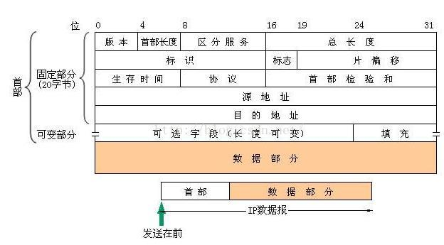

- **版本-4位**：4或者6
- **首部长度-4位**：最大60字节；
- **服务类型-8位**：未使用
- **总长度-16位**：最大长度为2 ^ 16 - 1= 65535字节；
- **标识-16位**：如果MTU导致IP分片，则**每个分片的 IP 数据报标识都是一致的**；
- **标志-3位**：最低位为 MF，MF=1代表后面还有分片的数据报，MF=0代表当前数据报已是最后的数据报。次低位为 DF，DF=1代表不能分片，DF=0代表可以分片,还有一位是保留未用的。
- **片偏移-13位**：**代表某个分片在原始数据中的相对位置**。
- **生存时间TTL-8位：**以路由器跳数为单位，每过一个路由器TTL都会减一，为 0 时丢弃。
- **协议-8位：**代表上层传输层协议的类型，1- ICMP、2-IGMP、6-TCP、17-UDP 等
- **首部校验和-16位：**不包含数据部分的校验和。计算方法为，首先将校验和位置零，然后将IP首部每16位二进制反码求和即为校验和，最后写入校验和位置。
- **源IP地址-32位**：4字节
- **目的IP地址-32位**


## IPV4和IPV6的区别

- **数据报头**：**IPv6报头占40字节**，**IPV4报头20字节**；
- **地址长度**：**IPv6协议的地址长度是128位**，采用的是十六进制格式，既128位地址是以16位为一分组，每个16位分组写成4个十六进制数，中间用冒号分十六进制格式。**IPV4地址长度是32位**；
- **地址配置**：**IPv6协议支持地址自动配置**，这是一种即插即用的机制。IPv6节点通过地址自动配置得到IPv6地址和网关地址。


## IP分片、IP选路:

### **IP分片：**

- 如果数据报长度超过最大传输单元MTU，则将数据报文分为若干分片进行传输，并在目标系统中进行重组。
- 分片和重新组装的过程对传输层是透明的，其原因是当IP数据报进行分片之后，只有当它到达下一站时，才可进行重新组装，且它是由目的端的IP层来完成的。
- **IP分片是通过IP首部的标识字段、标志字段和片偏移字段来控制的**；

### **IP选路：**

- 就是根据路由表中的记录，来决定当前数据报是直接交付还是发往下一跳路由。
- 系统产生或者转发的每份IP数据报都要搜索路由表。
- 系统路由表的主要标志：
  - U-该路由可以使用；
  - G-该路由是一个网关；区分了直接路由和间接路由，其区别在于发往直接路由的分组中不但有目的IP地址还有目的MAC地址，相当于下一站就到达目的主机了。但是间接路由，IP地址是最终的目的IP，但是MAC是网关的MAC；如果没有该标记，说明和目的地址是直连的。
  - H-该路由是一个主机；目的地址是一个完整的主机地址。
- Centos下通过**route 可以查看和修改系统路由**；
- ICMP重定向报文：当IP包在某一个地方转向的时候，都回给发送IP报的源主机一个ICMP重定向报文，而源主机就可以利用这个信息来更新自己的路由表。重定向报文只能由路由器发出，重定向报文为主机所用，而不是为路由器所用。
- ICMP路由器发现报文：在主机引导以后要广播一个路由请求的ICMP报文，而多个路由器则会回应一个路由通告报文。而且，路由器定期广播它们的路由通告报文，允许正在监听的主机相应的更新它们的路由表。


## **ICMP协议：**

- **ICMP-网际控制报文协议**，**IGMP-网际组管理协议**
- ICMP主要功能：**ICMP差错通知 和 信息查询**。
- ICMP 报文是放在 IP 数据报中的数据区域发送的，由于ICMP使用IP交付，因此ICMP报文本身也可能出现丢失或者传输错误。
- **ICMP报文格式：IP首部(协议字段是1) + ICMP报文**
- **ICMP数据首部：类型 + 代码 + 校验和 + 选项数据；**
- ICMP差错报告报文5种类型，ICMP查询报告报文6种类型。
- **Type值**：0/8-Echo Reply and Echo (Ping)；3-端口不可达（TraceRoute）；11-超时 （TraceRoute）；13/14-时间戳和时间戳回复;


## ping协议：

- ping命令：主要用来测试两台主机之间的连通性。
- 首先根据目的IP和路由表决定走哪个网卡，再根据网卡的子网掩码地址判断目的IP是否在子网内。如果不在则会通过arp缓存查询IP的网卡地址，不存在的话会通过广播询问目的IP的mac地址，得到后就开始发包了，同时mac地址也会被arp缓存起来。
- ping 命令使用了两个ICMP 报文。首先，向目标服务器发出请求报文，目的主机收到之后会发送回答报文。
- 


## Traceroute协议

- 作用：测试两台主机之间的连通性。

- 原理：源主机向目的主机发送一连串的 IP 数据报。
- 第一个数据报 P1 的生存时间 TTL 设置为 1，当 P1 到达路径上的第一个路由器 R1 时，R1 收下它并把 TTL 减 1，此时 TTL 等于 0，R1 就把 P1 丢弃，并向源主机发送一个 ICMP 时间超过差错报告报文；
- 源主机接着发送第二个数据报 P2，并把 TTL 设置为 2。P2 先到达 R1，R1 收下后把 TTL 减 1 再转发给 R2，R2 收下后也把 TTL 减 1，由于此时 TTL 等于 0，R2 就丢弃 P2，并向源主机发送一个 ICMP 时间超过差错报文
- 不断执行这样的步骤，直到最后一个数据报刚刚到达目的主机，主机不转发数据报，也不把 TTL 值减 1。但是因为数据报封装的是无法交付的 UDP，因此目的主机要向源主机发送 ICMP 终点不可达差错报告报文。
- 之后源主机知道了到达目的主机所经过的路由器 IP 地址以及到达每个路由器的往返时间。


## **ARP和RARP**

- OSI模型中属于链路层、TCP/IP模型中属于网络层

- 报文：**ARP报文是由以太网帧进行封装传输的。没有封装进IP包。**

- **地址解析协议**，即ARP，**根据 IP 地址获取 MAC 地址**的一个网络层协议。


### ARP查询原理：

- 首先，每个**主机都有一个ARP缓存表**，里面**有主机和路由器的 IP 地址到 MAC 地址的映射表**。
- 当源主机要发送数据时，**首先检查ARP缓存中是否有对应的IP地址的目的MAC地址**，如果有，则直接发送数据；
- **如果没有，主机首先比较目的IP地址与自己的IP地址是否在同一子网中**，**如果在同一子网，则向本网段的所有主机发送ARP数据包（源IP，源MAC，目的IP）**；
- **如果不在同一子网**，**就通过ARP询问默认网关对应的MAC地址, 将数据转发给网关, 网关进行与主机类似的ARP解析过程**,将数据发送给目的主机,或者转发给下一个网关继续进行路由,直到到达目的主机。
- **当本网络的所有主机收到该ARP数据包，首先检查目的IP是不是本机IP**，如果**不是则忽略**，**如果是，则取出源IP和源MAC写入本地ARP缓存表中，然后将自己的ARP信息写入ARP响应包中。**
- 源主机收到ARP响应包后，更新自己的ARP缓存列表，并利用此信息发送数据。


### RARP协议工作流程：

- 逆地址解析协议，即RARP，通过MAC地址获得IP地址；
- 给主机发送一个本地的RARP广播，在此广播包中，声明自己的MAC地址并且请求任何收到此请求的RARP服务器分配一个IP地址；
- 本地网段上的RARP服务器收到此请求后，检查其RARP列表，查找该MAC地址对应的IP地址；
- 如果存在，RARP服务器就给源主机发送一个响应数据包并将此IP地址提供给对方主机使用；
- 如果不存在，RARP服务器对此不做任何的响应；
- 源主机收到从RARP服务器的响应信息，就利用得到的IP地址进行通讯；如果一直没有收到RARP服务器的响应信息，表示初始化失败。


## **集线器、交换机和路由器：**

- **集线器：物理层**设备，作用于比特；

- **交换机：链路层**设备，根据 MAC 地址进行存储转发，交换表中存储着 MAC 地址到接口的映射；

- **路由器：网络层设备**，进行路由选择和分组转发，

### 分组转发：

- 从数据报的首部提取目的主机的IP地址D，得到目的网络地址N。
- 若 N 就是与此路由器直接相连的某个网络地址，则进行直接交付；
- 路由表中有目的地址为 D 的特定主机路由，则把数据报传送给表中所指明的下一跳路由器；
- 若路由表中有到达网络 N 的路由，则把数据报传送给路由表中所指明的下一跳路由器；
- 若路由表中有一个默认路由，则把数据报传送给路由表中所指明的默认路由器；
- 否则报告转发分组出错。

### **路由选择：**

互联网可以划分为较小的自治系统AS，自治系统内部的路由选择：RIP 和 OSPF，自治系统间的路由选择：BGP

- **内部网关协议-选路信息协议RIP**：基于距离向量的路由选择协议。距离是指跳数，直接相连的路由器跳数为 1。跳数最多为 15，超过 15 表示不可达。RIP 按固定的时间间隔仅和相邻路由器交换自己的路由表，若干次交换之后，所有路由器最终会知道到达本自治系统中任何一个网络的最短距离和下一跳路由器地址。
- **内部网关协议-开放最短路经优先协议OSPF**：向本自治系统中的所有路由器发送信息，这种方法是洪泛法。所有路由器都具有全网的拓扑结构图，并且是一致的。
- **边界网关协议-BGP**：BGP 只能寻找一条比较好的路由，而不是最佳路由。每个 AS 都必须配置 BGP 发言人（可以不止一个），通过在两个相邻 BGP 发言人之间建立 TCP 连接来交换两个AS的路由信息。


# 四、传输层

## **用户数据报协议-UDP协议：特点、首部字段**

特点：无连接的，面向报文的，把应用程序传给IP层的数据发送出去，但是不保证能到达目的地。

UDP-数据报模式：指UDP发送端调用了几次 write，接收端必须用相同次数的 read 读完。UDP是基于报文的，在接收的时候，每次最多只能读取一个报文，报文和报文是不会合并的，如果缓冲区小于报文长度，则多出的部分会被丢弃。


## **UDP伪首部字段**：

- **UDP伪首部**(并不会发送，校验用) **+** **UDP首部 + 数据**
- 作用：**伪首部是为了增加校验和的检错能力**：通过伪首部的目的IP地址来检查报文是否收错了、通过伪首部的传输层协议号来检查传输层协议是否选对了。
- **UDP伪首部**： 32位源IP地址 + 32位目的IP地址 + 0 + 8位协议(17) + 16位UDP长度（首部+数据)


## **UDP首部：**

- 8字节；
- **源端口号** ：2字节
- **目的端口号** 
- **包长度** ：UDP首部和UDP数据
- **校验和**：检验和计算过程（以TCP校验为例，TCP首部校验和计算三部分：TCP首部+TCP数据+TCP伪首部。
- 发送端：
  - 首先，把伪首部、TCP报头、TCP数据分为16位的字，如果总长度为奇数个字节，则在最后增添一个位都为0的字节。把TCP报头中的校验和字段置为0。
  - 其次，用反码相加法（对每16bit进行二进制反码求和）累加所有的16位字（进位也要累加，进位则将高位叠加到低位）。
  - 最后，将上述结果作为TCP的校验和，存在检验和字段中。
  - 接收端：
  - 同样利用反码求和，高位叠加到低位， 如计算结果的16位中每一位都为1，则正确，否则说明发生错误。  
  - 实例：
  - 发送端数据1000 0100 校验和 0000 则反码 0111 1011 1111，叠加 0111+1011+1111 = 0010 0001， 高于4bit的， 叠加到低4位      0001 + 0010 = 0011 即为校验和
  - 接收端：数据：  1000   0100   检验和  0011，     反码：  0111   1011  1100， 叠加：  0111 + 1011 +1100 = 0001 1110  叠加为4bit为1111.   全为1，则正确


## **传输控制协议-TCP协议：**

### **TCP和UDP区别**

大致如下：

- **TCP面向连接，UDP面向非连接**即发送数据前不需要建立链接
- **TCP提供一种面向连接的、可靠的字节流服务，UDP无法保证**
- **TCP面向字节流，UDP面向报文**
- **TCP数据传输慢，UDP数据传输快**
- 在一个TCP连接中，仅有两方进行彼此通信，因此广播和多播不能用于TCP
- TCP使用校验和、累积确认、滑动窗口机制确认和重传机制来保证可靠传输，UDP无


### **TCP首部字段**：

20字节固定长度+可变长度

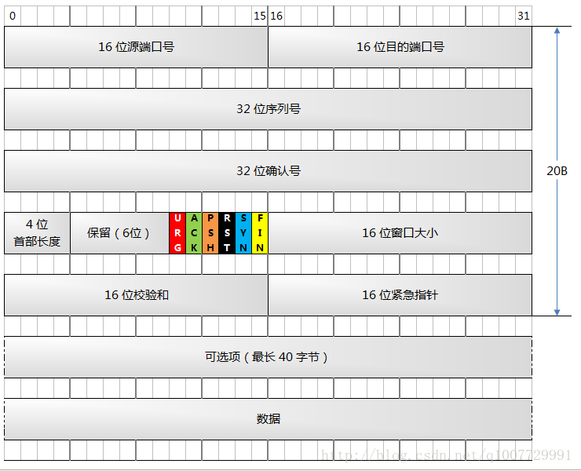

- **源端口**：2字节
- **目的端口**：2字节
- **序号**：4字节，去重，排序;
  - 初始序号:当新连接建立的时候，第一个字节数据的序号称为初始序号ISN。ISN 一开始并不一定就是 1。在 RFC (规定网络协议的文档) 中规定，ISN 的分配是根据时间来的。当操作系统初始化的时候，有一个全局变量假设为 g_number 被初始化为 1（或 0），然后每隔 4us/微秒 加 1. 当 g_number 达到最大值的时候又绕回到 0. 当新连接建立时，就把 g_number 的值赋值给 ISN.
  - 如果序列号每次交换都会自增1，而连接又长时间存在且高速交换报文时，总有一个时刻序列号的长度会超过32位（2^32 - 1），此时序列号就会重置为0，此时的序列号就会从0重新开始自增1。这就是TCP序列号回绕问题。 Linux内核使用无符号整型到有符号整型的转化来计算。
- 序号字段只有在下面两种情况的任意一种才有意义：数据字段至少包含一个字节，这是一个 SYN 段，或者是 FIN 段，或者是 RST 段。
  
- **确认号**：4字节，代表接收端希望接收的数据序号，为上次接收到数据报的序号+1；例如，B 收到了 A 发送过来的报文，其序列号字段是 501，而数据长度是 200 字节，这表明 B 正确的收到了 A 发送的到序号 700 为止的数据。因此，B 期望收到 A 的下一个数据序号是 701，于是 B 在发送给 A 的ACK确认报文段中把确认号置为 701；
  - 只有当 ACK 标志位被置位的时候，确认号这个字段才有效。
- **数据偏移**：占 4 位，它指出 TCP 报文的数据距离 TCP 报文段的起始处有多远，实际代表TCP首部长度，最大为60字节。
- 6个**标志位**，每个标志位1位；
  - SYN，为同步标志，用于数据同步；
  - ACK，为确认序号，ACK=1时确认号才有效；
  - FIN，为结束序号，用于发送端提出断开连接；
  - URG，为紧急序号，URG=1是紧急指针有效；
  - PSH，指示接收方立即将数据提交给应用层，而不是等待缓冲区满；
  - RST，重置连接。
- **窗口值**，16位，2字节；标识接收方可接受的数据字节数。
- **校验和**，16位，2字节；用于检验数据完整性。校验首部和数据这两部分；
- **紧急指针**，占 2 字节，指出本报文段中的紧急数据的字节数；只有当URG标识位为1时，紧急指针才有效。


### **TCP如何实现可靠传输：**

- TCP校验和 
- 确认机制（序列号、确认应答）
- 重传机制 
- 流量控制(滑动窗口) + 拥塞控制


## **TCP连接控制：**

### **三次握手：**

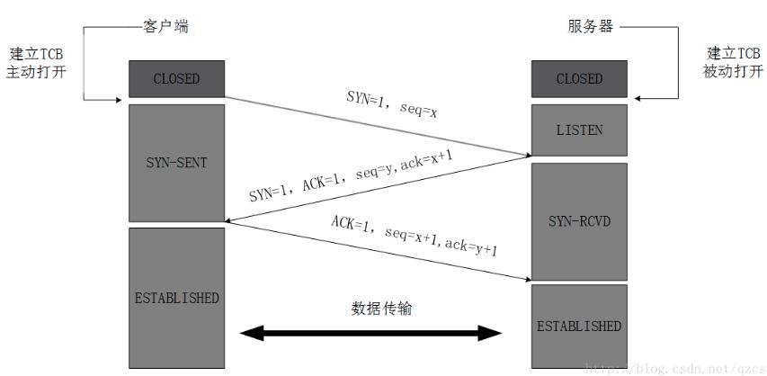

- **为什么需要三次握手：**防止已经失效的连接请求报文突然又传送到了服务器，从而错误打开连接。

- DDos攻击：SYN flood，泛洪攻击，占满半连接队列；


### **四次挥手：**

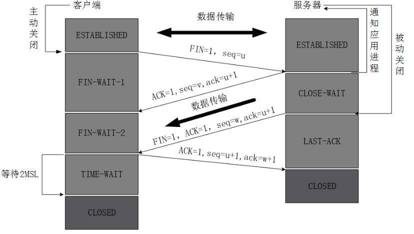

- **为什么需要四次挥手**：断开连接的时候,一个方向的断开,只是说明该方向数据已传输完毕,而另一个方向或许还有数据,所以得等到另一个方向数据也全部传输完成后,才能正确的关闭连接。


### TIME_WAIT的作用：

客户端接收到服务器端的 FIN 报文后进入此状态，此时并不是直接进入 CLOSED 状态，还需要等待一个时间计时器设置的时间 **2MSL(最大报文存活时间)**。这么做有两个理由：

- **确保最后一个确认报文能够到达。**因为这个 ACK 报文可能丢失，站在服务器的角度看来，我已经发送了 FIN+ACK 报文请求断开了，客户端还没有给我回应，应该是我发送的请求断开报文它没有收到，于是服务器又会重新发送一次，而客户端就能在这个 2MSL 时间段内收到这个重传的报文，接着给出回应报文，并且会重启 2MSL 计时器。
- 等待2MSL时间是为了**让本连接持续时间内所产生的所有报文都从网络中消失**，使得下一个新的连接不会出现旧的连接请求报文。


**TIME_WAIT 的危害：**

Linux 分配给一个用户的文件句柄是有限的**，如果系统中存在大量的 TIME_WAIT 状态，一旦达到句柄数上限，新的请求就无法被处理了，而且大量 TIME_WAIT 连接占用资源影响性能。**

对 / etc/sysctl.conf 文件内容进行修改可以关闭 TIME_WAIT 状态，但是会影响TCP的可靠性：

```bash
#表示开启重用。允许将TIME-WAIT sockets重新用于新的TCP连接，默认为0，表示关闭  
net.ipv4.tcp_tw_reuse = 1  
#表示开启TCP连接中TIME-WAIT sockets的快速回收，默认为0，表示关闭  
net.ipv4.tcp_tw_recycle = 1
```


### CLOSE_WAIT状态：

被动关闭的那端会经历这个状态。如果一直保持在 CLOSE_WAIT 状态，那么只有一种情况，就是在客户端关闭连接之后服务器程序自己没有进一步发出 FIN 报文，

**原因：**

 TCP 连接没有调用关闭方法，如socket的close，或者对方连接关闭之后程序里没有检测到，或者程序压根就忘记了这个时候需要关闭连接，于是这个资源就一直被程序占着。

**解决办法：**

可以使用 TCP 的 keepalive 功能，让操作系统替我们自动清理掉 CLOSE_WAIT 连接。

```bash
net.ipv4.tcp_keepalive_time=1200
```

**出现大量close_wait 的情况：**

linux 中出现大量 close_wait 的情况一般是应用在检测到对端 fin 时没有及时 close 当前连接。

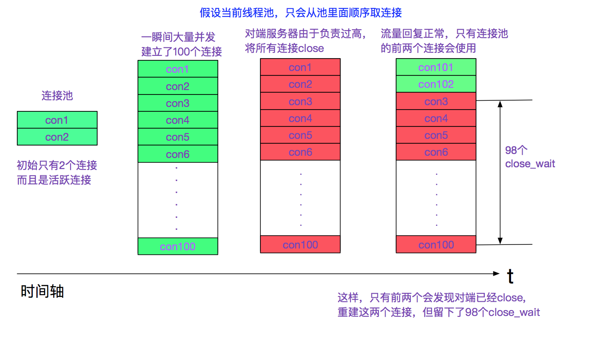

当出现这种情况，通常是 参数的配置不对 (如果连接池有定时收缩连接功能的话)。

给连接池加上心跳也可以解决这种问题。如果应用 close 的时间过晚，对端已经将连接给销毁。则应用发送给 fin 给对端，对端会由于找不到对应的连接而发送一个 RST(Reset) 报文。


**操作系统何时回收 close_wait：**

如果应用迟迟没有调用 close_wait, 那么 tcp 本身有一个包活 (keep alive) 定时器，在 (keep alive) 定时器超时之后，会强行将此连接关闭。


## TCP几种连接：

### TCP半打开连接：

- 如果一方已经关闭或者异常终止连接而另外一方却还不知道，这样的连接就称为半打开连接。处理原则就是接收方以复位RST做应答，然后重新建立连接。

### TCP同时打开：

- 两个应用程序同时彼此执行主动打开的情况，两端的端口一致，TCP中，对于同时打开它仅建立一条连接而不是两条连接。

### TCP半关闭：

- 指TCP链接中A向B发送 FIN 请求关闭，另一端B回应ACK之后，并没有立即发送 FIN ACK给A,A方处于半连接状态（半开关），此时A可以接收B发送的数据，但是A已经不能再向B发送数据。


### **TCP 握手中的半连接队列和全连接队列：**

- 在握手阶段存在两个队列：syns queue（半连接队列）、accept queue（全连接队列）。

- 流程简述如下：
  - 客户端发送 SYN 包到服务端进行第一次报文握手，此时服务端将此请求信息放在半连接队列中并回复 SYN+ACK 给客户端。SYN Flood就是不停的建立连接导致半连接队列满了，其他请求无法进入。
  - 客户端收到SYN+ACK，发出 ACK 确认给服务端；此时服务器端：
  - 全队列未满：从半连接队列拿出此消息放入全连接队列中。
  - 全队列已满：处理方式和 tcp_abort_on_overflow（cat /proc/sys/net/ipv4/tcp_abort_on_overflow）有关：  tcp_abort_on_overflow=0；表示丢弃该 ACK；tcp_abort_on_overflow=1；表示发送一个 RST 给客户端，直接废弃掉这个握手过程。
- 服务端 accept 处理此请求，从全队列中将此请求信息拿出。
- backlog：
  - **backlog** 表明它是**已连接但是还未处理的队列的大小**。这个队列如果满的话，会发送一个 ECONN-REFUSED 错误信息给客户端。就是常见的 “Connection Refused”。


## **TCP流量控制机制：**

**滑动窗口、慢启动、拥塞避免、快重传、快恢复**

### 一、滑动窗口：

- 滑动窗口：
  - “窗口”对应的是一段可以被发送者发送的字节序列，其连续的范围称之为 “窗口”；
  - “滑动” 则是指这段 “允许发送的范围” 是可以随着发送的过程而变化的，方式就是按顺序“滑动”。

- 发送方的发送缓存内的数据都可以被分为4类: 
  - 已发送，已收到ACK 
  - 已发送，未收到ACK 
  - 未发送，但允许发送 
  - 未发送，但不允许发送

  - 其中类型2和3都属于发送窗口。
  
- 接收方的缓存数据分为3类： 
  - 已接收 
  - 未接收但准备接收 
  - 未接收而且不准备接收

  - 其中类型2属于接收窗口。


- **滑动机制**

- TCP只对收到的最后一个有序的数据包回复确认ACK；

- 发送窗口只有收到发送窗口内字节的ACK确认，才会移动发送窗口的左边界。

- 接收窗口只有在前面所有的段都确认的情况下才会移动左边界。当在前面还有字节未接收但收到后面字节的情况下，窗口不会移动，并不对后续字节确认。以此确保对端会对这些数据重传。

- 遵循快速重传、累计确认、选择确认等规则。


### 二、流量控制：

- TCP 利用滑动窗口实现流量控制的机制，主要的方式就是**返回的确认ACK 中会包含自己的接收窗口的大小**，TCP首部的滑动窗口值大小字段，并且利用大小来控制发送方的数据发送：

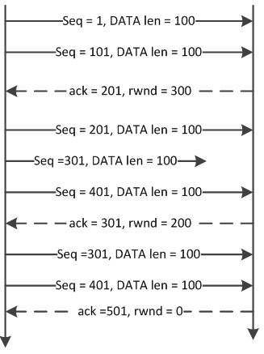


- **TCP 持久计时器：**当客户端或服务器收到对方的零窗口通知时，就启用该计时器，时间到则发送一个 1 字节的探测报文，对方会在此时回应自身的接收窗口大小，如果结果仍未 0，则重设持续计时器，继续等待。

- TCP流量传递效率：原则是尽可能一次多发送几个字节，或者窗口空余较多的时候通知发送方一次发送多个字节。使用 Nagle 算法。


### 三、拥塞控制：

#### 1.概念

- 拥塞控制由四个算法组成：慢启动、拥塞避免、快重传、快恢复；
- 拥塞控制算法在Linux下有多种实现，比如Tahoe算法、Vegas算法、Reno算法、newReno算法、bic算法、cubic算法等；在服务器的/proc/sys/net/ipv4/tcp_congestion_control可以看到；
- 术语：
  - SMSS：发送方可以传输的最大报文段的大小；
  - RMSS：接收方愿意接受的最大报文段的大小；
  - RWND：接收方窗口大小；
  - CWND：拥塞窗口,限制TCP可以发送的数据量；
  - SWND：发送窗口，SWND值是RWND和CWND中的较小者；在任何给定时间，TCP不得发送序列号高于最高确认序列号和SWND之和的数据。
  - IW：初始窗口是发件人的大小三次握手完成后的拥塞窗口。
- 参考RFC-5681


#### 2.慢启动、拥塞避免、快重传、快恢复

- **慢启动**：TCP连接刚建立，刚开始发送数据时并不知道网络的实际情况，需要一点一点地提速，试探一下网络的承受能力。
  - TCP连接建立好之后，拥塞窗口CWND将被设置成初始值IW，其大小为1个SMSS(新的Linux内核提高了该初始值)，
  - 此后发送端每收到接收端的一个确认ACK，拥塞窗口CWND += min（N，SMSS），其中 N 是此次确认中包含的之前未被确认的字节数。即第一次发送1个MSS，接收到ACK后，发送2个MSS，接到两个ACK确认后，发送4个MSS...**CWND 将按照指数形式扩大**；
  - 慢启动阈值ssthresh：当 CWND >= ssthresh 时，TCP 拥塞控制将进入拥塞避免阶段。
- **拥塞避免**：拥塞避免算法使得 CWND 按照线性方式增加，从而减缓其扩大。
  - 每收到一个对新数据的确认报文段，CWND += SMSS*SMSS/CWND，近似值为每个RTT(数据包往返时间) CWND 增加1。
  - 如果拥塞发生，发送端如何判断拥塞已经发生的：
    - 1.传输超时，TCP 重传定时器RTO超时；
    - 2.接收到重复的确认报文段。
  - 拥塞控制对这两种情况有不同的处理方式。对第一种情况仍然使用慢启动和拥塞避免。对第二种情况则使用快速重传和快速恢复。注意，第二种情况如果发生在重传定时器溢出之后，则也被拥塞控制当成第一种情况来对待。
  - 
  - 对于第一种情况的超时，发送端执行重传，并进行如下调整：
  - 令慢启动阈值ssthresh = max（FlightSize/2，2*SMSS），其中FlightSize是已经发送但未收到确认的字节数。
  - 这样调整之后，CWND将小于SMSS，那么也必然小于新的慢启动门限值ssthresh（一定不小于SMSS的2倍），故而拥塞控制再次进入慢启动阶段。
- **快重传**：
  - 在很多情况下，发送端都可能接收到重复的确认报文段，比如TCP报文段丢失，或者接收端收到乱序TCP报文段并重排之等。拥塞控制算法需要判断当收到重复的确认报文段时，网络是否真的发生了拥塞，或者说TCP报文段是否真的丢失了。即第二种情况的超时。
  - **发送端如果连续收到3个重复的确认报文段**，就认为是拥塞发生了。然后它启用快速重传和快速恢复算法来处理拥塞，这个机制不需要等到重传定时器超时，所以叫做快速重传，而快速重传后没有使用慢启动算法，而是拥塞避免算法，所以这又叫做快速恢复算法。
  - TCP Reno 的快重传算法：
    - CWND大小缩小为当前的一半；
    - ssthresh 设置为缩小后的 CWND大小；
    - 然后进入快速恢复算法；

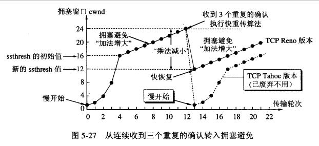

- **快恢复：**

  - 在进入快速恢复之前，cwnd 和 ssthresh 已经被更改为原有 cwnd 的一半。
  - 快速恢复算法的逻辑如下：
    - cwnd = cwnd + 3 * SMSS，加 3 * SMSS 的原因是因为收到 3 个重复的 ACK。
    - 重传 DACKs 指定的数据包。
    - 如果再收到 DACKs，那么 cwnd 大小增加一。
    - 如果收到新的 ACK，表明重传的包成功了，那么退出快速恢复算法。将 cwnd 设置为 ssthresh，然后进入拥塞避免算法。

  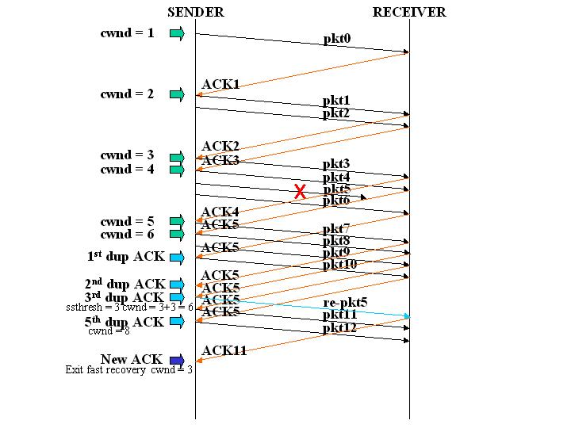

  - 如图所示，第五个包发生了丢失，所以导致接收方接收到三次重复ACK，也就是ACK5。所以将ssthresh设置当当时cwnd的一半，也就是6/2 = 3，cwnd设置为3 + 3 = 6。然后重传第五个包。当收到新的ACK时，也就是ACK11，则退出快速恢复阶段，将cwnd重新设置为当前的ssthresh，也就是3，然后进入拥塞避免算法阶段。

- 


#### 3.Tahoe、Reno、BIC等算法

- 基于丢包反馈的 TCP 协议（Tahoe、Reno、NewReno、SACK）
  - Tahoe算法没有快速恢复，在进入快速重传算法后，重新开始慢启动算法，拥塞窗口CWND重新从1开始传输；问题：能有效避免信息拥塞，但是性能低，因为拥塞窗口在拥塞发生时减为1；
  - Reno算法：慢启动(cwnd指数增长)、拥塞避免(cwnd>=ssthresh，线性增长)、快重传(三个重复ACK，立即重传)、快恢复(拥塞窗口在发生拥塞时窗口减为cwnd=cwnd + 3)，问题：多个分组在一个窗口内丢失。
  - NewReno算法：对Reno改进，在同一窗口内发生多包丢失时，并不因为部分确认而多次退出快速恢复，而是等所有丢失的分组都重传完毕后才退出退出快速恢复；
  - SACK算法：维护一个选择域的数据段，维护一个pipe变量来估计出现在网络中的分组数，当pipe<cwnd时，发送端发送新的或者需要重传的分组，并且pipe++；当发送端接收了一个带SACK选项的重复ACK，表明新的分组已经被接受端接收，则pipe--；
- 基于延时反馈的 TCP 协议（Vegas）
  - 经典的 Vegas 算法的基本思路：RTT 增加，拥塞窗口减小；RTT 减少，拥塞窗口变大。
  - **重传机制**：Vegas 采用更精确的 RTT 估计值在以下两种情形下决定是否重发：
    - 当接受到重复 ACK 时，Vegas 检查目前时间和记录的时间标签之差是否比超时值大，如果是，则立刻重发数据包，不必等第三个重复 ACK。当接受重传数据包应答后，Vegas 以 3/4 降低拥塞窗口。
    - 当接受到非重复的 ACK 时，如果它是重发之后的第一或是第二个确认，Vegas 将再次检测数据发送时间间隔是否查过超时值。如果是，则重发。
  - **拥塞避免机制**：Vegas 通过比较实际吞吐量和期望吞吐量来调节拥塞窗口的大小。
  - **慢启动机制：**在 Vegas 慢启动中，每经过两个 RTT 使 W 增加 1 倍。其中前一个 RTT 内是与 TCP Reno 相同的指数增长，即每收到一个 ACK 包就将加 1，同时发送出两个数据包，可称为增长期；后一个 RTT 内保持不变以观测 RTT 的变化，可称为观测期。Vegas 的慢启动过程就是由一个增长期和一个观测期周期往复，在每个观测期结束时，计算新的 RTT 和 diff 的值，以此决定是继续下一个周期还是结束慢启动。
  - 无线传输中的 Westwood 算法：基本思路：发送端利用检测到的 ACK 的到达率来估测可使用的带宽。

- 基于丢包反馈的高速带宽算法（BIC-TCP、CUBIC）
  - BIC 包括两部分：二分搜索增加和加性增加；
  - 二分搜索： TCP 主动搜索一个处于丢包触发阈值的分组发送速率。设置一个快速恢复结束后的拥塞窗口大小值Wmin和快速恢复结束前的拥塞窗口大小值Wmax，每收到一个ACK的时候，便将窗口设置到Wmax和Wmin的中点，一直持续到接近Wmax。
  - 加性增长：如果目前值与目标值差值太大，将拥塞窗口直接设置为目标值带来很大压力。此时设置一个 Smax，按照 Smax 步长增长。
  - CUBIC：对BIC算法的简化，采用三次项支配窗口的扩充算法
- 


## TCP七个定时器：

超时时间RTO是根据数据包往返时间RTT来设置；

TCP连接中RTO的时间，采用指数退避的方式增长，每一次的RTO是上一个RTO值的两倍；

### 1.建立连接定时器

- 在 TCP 三次握手创建一个连接时，以下两种情况会发生超时：
  - client 发送 SYN 后，进入 SYN_SENT 状态，等待 server 的 SYN+ACK。即SYN丢失
  - server 收到连接创建的 SYN，回应 SYN+ACK 后，进入 SYN_RECD 状态，等待 client 的 ACK。，即SYN+ACK丢失；
  - 来自发送端的ACK丢失。
- 在发送端启动是普通的超时计时器，在接收端启动的是 SYN-ACK 计时器。
- 超时计时器就是在发送端发送 SYN 的时候开始计时，默认是 1 秒，如果过了 1 秒没有收到确认，会再次发送 SYN，然后将计时器设置成为 2 秒，然后依 4 秒，8 秒，16 秒，以此类推。当然，在代码中有一个重试上限，在 linux 上的默认是设置为 5 次。
- 同样的 SYN-ACK 计时器在接收端接收到 SYN 之后发出 SYN-ACK 消息之后启动，间隔和重试次数和普通计时器都是一致的，当然他会做一些其他的事情所以和普通计时器是有一些区别的。
- 在/proc/sys/net/ipv4/tcp_syn_retries 可以设置到底要重新发送几次SYN包，默认是5次。


### **2.重传定时器**

- 重传定时器在TCP发送数据时设定，在计时器超时后没有收到返回的确认ACK，发送端就会重新发送队列中需要重传的报文段。
  - 当TCP发送了位于发送队列最前端的报文段后就启动这个RTO计时器；
  - 如果队列为空则停止计时器，否则重启计时器； 
  - 当计时器超时后，TCP会重传发送队列最前端的报文段；
  - 当一个或者多个报文段被累计确认后，这个或者这些报文段会被清除出队列.
- 重传计时器保证了接收端能够接收到丢失的报文段，继而保证了接收端交付给接收进程的数据始终的有序完整的。因为接收端永远不会把一个失序不完整的报文段交付给接收进程。
- TCP 把一个包从发送端发送出去到接收到这个包的回复这段时间称之为 RTT，RTO是由数据包的往返时间RTT来决定的，RTO稍大于RTT。 RTT 都是动态变化的，所以 RTO 也应随着 RTT 动态变化。
- 如果重传后还是没有在 RTO 时间内收到 ACK，这时候会认为是网络拥堵，会引发 TCP 拥塞控制行为，使 RTO 翻倍。
- RTT和RTO的计算：
  - SRTT = SRTT + α * (RTT - SRTT), a取值是0.125；
  - 具体实际中的做法是这样的，首先采样几次 RTT 的值，然后在第一次迭代的时候 SRTT 的初始值为 RTT，后面就是根据上述公式每次计算出来的 SRTT 来计算就行了。
  - RTT偏差DevRTT：DevRTT = (1-β) * DevRTT + β *(|RTT - SRTT|)，β是 0.25
  - RTO计算：RTO = SRTT + 4 * DevRTT
  - 关于RTO超时加倍：假设当前超时重传定时器溢出时，与最早的未被确认的报文段相关联的RTO为0.75s，TCP就会重传报文段，并把新的RTO设置为1.5s，如果1.5s后又溢出了，则TCP将再次重传报文段，并把RTO设置为3秒。因此，超时间隔在每次重传后会呈指数上升，然而每当重传定时器在另外两个事件（收到上层应用的数据和收到ACK）中的任意一个启动时，RTO有最近的EstimatedRTT 和DevRTT重新计算。在[RFC 6298]中，推荐初始超时重传时间为1秒。
- 


### 3.延迟应答定时器

- 延迟应答也被成为捎带ACK， 这个定时器是在延迟应答的时候使用的。 
- 为什么要延迟应答呢？ 延迟应答是为了提高网络传输的效率。
- 举例说明，比如服务端收到客户端的数据后， 不是立刻回ACK给客户端， 而是等一段时间(一般最大200ms)，这样如果服务端要是有数据需要发给客户端，那么这个ACK就和服务端的数据一起发给客户端了， 这样比立即回给客户端一个ACK节省了一个数据包。


### 4.持久定时器：

- TCP通过让接收方指明希望从发送方接收的数据字节数（即窗口大小）来进行流量控制。
- 当客户端或服务器收到对方的零窗口通知时，就启用该计时器，来周期性地向接收方查询，以便发现窗口是否已增大，从发送方发出的报文段称为窗口探查报文，一个 1 字节，对方会在此时回应自身的接收窗口大小，如果结果仍未 0，则重设持续计时器，继续等待。
- 糊涂窗口综合症：接收方通告了一个 1 字节的窗口给发送方，然后发送方发送了 1 字节的数据给接收方。接着，接收方又通告了一个 1 字节的窗口，这样持续下去，使网络的效率很低。
  - 针对接收方来说，先等一段时间，等到接收缓存有足够的空间了才发出确认。
  - 针对发送方来说，发送方不要发送太小的报文，而是把数据积累成一个足够大的报文段（达到 MSS），或者是积累到接收方通告窗口大小一半的报文段。
  -  Nagle 算法，它正是用于解决这个问题的。
- 


### 5.保活定时器：

- 在TCP连接建立的时候指定了SO_KEEPALIVE，保活定时器才会生效。
- 如果客户端和服务端长时间没有数据交互，那么需要保活定时器来判断是否对端还活着，默认是2小时。
- 服务器每收到一次客户端的请求后都会重新复位这个计时器，若两小时还没有收到客户端的任何数据，服务器就会发送一个探测报文段，以后每隔 75 秒发送一次，若一连发送 10 个探测报文仍然没反应，服务器就认为客户端出了故障，接着就关闭连接。
- 确认对端是否活着， 那么应该自己实现心跳包，而不是依赖于这个保活定时器。
- TCP心跳： TCP的keep alive是检查当前TCP连接是否活着，当一个连接“一段时间”没有数据通讯时，一方会发出一个心跳包（Keep Alive包），如果对方有回包则表明当前连接有效，继续监控。


### 6.FIN_WAIT_2定时器

- 主动关闭的一端调用完close以后（即发FIN给被动关闭的一端， 并且收到其对FIN的确认ACK）则进入FIN_WAIT_2状态。
- FIN_WAIT_2定时器：如果在该定时器超时的时候，还是没收到被动关闭一端发来的FIN，就直接释放这个链接
- FIN_WAIT_2定时器的时间可以从/proc/sys/net/ipv4/tcp_fin_timeout中查看和设置。默认是60秒。


### **7.TIME_WAIT定时器：**

- 时间等待计时器是在四次挥手的时候使用的。2MSL（MSL=最长报文生存时间）


## **TCP粘包和分包**

- **为什么出现粘包现象**
  - **发送方原因**：TCP默认会使用Nagle算法。而Nagle算法会收集多个小分组的字节流，在一个确认到来时一起发送。所以Nagle算法造成了发送方有可能造成粘包现象。
  - **接收方原因**：TCP接收到分组时，并不会立刻送至应用层处理，或者说，应用层并不一定会立即处理；实际上，TCP将收到的分组保存至接收缓存里，然后应用程序主动从缓存里读收到的分组。这样一来，如果TCP接收分组的速度大于应用程序读分组的速度，多个包就会被存至缓存，应用程序读时，就会读到多个首尾相接粘到一起的包。

- **分包产生的原因：**一个数据包被分成了多次接收。如IP分片传输、TCP分段传输等都会导致。

- **粘包处理：**使用TCP_NODELAY选项来关闭Nagle算法。或者接受方在应用层进行数据的处理。如消息定长、在消息的尾部加一些特殊字符、根据业务逻辑来找到指定的特殊协议头部，协议长度，协议尾部等。


## **socket网络编程**

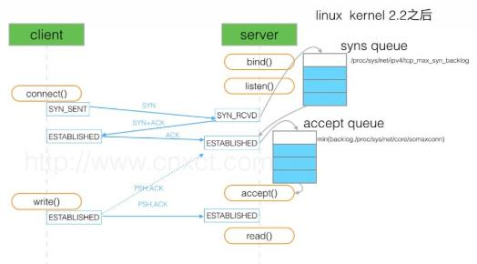

### socket相关函数参数：

```C++
/*
返回值为一个文件描述符fd。
socket函数第一个参数为协议域，第二个参数表示socket类型，第三个参数表示协议。
*/
int socket(int domain, int type, int protocol);

/*
sockfd：即 socket 描述字;
addr：一个 const struct sockaddr * 指针，指向要绑定给 sockfd 的协议地址。
addrlen：对应的是地址的长度。
*/
int bind(int sockfd, const struct sockaddr *addr, socklen_t addrlen);

/*
listen 函数的第一个参数即为要监听的 socket 描述字，第二个参数为相应 socket可以排队的最大连接个数。
connect 函数的第一个参数即为客户端的 socket 描述字，第二参数为服务器的 socket 地址，第三个参数为 socket 地址的长度。
*/
int listen(int sockfd, int backlog);
int connect(int sockfd, const struct sockaddr *addr, socklen_t addrlen);

/*
accept 函数的第一个参数为服务器的 socket 描述字，第二个参数为指向 struct sockaddr * 的指针，用于返回客户端的协议地址，第三个参数为协议地址的长度。
*/
int accept(int sockfd, struct sockaddr *addr, socklen_t *addrlen);
```


### socket的关闭与TCP的关闭状态：

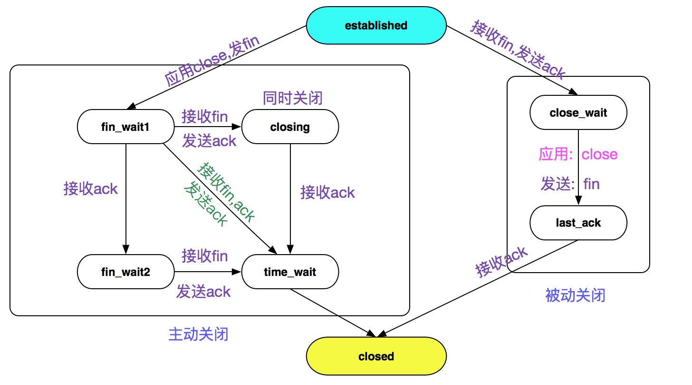

- **主动关闭侧：**
  - 关闭 socket 的时候，会使用 close(fd) 函数，主动关闭socket，在多进程的 socket 服务器编写过程中，父进程也需要 close(fd) 一次，以免 socket 无法最终关闭（父进程中accept了fd，在子进程中利用该fd进行read和write的情况）
  - socket的close会调用内核的tcp_close_state函数，将TCP状态设置为fin_wait1，并调用 tcp_send_fin，主动关闭的这一端等待对端的 ACK，如果 ACK 回来了，就设置 TCP 状态为 FIN_WAIT2，
  - 从 TCP_FIN_WAIT1 变迁到 TCP_FIN_WAIT2 之后，还调用 tcp_time_wait 设置一个 TCP_FIN_WAIT2 定时器，在 tmo+2MSL超时后会TCP连接会直接变迁到 closed 状态。有这样一步的原因是防止对端由于种种原因始终没有发送 fin, 防止一直处于 FIN_WAIT2 状态。
  - 在 FIN_WAIT2 状态等待对端的 FIN，完成后面两次挥手，然后接收到对端发送的 FIN 之后, 将会将状态设置为 time_wait。
  - time_wait 状态时，原 socket 会被 destroy, 然后新创建一个 inet_timewait_sock, 这样就能及时的将原 socket 使用的资源回收。inet_timewait_sock 被挂入一个 bucket 中，由 inet_twdr_twcal_tick 定时从 bucket 中将超过 2MSL 的 time_wait 的实例删除。
- **被动关闭侧：**
  - 在 tcp 的 socket 时候，如果是 established 状态，接收到了对端的 FIN, 则是被动关闭状态, 会进入 close_wait 状态；
  - 收到对端的 fin 之后发送 ack 告知对端收到了，
  - 如果对端关闭了，对端应用端在 read 的时候得到的返回值是 0, 此时就应该手动调用 close 去关闭连接，会将状态改为 last_ack 状态，并发送本端的 fin+ack,在接收到主动关闭端的 last_ack 之后，则调用 tcp_done(sk) 设置 sk 为 tcp_closed 状态，并回收资源。


# 五、应用层

## **1.DNS：**

### DNS域名空间：

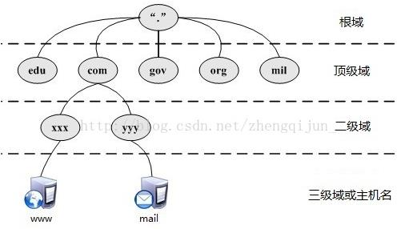

- DNS是应用层协议，作用为把域名解析为IP地址，将IP地址解析为域名。(即正向解析和反向解析)
- DNS域名服务器树状结构
- 比如: www . abcd . com，www是三级域名，abcd是二级域名，com是顶级域名


### **域名解析过程：**

- 在浏览器中输入www. abc .com域名，操作系统会先检查自己本地的hosts文件是否有这个网址映射关系，如果有，就先调用这个IP地址映射，完成域名解析。
- 如果hosts里没有这个域名的映射，则查找本地DNS缓存，是否有这个网址映射关系，如果有，直接返回;
- 如果hosts与本地DNS解析器缓存都没有相应的网址映射关系，首先会找TCP/IP参数中设置的本地DNS服务器，此服务器收到查询时，如果要查询的域名，包含在本地DNS缓存中，则返回解析结果完成域名解析；
- 如果要查询的域名，不由本地DNS服务器区域解析，但DNS服务器已缓存了此网址映射关系，则调用这个IP地址映射，完成域名解析，此解析不具有权威性。
- 如果还查询不到，则根据本地DNS服务器的设置进行查询，本地DNS就把请求发至 根域名服务器，根域名服务器收到请求后会判断这个域名(.com)是谁来授权管理，并会返回一个负责该顶级域名服务器的一个IP。
- 本地DNS服务器收到IP信息后，将会联系负责.com域的顶级域名服务器。这台负责.com域的服务器收到请求后，如果自己无法解析，它就会找一个管理下一级二级域名服务器地址(abc.com)给本地DNS服务器。当本地DNS服务器收到这个地址后，就会找abc.com二级域名服务器，重复上面的动作，进行查询，直至找到www. abc .com主机。


### **递归查询与迭代查询：**

- 递归查询：主机向本地域名服务器的查询；如果主机所询问的本地域名服务器不知道被查询的域名的IP地址，那么本地域名服务器就以DNS客户的身份，向其它根域名服务器继续发出查询请求报文(即替主机继续查询)，而不是让主机自己进行下一步查询。
- 迭代查询：当根域名服务器收到本地域名服务器发出的迭代查询请求报文时，要么给出所要查询的IP地址，要么告诉本地服务器：“你下一步应当向哪一个域名服务器进行查询”。然后让本地服务器进行后续的查询。
- 递归查询时，返回的结果只有两种:查询成功或查询失败.
- 迭代查询，又称作重指引,返回的是最佳的查询点或者主机地址.

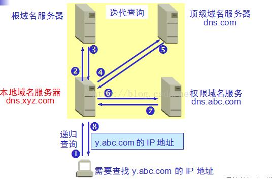


### **DNS缓存：**

一条域名的DNS记录会在本地有两种缓存：浏览器缓存和操作系统(OS)缓存。在浏览器中访问的时候，会优先访问浏览器缓存，如果未命中则访问OS缓存，最后再访问DNS服务器。


### **正向解析&反向解析：**

正向查找区域就是通常所说的域名解析；

反向查找区域即是IP反向解析，它得到作用是通过查找IP地址的PTR记录来得到该IP地址指向的域名。

反向域名解析系统（RDNS）的功能确保适当的邮件交换记录是生效的。反向域名解析与通常的正向域名解析下相反，提供IP地址到域名的对应。反向解析主要应用到邮件服务器中来阻拦垃圾邮件。


## **2.HTTP:**

HTTP是无状态的(指的是每次的请求都是独立的，它的执行情况和结果与前面的请求和之后的请求是无直接关系的)，不安全的(明文传输)，无连接的(HTTP1.0)


### HTTP状态码：

- 2X开头状态码-  2xx (成功)表示成功处理了请求的状态代码，200-成功
- 3X开头状态码- 3xx (重定向) 表示要完成请求，需要进一步操作。301-永久重定向，302-临时重定向，304-自从上次请求后，请求的网页未修改过。
  - 301：使用域名跳转，我们访问 http://www.baidu.com 会跳转到 https://www.baidu.com，发送请求之后，就会返回301状态码，然后返回一个location，提示新的地址，浏览器就会拿着这个新的地址去访问。 301请求是可以缓存的。
  - 302：用于临时跳转，比如未登陆的用户访问用户中心重定向到登录页面。
- 4X开头状态码- 4xx(请求错误) 这些状态代码表示请求可能出错，400 - 服务器不理解，403-服务器禁止，404-服务器找不到；
- 5X开头状态码- 5xx(服务器错误)这些状态代码表示服务器在尝试处理请求时发生内部错误。500-服务器内部错误，502-网关错误，504-网关超时


### HTTP报文格式：

- 请求报文和响应报文，请求行 + 请求头 + 请求体；响应行 + 响应头 + 响应体

- 请求行方法字段包含：GET、POST、HEAD、OPTIONS、PUT、DELETE、PATCH、CONNECT

- 请求头常用包含字段：Accept、Accept-Charset、Accept-Encoding、Accept-Language、Connection、Host、Referer、Cache-Control、Cookie、User-Agent

- 响应头常用包含字段：Connection、Content-Encoding、Content-Type、Content-Length、Date、Cache-Control、Location、Server


### cookie和session：

- 存在的位置：cookie 存在于客户端，临时文件夹中；  session存在于服务器的内存中，一个session域对象为一个用户浏览器服务

- 安全性：cookie是以明文的方式存放在客户端的，安全性低，可以通过一个加密算法进行加密后存放；  session存放于服务器的内存中，所以安全性好
- 网络传输量：cookie会传递消息给服务器；  session本身存放于服务器，不会有传送流量
- 生命周期：cookie的生命周期是累计的，从创建时，就开始计时，20分钟后，cookie生命周期结束；session的生命周期是间隔的，从创建时，开始计时如在20分钟，没有访问session，那么session生命周期被销毁。但是，如果在20分钟内（如在第19分钟时）访问过session，那么，将重新计算session的生命周期。关机会造成session生命周期的结束，但是对cookie没有影响
- 访问范围：cookie为多个用户浏览器共享；  session为一个用户浏览器独享


### **get和post：**

- 作用：GET 用于获取资源，而 POST 用于传输实体主体。
- 参数：GET 和 POST 的请求都能使用额外的参数，但是 GET 的参数是以查询字符串出现在 URL 中，而 POST 的参数存储在实体主体中。
- 安全性：安全的 HTTP 方法不会改变服务器状态，也就是说它只是可读的。GET 方法是安全的，而 POST 却不是，因为 POST 的目的是传送实体主体内容，这个内容如表单数据，上传成功之后，服务器可能把这个数据存储到数据库中，会改变HTTP状态。
- 幂等性：幂等的 HTTP 方法，同样的请求被执行一次与连续执行多次的效果是一样的，服务器的状态也是一样的。在正确实现的条件下，GET是幂等的，而 POST 方法不是。
- 缓存：GET请求报文的是可缓存的，但是POST不可缓存。


### **HTTP长连接：**

- 在HTTP/1.0中默认使用短连接。也就是说，客户端和服务器每进行一次HTTP操作，就建立一次连接，任务结束就中断连接。

- **HTTP/1.1起，默认使用长连接**，用以保持连接特性，支持流水线和分块传输编码。
- 优点：**在一个TCP连接内，多个HTTP请求可以并行，下一个HTTP请求在上一个HTTP请求的应答完成之前就发起。**
- 使用长连接的HTTP协议，会在响应头加入这行代码：Connection:keep-alive。
- **HTTP长连接的超时时间**：
  - 服务器有时候会告诉客户端超时时间，如Keep-Alive: timeout=20，表示这个TCP通道可以保持20秒
  - max=XXX，表示这个长连接最多接收XXX次请求就断开。
  - 如果服务器没有告诉客户端超时时间，服务端可能主动发起四次握手断开TCP连接，客户端能够知道该TCP连接已经无效；
  - TCP还有心跳包来检测当前连接是否还活着。
- TCP的keep alive是检查当前TCP连接是否活着；HTTP的Keep-alive是要让一个TCP连接活久点。


### 长连接的数据传输

- 使用长连接之后，客户端、服务端怎么知道本次传输结束呢？
- 一是判断传输数据是否达到了Content-Length指示的大小；
- 二是动态生成的文件没有Content-Length，它是分块传输（chunked），这时候就要根据chunked编码来判断，chunked编码的数据在最后有一个空chunked块，表明本次传输数据结束。


## **3.HTTPS：**

### **HTTP和HTTPS区别**

- HTTP协议是以明文的方式在网络中传输数据，而HTTPS协议传输的数据则是经过TLS加密后的，HTTPS具有更高的安全性
- HTTPS在TCP三次握手阶段之后，还需要进行SSL 的handshake，协商加密使用的对称加密密钥
- HTTPS协议需要服务端申请证书，浏览器端安装对应的根证书
- HTTP协议端口是80，HTTPS协议端口是443


### 对称加密和非对称加密：

- **对称加密**是指：加密和解密使用相同密钥的算法。对称加密：有流式、分组两种；
  - **流加密**是将消息作为字节流对待，并且使用数学函数分别作用在每一个字节位上。
  - **分组加密**是将消息划分为若干个分组，这些分组随后会通过数学函数进行处理，每次一个分组。
- **非对称加密**：加密使用的密钥和解密使用的密钥是不相同的，分别称为：公钥、私钥。常见的密钥交换算法有RSA，DSA，ECDHE，DH，DHE等算法。
- 对比：
  - 对称加密的优点：计算量小、加密速度快、加密效率高。缺点：交易双方都使用同样密钥，安全性得不到保证，每次使用对称加密算法时，都需要使用其他人不知道的惟一密钥，这会使得发收信息双方所拥有的钥匙数量呈几何级数增长，密钥管理成为负担。
  - 非对称加密的优点：专门针对对称密钥传输做加解密，使得对称密钥的交互传输变得非常安全。缺点：CPU计算资源消耗非常大。非对称加密算法对加密内容的长度有限制，不能超过公钥长度。
  - 非对称加解密目前只能用来做对称密钥交换或者CA签名，不适合用来做应用层内容传输的加解密。

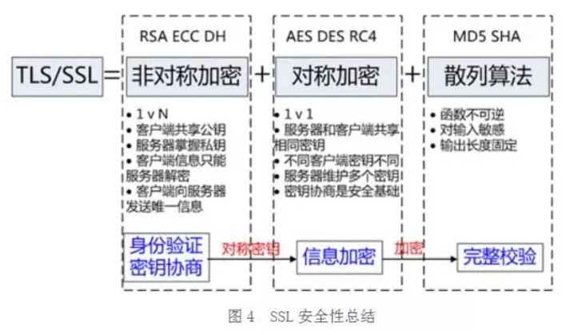

- 哈希算法：将任意长度的信息转换为较短的固定长度的值，通常其长度要比信息小得多，且算法不可逆– 摘要。例如：MD5、SHA-1、SHA-2、SHA-256 等。
- SSL利用基于MD5或SHA的MAC算法来保证消息的完整性，MAC算法是在密钥参与下的数据摘要算法，能将密钥和任意长度的数据转换为固定长度的数据。发送者在密钥的作用下，利用MAC算法计算出消息的MAC值，并将其添加在需要发送的消息之后，并发送给接收者。接收者利用同样的密钥和MAC算法计算出消息的MAC值，并与接收到的MAC值比较。如果二者相同，则报文没有改变；否则，报文在传输过程中被修改或者污染，接收者将丢弃该报文。
- 签名就是在信息的后面再加上一段内容（信息经过hash后的值），可以证明信息没有被修改过。hash值一般都会加密后（也就是签名）再和信息一起发送，以保证这个hash值不被修改。


### **HTTPS加密过程：**

- **1.client hello**：
  - 客户端向服务器发送握手信息，告知自己支持的加密算法、摘要算法、安全层协议版本、随机数 `Random-Secret-C`。
- **2.server hello**：
  - 服务端随机生成本次握手需要的非对称加密的密钥对（私钥+公钥），将来用来传输对称加密密钥。
  - 服务端生成消息，内容包含随机数 `Random-Secret-S`，确定的一组加密算法和摘要算法，服务端公钥，域名信息等。
  - 服务端对信息内容摘要，使用摘要的信息向 CA 机构申请的签名证书。服务端向客户端发送消息和申请的证书。
- **3.验证服务端证书，提取服务端公钥**：
- 证书校验的过程：
  - 浏览器读取证书中的证书所有者、有效期等信息进行一一校验；
  - 浏览器开始查找操作系统中已内置的受信任的证书发布机构 CA，与服务器发来的证书中的颁发者 CA 比对，用于校验证书是否为合法机构颁发 ；
  - 如果找不到，浏览器就会报错，说明服务器发来的证书是不可信任的；
  - 如果找到，那么浏览器就会从操作系统中取出  颁发者 CA  的公钥，然后对服务器发来的证书里面的签名进行解密；
  - 浏览器使用相同的 hash 算法计算出服务器发来的证书的 hash 值，将这个计算的 hash 值与证书中签名做对比；
  - 对比结果一致，则证明服务器发来的证书合法，没有被冒充，此时浏览器就可以读取证书中的公钥，用于后续加密了
- 客户端生成随机数字 `Pre-Master-Secret`，将其进行摘要处理，使用服务端公钥对消息和摘要结果加密，生成对称密钥，发送给服务器，并发送一个编码改变通知，说明以后将会开始加密通信。
- **4.服务器端生成对称加密密钥**
  - 服务器使用私钥对收到的信息解密，对消息进行摘要对比无误，则说明对称加密的密钥没有被篡改，然后使用 `Random-Secret-C`,`Random-Secret-S`,`Pre-Master-Secret` 生成最终将要进行对称加密通信的密钥 `Master-Secret`。
  - 服务器使用 `Master-Secret` 加密一段握手信息及其摘要，发送给客户端，并发送一个编码改变通知，说明以后将会开始加密通信。
- **5.客户端验证加密结果，握手结束**
  - 客户端使用 `Random-Secret-C`,`Random-Secret-S`,`Pre-Master-Secret` 生成同样的对称加密密钥 `Master-Secret`，使用密钥解密，并验证信息摘要，没有问题则握手结束。
- 后面的通信将会使用新生成的对称加密密钥加密进行。
- 为什么要有 3 个随机数？
  - 不管是客户端还是服务器，都需要随机数，这样生成的密钥才不会每次都一样。
  - 由于 `SSL` 协议中证书是静态的，因此十分有必要引入一种随机因素来保证协商出来的密钥的随机性。对于RSA密钥交换算法来说，`Pre-Master-Secret` 本身就是一个随机数，再加上 `hello` 消息中的随机，三个随机数通过一个密钥导出器最终导出一个对称密钥。
  - 那么客户端和服务器加上 Pre-Master-Secret 三个随机数一同生成的密钥就不容易被猜出了，一个伪随机可能完全不随机，可是是三个伪随机就十分接近随机了。
- 


### HTTPS中间人攻击：

- 中间人在收到服务器发送给客户端的公钥（这里是“正确的公钥”）后，并没有发给客户端，而是中间人将自己的公钥（这里中间人也会有一对公钥和私钥，这里称呼为“伪造公钥”）发给客户端。之后，客户端把对称密钥用这个“伪造公钥”加密后，发送过程中经过了中间人，中间人就可以用自己的私钥解密数据并拿到对称密钥，此时中间人再把对称密钥用“正确的公钥”加密发回给服务器。此时，客户端、中间人、服务器都拥有了一样的对称密钥，后续客户端和服务器的所有加密数据，中间人都可以通过对称密钥解密出来。

- 为了解决此问题，我们引入了数字证书的概念。


### **HTTPS的优缺点：**

优点：HTTPS协议是由SSL+HTTP协议构建的可进行加密传输、身份认证的网络协议，要比http协议安全，可防止数据在传输过程中不被窃取、改变，确保数据的完整性。

缺点：HTTPS协议握手阶段比较费时，会增加数据开销和功耗，速度较慢；需要支付证书授权的高额费用。


### 身份认证：

**1.数字证书的作用：**

- 身份授权
- 分发公钥：每个数字证书都包含了注册者生成的公钥（验证确保是合法的，非伪造的公钥）。在SSL握手时会通过certificate消息传输给客户端。
- 验证证书的合法性

**2.数字证书的验证：**

- 如何确认这个证书就是CA签发的呢？
  - 答案就是数字签名。数字签名是证书的防伪标签，目前使用最广泛的SHA-RSA（SHA用于哈希算法，RSA用于非对称加密算法）
- 数字签名的制作和验证过程如下：
  - 数字签名的签发。首先是使用哈希函数对待签名内容进行安全哈希，生成消息摘要，然后使用CA自己的私钥对消息摘要进行加密。
  - 数字签名的校验。使用CA的公钥解密签名，然后使用相同的签名函数对签名证书内容进行签名，并和服务端数字签名里的签名内容进行比较，如果相同就认为校验成功。
  - 数字签名的签发过程跟公钥加密的过程刚好相反，即是用私钥加密，公钥解密。（一对公钥和私钥，公钥加密的内容只有私钥能够解密；反过来，私钥加密的内容，也就有公钥才能够解密）

**3.数据完整性验证**

- SSL利用基于MD5或SHA的MAC算法来保证消息的完整性，由于MD5在实际应用中存在冲突的可能性比较大，所以尽量别采用MD5来验证内容一致性。
- 发送者在密钥的作用下，利用MAC算法计算出消息的MAC值，并将其添加在需要发送的消息之后，并发送给接收者。接收者利用同样的密钥和MAC算法计算出消息的MAC值，并与接收到的MAC值比较。如果二者相同，则报文没有改变；否则，报文在传输过程中被修改或者污染，接收者将丢弃该报文。
- 例如：MD5、SHA-1、SHA-2、SHA-256 等


### **HTTP2:**

- HTTP/2采用二进制格式而非文本格式

- HTTP/2是完全多路复用的，而非有序并阻塞的——只需一个连接即可实现并行,能同时处理多个消息的请求和响应;甚至可以在传输过程中将一个消息跟另外一个掺杂在一起。

- 所以客户端只需要一个连接就能加载一个页面。

- 使用报头压缩，HTTP/2降低了开销

- HTTP/2让服务器可以将响应主动“推送”到客户端缓存中,服务器推送服务通过“推送”那些它认为客户端，将会需要的内容到客户端的缓存中，以此来避免往返的延迟。


## **4.输入URL到打开页面的全过程：**

- 浏览器开启一个线程来处理这个请求，对URL判断如果是http协议就按照web方式处理；
- 浏览器先查看浏览器缓存-系统缓存-路由器缓存，如果缓存中有，会直接在屏幕中显示页面内容（此时没有向服务端发请求）。若没有，则进行下一步操作；
- 通过DNS解析获取网址的IP地址;
- 向真实IP地址服务器发起tcp连接，与浏览器建立tcp三次握手。
- 握手成功后，进行HTTP协议会话，浏览器发送报头(请求报头);
- webServer处理HTTP请求并返回HTTP报文，将数据返回至浏览器;
- 浏览器开始下载html文档(响应报头，状态码200)，同时设置缓存;
- 之后浏览器对整个 HTML 结构进行解析，生成HTML页面。